# 4.1 Softwarearchitektur , technologisches Design und Entwicklungsumgebung
## Aufgabe 1
Begründete Wahl des Technologie Stacks: Begründe deine Auswahl der Technologie-Stack-Elemente unter Berücksichtigung von Skalierbarkeit, Performance, Kosten und Wartbarkeit. Zudem sollte auf die spezifischen Anforderungen der Applikation (verteilte Architektur, Client und Server Kommunikation) eingegangen werden.
### 🎯 Ziel
Ein **fundierter Technologie-Stack** für eine verteilte Webanwendung zur Verwaltung von E-Mail-Kampagnen mit Fokus auf:
- Skalierbarkeit
- Performance
- Kosten
- Wartbarkeit
- Verteilte Architektur
- API-Integration
### Gewählter Technologie-Stack

| Bereich               | Technologie / Tool |
| --------------------- | ------------------ |
| **Frontend (SPA)**    | React.js + TypeScript + Tailwind CSS |
| **Mobile-App**        | React Native |
| **Backend**           | Laravel (PHP Framework) |
| **Datenbank**         | MongoDB |
| **API-Dokumentation** | OpenAPI (YAML) mit SwaggerUI / Postman |
| **Authentication**    | Laravel Sanctum |
| **Dev-Tools**         | VSCode oder Cursor.ai, Git, Figma?, Postman, GitHub Actions?, Mermaid.js, Drawsql, draw.io, PlantUml? |
| **KI-Unterstützung**  | Cursor.ai, Lovable.dev, ChatGPT, GitHub Copilot |
### 📘 Begründung nach Bereichen (Ausformuliert)
#### 1. **Frontend: React.js + TypeScript + Tailwind CSS**
React ermöglicht als modernes JavaScript-Framework die Entwicklung einer performanten SPA mit Wiederverwendbarkeit von Komponenten und gutem Ecosystem. TypeScript bringt zusätzlich statische Typisierung und reduziert damit Fehlerquellen im UI-Code.  
Tailwind CSS erlaubt durch Utility-First-Ansatz ein schnelles und konsistentes UI-Design – ideal für responsive Anwendungen.

📚 **Quellen**:
- _"Learning React" (Banks & Porcello, 2023, O’Reilly)_
- [React Official Docs](https://react.dev)
- [Tailwind CSS Docs](https://tailwindcss.com)
#### 2. **Backend: Laravel (PHP)**
Laravel ist ein leistungsfähiges, robustes MVC-Framework mit elegantem Syntax und breiter Community. Die Entscheidung für Laravel basiert auf der bestehenden langjährigen Erfahrung im Entwicklerteam, wodurch **Kosten und Einarbeitungszeit reduziert** werden.  
Laravel bietet integrierte Lösungen für Authentifizierung, API-Erstellung (mit Laravel Sanctum oder Passport), E-Mail-Versand und Datenvalidierung. Die Wartbarkeit und Erweiterbarkeit sind durch klare Trennung von Logik und Präsentation gewährleistet.

📚 **Quellen**:
- [Laravel.com Documentation](https://laravel.com/docs)
#### 3. **Datenbank: MongoDB**
Als NoSQL-Datenbank ist MongoDB optimal geeignet für flexible Datenstrukturen, z. B. dynamische Kampagneninhalte oder Kundeninteraktionen.  
Sie ist skalierbar, schemalos und integriert sich gut mit Laravel via Bibliotheken wie Laravel MongoDB (Jenssegers). Das Format (JSON) passt gut zu REST-APIs.

📚 **Quellen**:
- [MongoDB Documentation](https://www.mongodb.com)
#### 4. **API-Dokumentation: Swagger/OpenAPI (YAML)**
Für die maschinenlesbare Beschreibung der REST-Schnittstellen wird OpenAPI in YAML eingesetzt. Das erlaubt z. B. automatische Mock-Server, Generierung von API-Clients oder Testfällen.  
Swagger UI bietet eine intuitive Oberfläche zur interaktiven Nutzung und Prüfung der Schnittstellen durch Entwickler und Stakeholder.

📚 **Quellen**:
- [Swagger.io](https://swagger.io)
#### 5. **Dev-Tools & KI-Unterstützung**
- **VS Code oder Cursor.ai** als leistungsfähige, erweiterbare IDEs mit Unterstützung für PHP, JavaScript und TypeScript.
- **?Figma** für UI-/UX-Wireframes.
- **Postman** zur API-Entwicklung und Testautomatisierung.
- **GitHub Actions** für automatisiertes CI/CD.
- **Cloudflare** übernimmt DNS, Web Application Firewall (WAF), Caching und DDoS-Schutz.
- **[Cursor.ai](https://www.cursor.com/)** & **[Lovable.dev](https://lovable.dev/)** bieten KI-unterstützte Codevorschläge und Refactoring.
- **Mailtrap:** eine Sandbox-Umgebung für den sicheren Versand und die Analyse von E-Mails. Sie verhindert den unbeabsichtigten Versand an reale Benutzer und erlaubt gleichzeitig die Prüfung von Layouts und Header-Daten.

📚 **Quellen**:
- [Mailtrap.io Documentation](https://mailtrap.io/docs/)
- [GitHub Actions Docs](https://docs.github.com/en/actions)
- [Cloudflare Developer Docs](https://developers.cloudflare.com/)

---
## Aufgabe 2
Design der Softwarearchitektur für die verteilte Applikation : Entwurf einer Architektur, die die Trennung von Client und Server klar definiert. Es muss ein adäquates Diagramm ausgewählt und angewendet werden, um die Beziehungen zwischen den Komponenten und ihren Verantwortlichkeiten darzustellen.

### 🎯 Ziel
Entwurf einer **verteilten Softwarearchitektur**, die die Trennung zwischen Client und Server klar darstellt, und die Integration von Umsystemen berücksichtigt.

### Gewählte Architektur: Three-Tier Architecture mit REST API

Die Anwendung folgt einer **dreistufigen Architektur** (Three-Tier Architecture) mit klarer Trennung von Präsentations-, Geschäfts- und Datenschicht:

#### Architekturdiagramm: Komponentendiagramm (UML)

```mermaid
%%{init: {'theme': 'default'}}%%
graph TB
    subgraph "Presentation Tier (Client)"
        subgraph "React SPA"
            UI[React Components]
            STATE[State Management]
            AUTH[Authentication Module]
            API_CLIENT[API Client Layer]
        end
        
        subgraph "Mobile App"
            MOBILE_UI[React Native Components]
            MOBILE_STATE[Mobile State Management]
            MOBILE_API[Mobile API Client]
        end
    end
    subgraph "Application Tier (Server)"
        subgraph "Laravel Backend"
            ROUTES[API Routes]
            MIDDLEWARE[Authentication Middleware]
            CONTROLLERS[Controllers]
            SERVICES[Business Logic Services]
            POLICIES[Authorization Policies]
            RESOURCES[API Resources]
        end
        
        subgraph "External Services"
            MAILTRAP[Mailtrap Email Service]
            QUEUE[Queue System]
        end
    end
    subgraph "Data Tier"
        MONGODB[(MongoDB Database)]
        
        subgraph "External APIs"
            ERP[ERP System API]
            KUEBA[Küba AG API]
        end
    end
    %% Client to Server Communication
    UI --> API_CLIENT
    STATE --> API_CLIENT
    AUTH --> API_CLIENT
    API_CLIENT --> ROUTES
    
    MOBILE_UI --> MOBILE_API
    MOBILE_STATE --> MOBILE_API
    MOBILE_API --> ROUTES
    %% Server Internal Flow
    ROUTES --> MIDDLEWARE
    MIDDLEWARE --> CONTROLLERS
    CONTROLLERS --> SERVICES
    CONTROLLERS --> POLICIES
    CONTROLLERS --> RESOURCES
    SERVICES --> MONGODB
    SERVICES --> ERP
    SERVICES --> KUEBA
    SERVICES --> MAILTRAP
    CONTROLLERS --> QUEUE
    %% Data Flow
    MONGODB -.-> SERVICES
    ERP -.-> SERVICES
    KUEBA -.-> SERVICES
```



#### Komponentenbeschreibung

**Presentation Tier (Client-Seite):**
- **React Components**: Modulare UI-Komponenten für Kampagnenerstellung, Analytics und Landing Pages. Verantwortlich für die Darstellung und Benutzerinteraktion.
- **State Management**: Zentrale Zustandsverwaltung für Anwendungsdaten, implementiert mit React Context oder Redux. Koordiniert Datenfluss zwischen Komponenten.
- **API Client Layer**: Abstraktionsschicht für HTTP-Kommunikation mit dem Backend. Behandelt Authentication, Error Handling und Request/Response-Transformation.

**Application Tier (Server-Seite):**
- **API Routes**: REST-Endpunkte definiert in Laravel, die HTTP-Requests entgegennehmen und an entsprechende Controller weiterleiten.
- **Controllers**: Koordinieren den Datenfluss zwischen Client-Requests und Business Logic Services. Implementieren Input-Validierung und Response-Formatting.
- **Business Logic Services**: Kerngeschäftslogik für Kampagnenmanagement, Prospect-Import und Analytics. Kapseln komplexe Operationen und External API-Calls.

**Data Tier:**
- **MongoDB Database**: NoSQL-Datenbank für flexible Speicherung von Kampagnen, Prospects und Tracking-Daten. Unterstützt Schema-Evolution und horizontale Skalierung.
- **External APIs**: ERP-System für Kundendaten und Küba AG für Lead-Generierung. Bieten strukturierte Datenquellen für Prospect-Segmentierung.

### Integration mit Umsystemen

Die Architektur integriert folgende externe Systeme über REST-APIs:

1. **ERP-System Integration**: Über `ImportErpProspects` Action mit standardisiertem `ErpProspectData` DTO
2. **Küba AG API**: Über `ImportKuebaProspects` Action mit `KuebaProspectData` DTO  
3. **Mailtrap Email Service**: Für sicheren E-Mail-Versand und Testing über SMTP/REST API
4. **Queue System**: Für asynchrone Verarbeitung von E-Mail-Kampagnen und Datenimporten

### Begründung der Architekturwahl

**Skalierbarkeit**: Die drei-Tier Architektur ermöglicht unabhängige Skalierung von Frontend, Backend und Datenbank je nach Lastanforderungen.

**Wartbarkeit**: Klare Trennung der Verantwortlichkeiten durch Schichten-Prinzip. Services kapseln Business Logic, Controllers handhaben HTTP-Kommunikation.

**Performance**: Stateless REST API ermöglicht horizontale Skalierung. MongoDB bietet optimierte Abfragen für Campaign Analytics.

📚 **Quellen**:
- _"Software Architecture Patterns" (Richards, 2015, O'Reilly)_
- [Laravel Architecture Concepts](https://laravel.com/docs/architecture)

---

## Aufgabe 3
Toolbasiertes Design und Dokumentation der APIs : Begründete Wahl der API Technologie sowie deren Dokumentations Tools. Vollständige Erstellung des API Designs für die gemäss der Ausgangslage angebotene Web API. Dabei ist aber nur ein Datenobjekt vorzusehen.

### 🎯 Ziel
Begründete Wahl der API-Technologie und Dokumentationstools sowie vollständige Erstellung des API-Designs für die Web API mit einem Datenobjekt.

### Gewählte API-Technologie: REST mit OpenAPI 3.0

#### Begründung der API-Technologiewahl

**REST (Representational State Transfer)** wurde als API-Architektur gewählt aufgrund folgender Vorteile:

- **Standardisierung**: HTTP-basiert mit etablierten Verben (GET, POST, PUT, DELETE)
- **Stateless**: Jeder Request ist unabhängig, was horizontale Skalierung ermöglicht
- **Caching**: Unterstützt HTTP-Caching-Mechanismen für bessere Performance
- **Tooling**: Breite Unterstützung durch Entwicklungstools und Frameworks

#### Dokumentationstools

**OpenAPI 3.0 (YAML)** für API-Spezifikation:
- Maschinenlesbare Dokumentation ermöglicht automatische Code-Generierung
- Swagger UI für interaktive API-Dokumentation
- Unterstützung für Request/Response-Validierung

**Implementierte Tools**:
- **Swagger UI**: Für interaktive API-Exploration und Testing
- **Postman Collection**: Für automatisierte API-Tests
- **Laravel API Resources**: Für konsistente JSON-Response-Struktur

### API-Design: Campaign Management API

Das API-Design fokussiert auf das **Campaign** Datenobjekt als zentrales Element:

#### OpenAPI 3.0 Spezifikation (YAML)
- [http://apde_be.test/api/docs/openapi/](http://apde_be.test/api/docs/openapi/)
- [http://localhost:8000/api/docs/openapi/](http://localhost:8000/api/docs/openapi/)

### Implementierungsdetails
**Laravel API Resources** sorgen für konsistente JSON-Responses:
```php
class CampaignResource extends JsonResource
{
    public function toArray($request): array
    {
        return [
            'id' => $this->id,
            'title' => $this->title,
            'description' => $this->description,
            'status' => $this->status->value,
            'start_date' => $this->start_date?->toISOString(),
            'end_date' => $this->end_date?->toISOString(),
            'prospect_filter' => $this->prospect_filter,
            'created_at' => $this->created_at->toISOString(),
            'updated_at' => $this->updated_at->toISOString(),
            'landingpage' => new LandingpageResource($this->whenLoaded('landingpage')),
        ];
    }
}
```

### Begründung der Toolwahl

**OpenAPI 3.0**: Industriestandard für REST API-Dokumentation, ermöglicht automatische Validierung und Code-Generierung.

**Swagger UI**: Bietet interaktive Dokumentation, die von Entwicklern und Stakeholdern gleichermaßen genutzt werden kann.

**Laravel Sanctum**: Leichtgewichtige Token-basierte Authentifizierung, optimal für SPA-Anwendungen.

📚 **Quellen**:
- _"REST API Design Rulebook" (Masse, 2011, O'Reilly)_
- [OpenAPI Specification 3.0](https://spec.openapis.org/oas/v3.0.3)

---

## Aufgabe 4
Auswahl einer geeigneten Entwicklungsumgebung unter begründeter Berücksichtigung der KI Unterstützung.

## Form der Antwort
Die Struktur der Antwort muss sich an die Aufgabenstruktur halten und eine ent-sprechende Titelstruktur aufweisen.
Die geforderten Auswahlen sind jeweils mit einer fundierten Herleitung und mit mindestens je 2 Quellen (mind. je 1 aktuelles Fachbuch sowie je 1 Internetquelle) gut begründet darzulegen.
Jedes Element des geforderten Diagramms muss kurz (in 2-3 Sätzen) beschrie-ben sein.
Das API-Design sollte in einem maschinenlesbaren Format (z.B. YAML) doku-mentiert werden, um eine einfache Integration und spätere Erweiterungen zu ermöglichen.

## Hinweise
Berücksichtige für den Technologie-Stack folgende Aspekte:
- Serverseitig: Middleware, Frameworks, Programmiersprache, Datenbank
- Clientseitig: Frameworks, Programmiersprache, Runtime U mgebungen

Die Softwarearchitektur muss folgende Aspekte abdecken:
- Server und Clientseitige Architektur mit deren Pakete und Komponenten
- Integration mit den Umsystemen über adäquate Schnittstellen

Berücksichtige für die Entwicklungsumgebung Tools für folgende Aspekte:
- UI Wireframing
- IDE
- Unit Testing
- API Testing
- KI Unterstützung
- Versions kontrolle