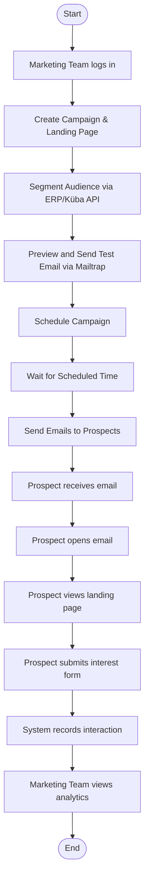
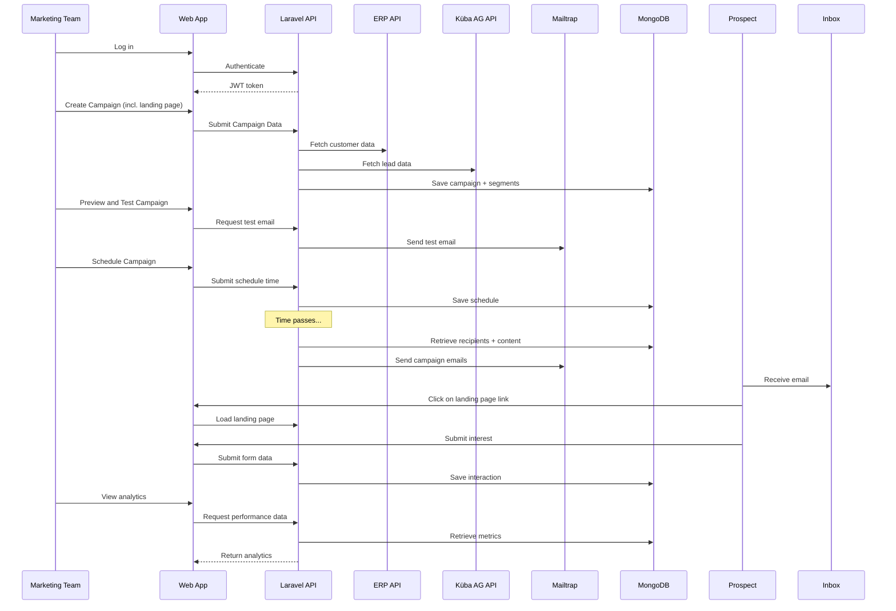

## 🔗 Kapitel: Identifizierte Externe APIs
Im Rahmen des E-Mail-Kampagnen-Management-Systems werden mehrere externe Schnittstellen konsumiert oder bereitgestellt, um Datenflüsse zu ermöglichen. Diese APIs sind essenziell für die Personalisierung, Analyse und Reichweite der Kampagnen.
### 1. **ERP-API (intern)** – _Kundendaten-Synchronisierung_
- **Typ**: REST API (internes System)
- **Richtung**: _Read Only_ (Konsumieren)
- **Zweck**: Zugriff auf bestehende Kundendaten (z. B. frühere Gäste), um personalisierte Kampagnen für Reaktivierung oder Upselling zu gestalten.
### 2. **Küba AG API** – _Lead- & Marktdaten_
- **Typ**: REST API (externe Quelle)
- **Richtung**: _Read Only_ (Konsumieren)
- **Zweck**: Beschaffung von Adress- und Profildaten potenzieller Neukunden für Kaltakquise bzw. Zielgruppensegmentierung.
### 3. **Mailtrap API** – _Testversand von E-Mails_
- **Typ**: SMTP + REST API
- **Richtung**: _Write_ (Push)
- **Zweck**: Versand und Logging von E-Mail-Kampagnen in einer sicheren Sandbox-Umgebung zur Qualitätskontrolle und Layoutprüfung.
### 4. **Analyse-Dashboard API** – _Bereitstellung von Kampagnendaten_
- **Typ**: REST API (öffentlich / abgesichert)
- **Richtung**: _Write_ (Push)
- **Zweck**: Externe Services (z. B. Dashboards oder BI-Tools) erhalten Zugriff auf anonymisierte Leistungskennzahlen (z. B. Öffnungsraten, CTR, Conversion Rate).

## 👥 Kapitel: Benutzerrollen & Akteure
Im System sind zwei primäre Benutzergruppen vorgesehen. Eine klare Rollenverteilung erleichtert sowohl das UI-Design als auch das Berechtigungsmanagement.
### 1. **Marketing-Team ("Admins")**
- **Zugriffsrechte**:
    - Login & Authentifizierung (Admin-Zugang)        
    - Erstellen, Bearbeiten & Planen von Kampagnen
    - Segmentierung von Zielgruppen        
    - Zugriff auf Echtzeit-Statistiken & Reaktionen
    - ?Verwaltung von Kontakten (Import/Mapping von ERP/Küba-Daten)
- **Technisches Verhalten**:
    - Nutzt SPA/Web-App (Desktop optimiert)
    - Arbeitet über sichere Authentifizierung (JWT/Sanctum)
    - ?Kann API-Zugriffe initiieren
### 2. **Prospects ("Gäste")**
- **Zugriffsrechte**:
    - Empfangen von Kampagnenmails
    - Zugriff auf Landing Pages
    - Optional: Rückmeldung / Buchung / Interessenangabe
- **Technisches Verhalten**:
    - Kein Login erforderlich
    - Öffnet Links aus E-Mails → SPA im Public-Modus (Landing Page)
    - Interagiert clientseitig mit Tracking-Endpunkten

## 📘 User Stories für **Marketing-Team (Admins)**

| Nr. | User Story                                                                                                                                                                                                         |
| --- | ------------------------------------------------------------------------------------------------------------------------------------------------------------------------------------------------------------------ |
| 1   | Als Marketingmitarbeiter möchte ich neue E-Mail-Kampagnen erstellen können, um gezielt Angebote an bestimmte Zielgruppen zu senden.                                                                                |
| 2   | Als Marketingmitarbeiter möchte ich bestehende Kampagnen bearbeiten und terminieren, damit ich auf aktuelle Marketingbedürfnisse reagieren kann.                                                                   |
| 3   | Als Marketingmitarbeiter möchte ich Zielgruppen aus ERP- oder externen Quellen segmentieren können, um relevante Empfänger auszuwählen.                                                                            |
| 4   | Als Marketingmitarbeiter möchte ich sehen können, wie viele Empfänger eine Kampagne geöffnet oder angeklickt haben, um deren Effektivität zu bewerten.                                                             |
| 5   | Als Marketingmitarbeiter möchte ich eine Vorschau und einen Testversand der E-Mail sehen, um Layout- und inhaltliche Fehler vor dem Versand zu vermeiden.                                                          |
| 6   | ?Als Marketingmitarbeiter möchte ich Kampagnen automatisch zu einem späteren Zeitpunkt versenden lassen können, um Planungssicherheit zu haben.                                                                    |
| 7   | Als Marketingmitarbeiter möchte ich mich per Login sicher authentifizieren, damit unautorisierte Personen keinen Zugang zum System haben.                                                                          |
| 8   | Als Marketingmitarbeiter möchte ich für jede Kampagne eine individuelle Landingpage mit eigenem Titel, Text und Call-to-Action gestalten können, damit ich den Inhalt optimal auf die Zielgruppe zuschneiden kann. |

## 💌 User Stories für **Prospects (Gäste / Empfänger)**

|Nr.|User Story|
|---|---|
|1|Als Prospect möchte ich eine personalisierte E-Mail erhalten, die für mich relevante Angebote enthält, damit ich mich angesprochen fühle.|
|2|Als Prospect möchte ich mit einem Klick auf einen Link in der E-Mail auf eine Landing Page gelangen, um mehr über das Angebot zu erfahren.|
|3|Als Prospect möchte ich ein Formular auf der Landing Page ausfüllen können (z. B. Interesse, Buchungsanfrage), um mit dem Hotel in Kontakt zu treten.|
|4|Als Prospect möchte ich keine Anmeldung benötigen, um Inhalte sehen zu können, damit die Interaktion möglichst einfach bleibt.|
|5|Als Prospect möchte ich mich von zukünftigen Kampagnen abmelden können, um keine unerwünschten E-Mails mehr zu erhalten.|

## Diagrams
### Use Case https://www.uml-diagrams.org/use-case-diagrams.html

```mermaid
%%{init: {'theme': 'default'}}%%
graph TD
    marketing_team[Marketing Team]
    prospect[Prospect]

    subgraph UseCases [Use Cases]
        UC1[Create Campaign]
        UC2[Edit or Schedule Campaign]
        UC3[Segment Target Groups]
        UC4[Preview and Test Email]
        UC5[Authenticate Login]
        UC6[View Campaign Analytics]
        UC7[Send Campaign via Mailtrap]
        UC8[Create Custom Landing Page]
        UC9[Receive Email]
        UC10[View Landing Page]
        UC11[Submit Interest or Contact Form]
        UC12[Opt-out or Unsubscribe]
    end

    %% Relationships
    marketing_team --> UC1
    marketing_team --> UC2
    marketing_team --> UC3
    marketing_team --> UC4
    marketing_team --> UC5
    marketing_team --> UC6
    marketing_team --> UC7
    marketing_team --> UC8

    prospect --> UC9
    prospect --> UC10
    prospect --> UC11
    prospect --> UC12
```

### Activity https://www.uml-diagrams.org/activity-diagrams.html


### Sequenzdiagramm https://www.uml-diagrams.org/sequence-diagrams.html


Other Diagrams: https://www.uml-diagrams.org/uml-25-diagrams.html
- Structure Diagrams:
	- Search for ones that fit.
- Behavior Diagrams
	- https://www.uml-diagrams.org/communication-diagrams.html
	- https://www.uml-diagrams.org/interaction-overview-diagrams.html

---
## ✅ Feature List / Auftragsdivision: E-Mail-Kampagnen-Management-System – Hotel Grand Pilatus
### 🔧 Grundsetup und Infrastruktur
1. **Laravel Projekt-Setup**
    - a) Projekt initialisieren & Konfiguration (.env, Routes, DB, Mail)
    - b) Auth-Setup via Laravel Sanctum (API Token Auth)
    - c) Basic Folder Structure: Controllers, Services, Repositories
2. **MongoDB-Datenbank konfigurieren**
    - a) Datenbankverbindung & .env-Anpassung
    - b) Erstellung von Collections (Campaigns, Users, Interactions, Segments)
3. **Modelle & Seeder vorbereiten**
    - a) Campaign, Prospect, Segment, LandingPage
    - b) Seeder für Testkampagnen
### 👤 Benutzer-Authentifizierung & Rollen
4. **(S-Auth) Benutzerverwaltung**
    - a) Admin-Login & Token-Erstellung
    - b) Middleware für geschützte Routen
    - c) Rollen- & Rechteprüfung (Admin vs Prospect)
### ✉️ Kampagnenmodul
5. **(S-1) Kampagnenerstellung (Admin)**
    - a) Kampagnenformular im SPA
    - b) API-Endpunkt für Kampagnenerstellung
    - c) Persistierung inkl. initialem Status
6. **(S-2) Landingpage-Erstellung**
    - a) Eigene Texte, CTAs, Layoutoptionen
    - b) Preview-Funktion im Frontend
    - c) Speicherung in Sub-Dokument in Campaign
7. **(S-3) Zielgruppen-Segmentierung**
    - a) Integration ERP API (intern)
    - b) Integration Küba API (extern)
    - c) Filtern, Anzeigen, Zuordnen zu Kampagne
8. **(S-4) Vorschau & Testversand**
    - a) Anzeige HTML-Vorschau
    - b) Mailtrap API-Integration
    - c) Logging des Mail-Events (optional)
9. **(S-5) Kampagnen-Terminierung**
    - a) Auswahl Versandzeitpunkt
    - b) Speicherung im Scheduler
    - c) Hintergrund-Job-Dispatch
### 📤 E-Mail-Versand & Interaktion
10. **(S-6) Kampagnenversand (automatisiert)**
	- a) Versand-Worker via Queue
	- b) Mail mit Tracking-Link generieren
11. **(S-7) Prospect E-Mail Empfang & Interaktion**
	- a) E-Mail empfangen & öffnen
	- b) Link zur Landingpage folgen
12. **(S-8) Landingpage anzeigen**
	- a) Inhalt aus Kampagnenobjekt laden
	- b) Formular zur Interessenbekundung
13. **(S-9) Formular absenden**
	- a) Validierung & Speichern in Interaction-Collection
	- b) Trigger Analytics Update
### 📊 Auswertung & Analyse
14. **(S-10) Admin-Analyse**
	- a) API-Endpunkt: Öffnungen, Klicks, Antworten
	- b) Metriken abrufen & im SPA visualisieren
15. **(S-11) Externe Analyse-API**
	- a) REST-Schnittstelle mit Token
	- b) Aggregierte Metriken pro Kampagne
### 🧪 Abschluss & Tests
16. **API-Dokumentation (Swagger/OpenAPI)**
	- a) YAML-Definition
	- b) Swagger UI Integration
17. **CI/CD & Deployment**
	- a) GitHub Actions einrichten
	- b) Cloudflare DNS, HTTPS, WAF konfigurieren
	- c) SPA + Backend Deploy auf Zielsystem
18. **Systemtest**
	- a) CRUD für Kampagnen testen
	- b) E2E-Test: Erstellung → Versand → Antwort

---
## Sitemap & Functionality based on User Stories
### 🖼️ Frontend View List Based on User Stories

| **View**                         | **Description & Functionality**                                                                      |
| -------------------------------- | ---------------------------------------------------------------------------------------------------- |
| **Login View**                   | - Admin login (JWT/Sanctum auth)  <br>- Input for email/password  <br>- Error display & redirect     |
| **Dashboard View (Admin)**       | - Overview of all campaigns (status, schedule, stats)  <br>- Quick links to create/edit/view         |
| **Campaign List View**           | - List of all campaigns with filters  <br>- View/edit/delete options  <br>- Status indicators        |
| **Campaign Create/Edit View**    | - Create or update campaign name, subject, content  <br>- Assign segments  <br>- Schedule sending    |
| **Landing Page Editor View**     | - Create/edit custom landing page for campaign  <br>- Input for headline, text, CTA  <br>- Preview   |
| **Segment Builder View**         | - Import and display ERP / Küba data  <br>- Apply filters and save as segment                        |
| **Preview & Test View**          | - Show full email preview  <br>- Button to send test email via Mailtrap  <br>- Feedback on success   |
| **Analytics View**               | - View open rates, clicks, submissions per campaign  <br>- Charts, KPIs, tables                      |
| **Public Landing Page View**     | - Accessed via email link  <br>- Shows personalized content  <br>- Allows form submission (interest) |
| **Form Submission Success View** | - Confirmation page after submission from Prospect                                                   |
| **Opt-out / Unsubscribe View**   | - One-click unsubscribe action  <br>- Optional reason input  <br>- Confirmation message              |
| **Error/Fallback View**          | - 404 / expired campaign / access denied / validation issues                                         |
### 🧭 Navigation Map (Simplified)
- **[Login]** → **[Dashboard]**
    - → [Campaign List]        
        - → [Campaign Create/Edit]
            - → [Landing Page Editor]
            - → [Segment Builder]
            - → [Preview & Test]                
    - → [Analytics]
- **[Email Link (Prospect)]** → [Landing Page] → [Form Success]
- **[Unsubscribe Link (Prospect)]** → [Opt-out View]

### 📘 Frontend Wireframes – Text-Based Mockups
#### 1. Login View
```
+----------------------------------+
|          Login to Admin         |
+----------------------------------+
| Email:  [_____________________]  |
| Password: [___________________]  |
|                                  |
| [ Login Button ]                |
|                                  |
|  ⚠ Invalid credentials          |
+----------------------------------+
```
#### 2. Dashboard View (Overview)
```
+------------------------------------------------+
| Hotel Grand Pilatus – Campaign Dashboard       |
+------------------------------------------------+
| [+ New Campaign]    [Filter: All | Scheduled]  |
+------------------------------------------------+
| Campaign Name       | Status     | Actions     |
|------------------------------------------------|
| Summer Deal 2024    | Scheduled  | View | ✎ | ✖ |
| VIP Reengagement    | Sent       | View        |
+------------------------------------------------+
```
#### 3. Campaign Create/Edit View
```
+-----------------------------------------------+
| New/Edit Campaign                             |
+-----------------------------------------------+
| Title:          [__________________________]  |
| Subject Line:   [__________________________]  |
| Select Segment: [🔽 ERP: Customers > 300 CHF] |
| Schedule Send:  [📅 2025-06-15 09:00]         |
| Landing Page:   [✎ Edit Landing Page]        |
+-----------------------------------------------+
| [ Save Draft ]    [ Schedule Campaign ]       |
+-----------------------------------------------+
```
#### 4. Landing Page Editor View
```
+--------------------------------------------+
| Landing Page Builder – Campaign: Summer24  |
+--------------------------------------------+
| Headline:     [_________________________]  |
| Text Body:    [_________________________]  |
| Call to Action Label: [ Book Now ]        |
| CTA Link URL:        [https://...]         |
+--------------------------------------------+
| [ Preview Landing Page ]   [ Save ]        |
+--------------------------------------------+
```
#### 5. Segment Builder View
```
+----------------------------------------------------+
| Segment Builder – ERP & Küba Data                  |
+----------------------------------------------------+
| [x] Only returning customers                       |
| [x] Region: Zürich, Luzern                         |
| [ ] Lead Score > 60 (Küba)                         |
+----------------------------------------------------+
| Segment Size: 1,438 prospects                      |
| [ Save Segment ]                                   |
+----------------------------------------------------+
```
#### 6. Preview & Test View
```
+-------------------------------------------------+
| Email Preview – Campaign: Summer Deal 2024      |
+-------------------------------------------------+
| [ Email Subject Preview ]                       |
| ---------------------------------------------- |
| Hi Max, check out our exclusive summer deal... |
| [CTA Button: Book Now]                          |
| ---------------------------------------------- |
|                                                 |
| [ Send Test Email to: ________________ ] [▶]    |
+-------------------------------------------------+
```
#### 7. Analytics View
```
+------------------------------------------------+
| Analytics – Campaign: VIP Reengagement         |
+------------------------------------------------+
| Open Rate:     📬 48%                          |
| Click Rate:    🔗 22%                          |
| Submissions:   📝 67 responses                 |
+------------------------------------------------+
| 📊 Chart: Open Rate over Time                  |
| 📈 Chart: Clicks per Segment                   |
+------------------------------------------------+
```
#### 8. Public Landing Page View (Prospect)
```
+----------------------------------------------------+
| Welcome to Grand Pilatus – Exclusive Offer         |
+----------------------------------------------------+
| Headline: Your VIP Upgrade Awaits                  |
| Text: Enjoy a luxury weekend with 25% off.         |
|                                                    |
| [ Book Now ]                                       |
|                                                    |
| Not interested? [ Unsubscribe ]                    |
+----------------------------------------------------+
```
#### 9. Form Submission Success View
```
+-------------------------------------+
| ✅ Thank you for your interest!     |
| We will get back to you shortly.    |
+-------------------------------------+
| [ Return to Homepage ]              |
+-------------------------------------+
```
#### 10. Unsubscribe View
```
+-------------------------------------+
| You have been unsubscribed.         |
| We're sorry to see you go.          |
|                                     |
| [ Optional: Tell us why: ________ ] |
+-------------------------------------+
```

---

# Project Documentation? / todo's / notes
- [ ] Informieren:
	- [x] Externe Schnittstellen die Verwendet werden können.  ✅ 2025-06-17
- [ ] Sort documentation to IPERKA
- [x] Feature List & sonstige Auftragsdivision ✅ 2025-05-30
- [ ] Todo's (Not Final Versions)
	- [x] Sitemap with Functionality ✅ 2025-05-30
	- [x] MockUps preview Frontend ✅ 2025-05-30
	- [ ] Real MockUps
	- [x] Datenbankmodell
	- [x] Sequenzdiagramm ✅ 2025-05-30
	- [ ] Realisierungskonzept
	- [ ] Testkonzept
	- [ ] Testfallspezifikation

- [x] Prototype ✅ 2025-07-13
	- [x] MongoDB & integration ✅ 2025-06-26
	- [x] Authentication ✅ 2025-06-26
	- [x] Backend Setup (Models) ✅ 2025-07-13
	- [x] Campaign Management System ✅ 2025-07-13
	- [x] Landing Page System ✅ 2025-07-13
	- [x] Prospect Management & Filtering ✅ 2025-07-13
	- [x] Campaign Tracking & Analytics ✅ 2025-07-13
	- [x] API Resources & Documentation ✅ 2025-07-13
	- [x] External API Integration (ERP/Küba) ✅ 2025-07-13
	- [ ] React Frontend
	- [ ] Dockerize / Deploy

