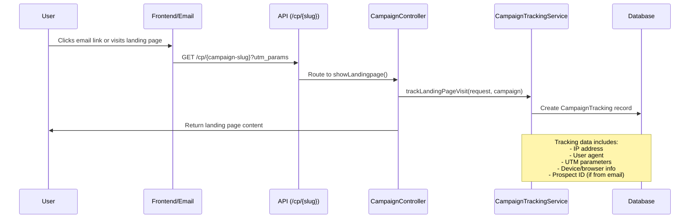

# Campaign Analytics API

## Endpoint

`GET /api/campaigns/{campaign}/analytics`

- **Example:** `/api/campaigns/686a3affca7748f6b807cbee/analytics`

## Description

Returns analytics data for a specific campaign. This endpoint provides aggregated statistics and insights about the campaign's performance, such as visits, conversions, and other tracked metrics.

## Authorization

- Requires authentication.
- User must have permission to view analytics for the specified campaign (policy: `viewAnalytics`).

## Request

- **Method:** `GET`
- **URL Params:**
  - `campaign` (string, required): The campaign's unique identifier (UUID).

## Response

- **Status:** `200 OK`
- **Content:** JSON object containing analytics data for the campaign.

## Errors

- `403 Forbidden`: If the user is not authorized to view analytics for the campaign.
- `404 Not Found`: If the campaign does not exist.

## Example Request

```
curl -X GET \
  -H "Authorization: Bearer <token>" \
  {{URL}}/api/campaigns/686a3affca7748f6b807cbee/analytics
```

## Example Response

```
{
    "campaign_overview": {
        "campaign_id": "686a3affca7748f6b807cbee",
        "campaign_title": "Ut reiciendis consequatur dolore.",
        "status": "completed",
        "start_date": "2025-08-04T13:02:20.000000Z",
        "end_date": "2025-08-18T00:20:20.000000Z"
    },
    "visits": {
        "total": 10,
        "unique_ip": 10,
        "total_unique": 10
    },
    "statistics": {
        "total_prospects_notified": 11,
        "unique_prospect_visits": 4,
        "email_cta_click_rate": 36.36
    },
    "device_browser_breakdown": {
        "device_types": {
            "desktop": 5,
            "tablet": 2,
            "mobile": 3
        },
        "browsers": {
            "Edge": 2,
            "Safari": 2,
            "Chrome": 4,
            "Firefox": 2
        },
        "operating_systems": {
            "Windows": 1,
            "Android": 3,
            "macOS": 2,
            "Linux": 1,
            "iOS": 3
        },
        "languages": {
            "it": 3,
            "en": 1,
            "fr": 2,
            "de": 4
        }
    },
    "utm_sources": {
        "source": {
            "facebook": 2,
            "google": 1,
            "direct": 3,
            "linkedin": 3,
            "twitter": 1
        },
        "medium": {
            "email": 2,
            "affiliate": 4,
            "banner": 3,
            "organic": 1
        }
    }
}
```

## Response Structure

### Campaign Overview
- `campaign_id`: The unique identifier of the campaign
- `campaign_title`: The title of the campaign
- `status`: Current status of the campaign (draft, active, paused, completed)
- `start_date`: Campaign start date in ISO format
- `end_date`: Campaign end date in ISO format

### Visits
- `total`: Total number of page visits
- `unique_ip`: Number of unique IP addresses that visited
- `total_unique`: Number of unique visitors (deduplicated by IP + user agent)

### Statistics
- `total_prospects_notified`: Total number of prospects that have been sent emails for this campaign
- `unique_prospect_visits`: Number of unique prospects who clicked through to the landing page
- `email_cta_click_rate`: Click-through rate percentage (calculated as: unique_prospect_visits / total_prospects_notified × 100)

### Device & Browser Breakdown
- `device_types`: Distribution of device types (desktop, mobile, tablet)
- `browsers`: Browser usage statistics
- `operating_systems`: Operating system distribution
- `languages`: Language preferences of visitors

### UTM Sources
- `source`: Traffic sources breakdown
- `medium`: Marketing medium breakdown

## How Analytics Data is Created

Campaign analytics are generated from tracking data that is automatically collected when users visit campaign landing pages. This section explains the data collection process and how analytics are calculated.

### Data Collection Flow



### 1. Automatic Tracking on Landing Page Visits

When a user visits a campaign landing page via `/api/cp/{identifier}`, the following tracking data is automatically collected:

#### Basic Tracking Information
```php
CampaignTracking::create([
    'campaign_id' => $campaign->id,
    'landingpage_id' => $campaign->landingpage?->id,
    'prospect_id' => $request->get('prospect'), // From email links
    'ip_address' => $request->ip(),
    'user_agent' => $request->userAgent(),
    'referrer' => $request->header('referer'),
    // UTM parameters from URL
    'utm_source' => $request->get('utm_source'),
    'utm_medium' => $request->get('utm_medium'),
    'utm_campaign' => $request->get('utm_campaign'),
    'utm_content' => $request->get('utm_content'),
    'utm_term' => $request->get('utm_term'),
    'gclid' => $request->get('gclid'), // Google Ads
    'fbclid' => $request->get('fbclid'), // Facebook Ads
    'tracking_data' => $this->extractTrackingData($request),
]);
```

#### Enhanced Tracking Data
The `tracking_data` field contains additional parsed information:
```php
[
    'language' => $request->getPreferredLanguage(),
    'timezone' => $request->header('timezone'),
    'screen_resolution' => $request->get('screen_resolution'),
    'device_type' => 'desktop|mobile|tablet', // Parsed from user agent
    'browser' => 'Chrome|Firefox|Safari|Edge|Other', // Parsed from user agent
    'os' => 'Windows|macOS|Linux|Android|iOS|Other', // Parsed from user agent
]
```

### 2. Email Campaign Tracking

When emails are sent through the campaign system, special tracking URLs are generated:

```php
// CampaignTrackingService::generateCampaignEmailUrl()
$params = [
    'prospect' => $prospect->id,
    'utm_source' => 'mail',
    'utm_medium' => 'web',
    'utm_campaign' => $campaign->title,
];

$baseUrl = config('app.spa_url');
$identifier = $campaign->slug;
$queryString = http_build_query($params);
return "{$baseUrl}/cp/{$identifier}?{$queryString}";
```

This creates URLs like: `https://app.example.com/cp/summer-sale-campaign?prospect=123&utm_source=mail&utm_medium=web&utm_campaign=Summer%20Sale`

### 3. Analytics Calculation Methods

The `CampaignAnalyticsService` processes the raw tracking data to generate meaningful analytics:

#### Visit Metrics
```php
private function getVisits(Campaign $campaign): array
{
    $totalVisits = $campaign->trackings()->count();
    $totalUniqueVisitsIP = $campaign->trackings()->distinct('ip_address')->count();
    
    // Unique visits by IP + User Agent combination
    $totalUniqueVisits = $campaign->trackings()
        ->whereNotNull('ip_address')
        ->get(['ip_address', 'user_agent'])
        ->map(fn ($tracking): string => $tracking->ip_address.'|'.($tracking->user_agent ?? 'no_user_agent'))
        ->unique()
        ->count();

    return [
        'total' => $totalVisits,
        'unique_ip' => $totalUniqueVisitsIP,
        'total_unique' => $totalUniqueVisits,
    ];
}
```

#### Campaign Performance Statistics
```php
private function getStatistics(Campaign $campaign): array
{
    // Count prospects who were sent emails for this campaign
    $totalProspectsNotified = $campaign->campaignProspects()->pluck('prospect_id')->unique()->count();
    
    // Count unique prospects who actually visited the landing page
    $uniqueProspectVisits = $campaign->trackings()->whereNotNull('prospect_id')->distinct('prospect_id')->count();
    
    // Calculate click-through rate
    $emailCtaClickRate = $uniqueProspectVisits > 0 && $totalProspectsNotified > 0 
        ? round(($uniqueProspectVisits / $totalProspectsNotified) * 100, 2) 
        : 0;

    return [
        'total_prospects_notified' => $totalProspectsNotified,
        'unique_prospect_visits' => $uniqueProspectVisits,
        'email_cta_click_rate' => $emailCtaClickRate,
    ];
}
```

#### Device and Browser Analytics
```php
private function getDeviceBrowserBreakdown(Campaign $campaign): array
{
    $trackingData = $campaign->trackings()
        ->whereNotNull('tracking_data')
        ->pluck('tracking_data');

    return [
        'device_types' => $this->createBreakdown($trackingData, 'device_type'),
        'browsers' => $this->createBreakdown($trackingData, 'browser'),
        'operating_systems' => $this->createBreakdown($trackingData, 'os'),
        'languages' => $this->createBreakdown($trackingData, 'language'),
    ];
}

private function createBreakdown(Collection $trackingData, string $key): array
{
    return $trackingData
        ->groupBy(fn ($data): string => $data[$key] ?? 'unknown')
        ->map(fn ($group): int => $group->count())
        ->toArray();
}
```

#### UTM Source Analysis
```php
private function getUtmSourceBreakdown(Campaign $campaign): array
{
    $tracking = $campaign->trackings()
        ->whereNotNull('utm_source')
        ->get();

    return [
        'source' => $tracking->groupBy('utm_source')->map(fn ($group): int => $group->count())->toArray(),
        'medium' => $tracking->groupBy('utm_medium')->map(fn ($group): int => $group->count())->toArray(),
    ];
}
```

### 4. Data Models and Relationships

#### CampaignTracking Model
The core tracking data is stored in the `campaign_trackings` collection with the following structure:

```php
/**
 * @property string $id
 * @property string|null $campaign_id
 * @property string|null $landingpage_id
 * @property string|null $prospect_id
 * @property string|null $ip_address
 * @property string|null $user_agent
 * @property string|null $referrer
 * @property string|null $utm_source
 * @property string|null $utm_medium
 * @property string|null $utm_campaign
 * @property string|null $utm_content
 * @property string|null $utm_term
 * @property string|null $gclid
 * @property string|null $fbclid
 * @property array<string, mixed> $tracking_data
 * @property \Illuminate\Support\Carbon|null $created_at
 * @property \Illuminate\Support\Carbon|null $updated_at
 */
```

#### Relationships
- `Campaign` hasMany `CampaignTracking` records
- `CampaignTracking` belongsTo `Campaign`
- `CampaignTracking` belongsTo `Landingpage`
- `CampaignTracking` belongsTo `Prospect` (when visit comes from email)

### 5. User Agent Parsing

The system automatically parses user agents to extract device and browser information:

```php
// Device type detection
private function detectDeviceType(?string $userAgent): ?string
{
    if (preg_match('/Mobile|Android|iPhone|iPad/', $userAgent)) {
        return 'mobile';
    }
    if (preg_match('/Tablet|iPad/', $userAgent)) {
        return 'tablet';
    }
    return 'desktop';
}

// Browser detection
private function detectBrowser(?string $userAgent): ?string
{
    if (preg_match('/Chrome/', $userAgent)) return 'Chrome';
    if (preg_match('/Firefox/', $userAgent)) return 'Firefox';
    if (preg_match('/Safari/', $userAgent)) return 'Safari';
    if (preg_match('/Edge/', $userAgent)) return 'Edge';
    return 'Other';
}

// Operating system detection
private function detectOS(?string $userAgent): ?string
{
    if (preg_match('/Windows/', $userAgent)) return 'Windows';
    if (preg_match('/Mac/', $userAgent)) return 'macOS';
    if (preg_match('/Linux/', $userAgent)) return 'Linux';
    if (preg_match('/Android/', $userAgent)) return 'Android';
    if (preg_match('/iOS/', $userAgent)) return 'iOS';
    return 'Other';
}
```

### 6. Privacy and Data Handling

- **IP Address Storage**: IP addresses are stored for uniqueness calculations but should be handled according to privacy regulations
- **User Agent Storage**: Full user agents are stored for detailed device/browser analysis
- **Prospect Tracking**: Only linked to prospects when visits come from authenticated email links
- **UTM Parameter Preservation**: All UTM parameters are preserved for marketing attribution analysis

### 7. Performance Considerations

- Analytics calculations are performed on-demand when the analytics endpoint is accessed
- For high-traffic campaigns, consider implementing caching for analytics data
- The unique visitor calculation uses IP + User Agent combination which provides a reasonable balance between accuracy and privacy
- Database indexes on `campaign_id`, `prospect_id`, and tracking timestamps can improve query performance

### 8. Data Retention

Consider implementing data retention policies for tracking data:
- Keep detailed tracking data for active analysis periods
- Aggregate older data to preserve trends while reducing storage
- Comply with privacy regulations regarding data retention periods