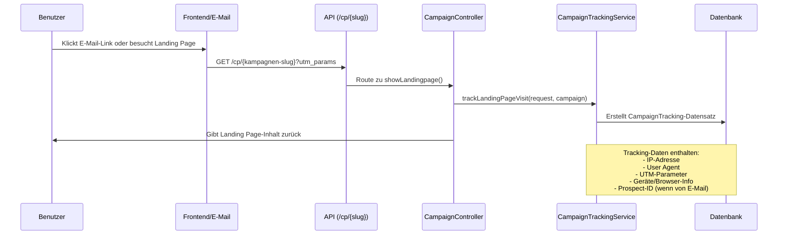

# Kampagnen-Analytics API

## Endpunkt

`GET /api/campaigns/{campaign}/analytics`

- **Beispiel:** `/api/campaigns/686a3affca7748f6b807cbee/analytics`

## Beschreibung

Gibt Analytics-Daten für eine spezifische Kampagne zurück. Dieser Endpunkt stellt aggregierte Statistiken und Einblicke in die Kampagnen-Performance bereit, wie Besuche, Konversionen und andere verfolgte Metriken.

## Autorisierung

- Erfordert Authentifizierung.
- Benutzer muss die Berechtigung haben, Analytics für die angegebene Kampagne einzusehen (Policy: `viewAnalytics`).

## Anfrage

- **Methode:** `GET`
- **URL-Parameter:**
  - `campaign` (string, erforderlich): Der eindeutige Identifier der Kampagne (UUID).

## Antwort

- **Status:** `200 OK`
- **Inhalt:** JSON-Objekt mit Analytics-Daten für die Kampagne.

## Fehler

- `403 Forbidden`: Wenn der Benutzer nicht autorisiert ist, Analytics für die Kampagne einzusehen.
- `404 Not Found`: Wenn die Kampagne nicht existiert.

## Beispiel-Anfrage

```bash
curl -X GET \
  -H "Authorization: Bearer <token>" \
  {{URL}}/api/campaigns/686a3affca7748f6b807cbee/analytics
```

## Beispiel-Antwort

```json
{
    "campaign_overview": {
        "campaign_id": "686a3affca7748f6b807cbee",
        "campaign_title": "Ut reiciendis consequatur dolore.",
        "status": "completed",
        "start_date": "2025-08-04T13:02:20.000000Z",
        "end_date": "2025-08-18T00:20:20.000000Z"
    },
    "visits": {
        "total": 10,
        "unique_ip": 10,
        "total_unique": 10
    },
    "statistics": {
        "total_prospects_notified": 11,
        "unique_prospect_visits": 4,
        "email_cta_click_rate": 36.36
    },
    "device_browser_breakdown": {
        "device_types": {
            "desktop": 5,
            "tablet": 2,
            "mobile": 3
        },
        "browsers": {
            "Edge": 2,
            "Safari": 2,
            "Chrome": 4,
            "Firefox": 2
        },
        "operating_systems": {
            "Windows": 1,
            "Android": 3,
            "macOS": 2,
            "Linux": 1,
            "iOS": 3
        },
        "languages": {
            "it": 3,
            "en": 1,
            "fr": 2,
            "de": 4
        }
    },
    "utm_sources": {
        "source": {
            "facebook": 2,
            "google": 1,
            "direct": 3,
            "linkedin": 3,
            "twitter": 1
        },
        "medium": {
            "email": 2,
            "affiliate": 4,
            "banner": 3,
            "organic": 1
        }
    }
}
```

## Antwort-Struktur

### Kampagnen-Übersicht
- `campaign_id`: Der eindeutige Identifier der Kampagne
- `campaign_title`: Der Titel der Kampagne
- `status`: Aktueller Status der Kampagne (draft, active, paused, completed)
- `start_date`: Kampagnen-Startdatum im ISO-Format
- `end_date`: Kampagnen-Enddatum im ISO-Format

### Besuche
- `total`: Gesamtanzahl der Seitenbesuche
- `unique_ip`: Anzahl der eindeutigen IP-Adressen, die besucht haben
- `total_unique`: Anzahl der eindeutigen Besucher (dedupliziert durch IP + User Agent)

### Statistiken
- `total_prospects_notified`: Gesamtanzahl der Prospects, die E-Mails für diese Kampagne erhalten haben
- `unique_prospect_visits`: Anzahl der eindeutigen Prospects, die zur Landing Page durchgeklickt haben
- `email_cta_click_rate`: Click-Through-Rate in Prozent (berechnet als: unique_prospect_visits / total_prospects_notified × 100)

### Geräte- & Browser-Aufschlüsselung
- `device_types`: Verteilung der Gerätetypen (desktop, mobile, tablet)
- `browsers`: Browser-Nutzungsstatistiken
- `operating_systems`: Betriebssystem-Verteilung
- `languages`: Sprachpräferenzen der Besucher

### UTM-Quellen
- `source`: Traffic-Quellen-Aufschlüsselung
- `medium`: Marketing-Medium-Aufschlüsselung

## Wie Analytics-Daten erstellt werden

Kampagnen-Analytics werden aus Tracking-Daten generiert, die automatisch gesammelt werden, wenn Benutzer Kampagnen-Landing Pages besuchen. Dieser Abschnitt erklärt den Datensammlungsprozess und wie Analytics berechnet werden.

### Datensammlungsablauf



### 1. Automatisches Tracking bei Landing Page-Besuchen

Wenn ein Benutzer eine Kampagnen-Landing Page über `/api/cp/{identifier}` besucht, werden automatisch folgende Tracking-Daten gesammelt:

#### Grundlegende Tracking-Informationen
```php
CampaignTracking::create([
    'campaign_id' => $campaign->id,
    'landingpage_id' => $campaign->landingpage?->id,
    'prospect_id' => $request->get('prospect'), // Von E-Mail-Links
    'ip_address' => $request->ip(),
    'user_agent' => $request->userAgent(),
    'referrer' => $request->header('referer'),
    // UTM-Parameter aus URL
    'utm_source' => $request->get('utm_source'),
    'utm_medium' => $request->get('utm_medium'),
    'utm_campaign' => $request->get('utm_campaign'),
    'utm_content' => $request->get('utm_content'),
    'utm_term' => $request->get('utm_term'),
    'gclid' => $request->get('gclid'), // Google Ads
    'fbclid' => $request->get('fbclid'), // Facebook Ads
    'tracking_data' => $this->extractTrackingData($request),
]);
```

#### Erweiterte Tracking-Daten
Das `tracking_data`-Feld enthält zusätzliche geparste Informationen:
```php
[
    'language' => $request->getPreferredLanguage(),
    'timezone' => $request->header('timezone'),
    'screen_resolution' => $request->get('screen_resolution'),
    'device_type' => 'desktop|mobile|tablet', // Geparst aus User Agent
    'browser' => 'Chrome|Firefox|Safari|Edge|Other', // Geparst aus User Agent
    'os' => 'Windows|macOS|Linux|Android|iOS|Other', // Geparst aus User Agent
]
```

### 2. E-Mail-Kampagnen-Tracking

Wenn E-Mails über das Kampagnensystem gesendet werden, werden spezielle Tracking-URLs generiert:

```php
// CampaignTrackingService::generateCampaignEmailUrl()
$params = [
    'prospect' => $prospect->id,
    'utm_source' => 'mail',
    'utm_medium' => 'web',
    'utm_campaign' => $campaign->title,
];

$baseUrl = config()->string('app.spa_url');
$identifier = $campaign->slug;
$queryString = http_build_query($params);
return "{$baseUrl}/cp/{$identifier}?{$queryString}";
```

Dies erstellt URLs wie: `https://app.example.com/cp/summer-sale-campaign?prospect=123&utm_source=mail&utm_medium=web&utm_campaign=Summer%20Sale`

### 3. Analytics-Berechnungsmethoden

Der `CampaignAnalyticsService` verarbeitet die Roh-Tracking-Daten, um aussagekräftige Analytics zu generieren:

#### Besuchs-Metriken
```php
private function getVisits(Campaign $campaign): array
{
    $totalVisits = $campaign->trackings()->count();
    $totalUniqueVisitsIP = $campaign->trackings()->distinct('ip_address')->count();

    // Eindeutige Besuche nach IP + User Agent-Kombination
    $totalUniqueVisits = $campaign->trackings()
        ->whereNotNull('ip_address')
        ->get(['ip_address', 'user_agent'])
        ->map(fn ($tracking): string => $tracking->ip_address.'|'.($tracking->user_agent ?? 'no_user_agent'))
        ->unique()
        ->count();

    return [
        'total' => $totalVisits,
        'unique_ip' => $totalUniqueVisitsIP,
        'total_unique' => $totalUniqueVisits,
    ];
}
```

#### Kampagnen-Performance-Statistiken
```php
private function getStatistics(Campaign $campaign): array
{
    // Zähle Prospects, die E-Mails für diese Kampagne erhalten haben
    $totalProspectsNotified = $campaign->campaignProspects()->pluck('prospect_id')->unique()->count();

    // Zähle eindeutige Prospects, die tatsächlich die Landing Page besucht haben
    $uniqueProspectVisits = $campaign->trackings()->whereNotNull('prospect_id')->distinct('prospect_id')->count();

    // Berechne Click-Through-Rate
    $emailCtaClickRate = $uniqueProspectVisits > 0 && $totalProspectsNotified > 0
        ? round(($uniqueProspectVisits / $totalProspectsNotified) * 100, 2)
        : 0;

    return [
        'total_prospects_notified' => $totalProspectsNotified,
        'unique_prospect_visits' => $uniqueProspectVisits,
        'email_cta_click_rate' => $emailCtaClickRate,
    ];
}
```

#### Geräte- und Browser-Analytics
```php
private function getDeviceBrowserBreakdown(Campaign $campaign): array
{
    $trackingData = $campaign->trackings()
        ->whereNotNull('tracking_data')
        ->pluck('tracking_data');

    return [
        'device_types' => $this->createBreakdown($trackingData, 'device_type'),
        'browsers' => $this->createBreakdown($trackingData, 'browser'),
        'operating_systems' => $this->createBreakdown($trackingData, 'os'),
        'languages' => $this->createBreakdown($trackingData, 'language'),
    ];
}

private function createBreakdown(Collection $trackingData, string $key): array
{
    return $trackingData
        ->groupBy(fn ($data): string => $data[$key] ?? 'unknown')
        ->map(fn ($group): int => $group->count())
        ->toArray();
}
```

#### UTM-Quellen-Analyse
```php
private function getUtmSourceBreakdown(Campaign $campaign): array
{
    $tracking = $campaign->trackings()
        ->whereNotNull('utm_source')
        ->get();

    return [
        'source' => $tracking->groupBy('utm_source')->map(fn ($group): int => $group->count())->toArray(),
        'medium' => $tracking->groupBy('utm_medium')->map(fn ($group): int => $group->count())->toArray(),
    ];
}
```

### 4. Datenmodelle und Beziehungen

#### CampaignTracking-Modell
Die Kern-Tracking-Daten werden in der `campaign_trackings`-Collection mit folgender Struktur gespeichert:

```php
/**
 * @property string $id
 * @property string|null $campaign_id
 * @property string|null $landingpage_id
 * @property string|null $prospect_id
 * @property string|null $ip_address
 * @property string|null $user_agent
 * @property string|null $referrer
 * @property string|null $utm_source
 * @property string|null $utm_medium
 * @property string|null $utm_campaign
 * @property string|null $utm_content
 * @property string|null $utm_term
 * @property string|null $gclid
 * @property string|null $fbclid
 * @property array<string, mixed> $tracking_data
 * @property \Illuminate\Support\Carbon|null $created_at
 * @property \Illuminate\Support\Carbon|null $updated_at
 */
```

#### Beziehungen
- `Campaign` hasMany `CampaignTracking`-Datensätze
- `CampaignTracking` belongsTo `Campaign`
- `CampaignTracking` belongsTo `Landingpage`
- `CampaignTracking` belongsTo `Prospect` (wenn Besuch von E-Mail kommt)

### 5. User-Agent-Parsing

Das System parst automatisch User Agents, um Geräte- und Browser-Informationen zu extrahieren:

```php
// Gerätetyp-Erkennung
private function detectDeviceType(?string $userAgent): ?string
{
    if ($userAgent === null || $userAgent === '' || $userAgent === '0') {
        return null;
    }

    if (preg_match('/Mobile|Android|iPhone|iPad/', $userAgent)) {
        return 'mobile';
    }

    if (preg_match('/Tablet|iPad/', $userAgent)) {
        return 'tablet';
    }

    return 'desktop';
}

// Browser-Erkennung
private function detectBrowser(?string $userAgent): ?string
{
    if ($userAgent === null || $userAgent === '' || $userAgent === '0') {
        return null;
    }

    if (preg_match('/Chrome/', $userAgent)) return 'Chrome';
    if (preg_match('/Firefox/', $userAgent)) return 'Firefox';
    if (preg_match('/Safari/', $userAgent)) return 'Safari';
    if (preg_match('/Edge/', $userAgent)) return 'Edge';
    return 'Other';
}

// Betriebssystem-Erkennung
private function detectOS(?string $userAgent): ?string
{
    if ($userAgent === null || $userAgent === '' || $userAgent === '0') {
        return null;
    }

    if (preg_match('/Windows/', $userAgent)) return 'Windows';
    if (preg_match('/Mac/', $userAgent)) return 'macOS';
    if (preg_match('/Linux/', $userAgent)) return 'Linux';
    if (preg_match('/Android/', $userAgent)) return 'Android';
    if (preg_match('/iOS/', $userAgent)) return 'iOS';
    return 'Other';
}
```

### 6. Datenschutz und Datenbehandlung

- **IP-Adressen-Speicherung**: IP-Adressen werden für Eindeutigkeitsberechnungen gespeichert, sollten aber gemäß Datenschutzbestimmungen behandelt werden
- **User-Agent-Speicherung**: Vollständige User Agents werden für detaillierte Geräte-/Browser-Analyse gespeichert
- **Prospect-Tracking**: Nur verknüpft mit Prospects, wenn Besuche von authentifizierten E-Mail-Links kommen
- **UTM-Parameter-Bewahrung**: Alle UTM-Parameter werden für Marketing-Attributionsanalyse bewahrt

### 7. Performance-Überlegungen

- Analytics-Berechnungen werden on-demand durchgeführt, wenn der Analytics-Endpunkt aufgerufen wird
- Für hochfrequentierte Kampagnen sollte Caching für Analytics-Daten in Betracht gezogen werden
- Die Eindeutige-Besucher-Berechnung verwendet IP + User Agent-Kombination, was ein vernünftiges Gleichgewicht zwischen Genauigkeit und Datenschutz bietet
- Datenbank-Indizes auf `campaign_id`, `prospect_id` und Tracking-Zeitstempel können die Query-Performance verbessern

### 8. Datenaufbewahrung

Überlegungen zur Implementierung von Datenaufbewahrungsrichtlinien für Tracking-Daten:
- Detaillierte Tracking-Daten für aktive Analysezeiträume aufbewahren
- Ältere Daten aggregieren, um Trends zu bewahren und gleichzeitig den Speicherplatz zu reduzieren
- Datenschutzbestimmungen bezüglich Datenaufbewahrungszeiten einhalten

## Implementierungsdetails

### Kernkomponenten für Analytics

1. **CampaignAnalyticsController** (`app/Http/Controllers/Api/CampaignAnalyticsController.php`)
   - **Analytics-Endpunkt:** `GET /api/campaigns/{campaign}/analytics`
   - **Autorisierung:** Gate::authorize('viewAnalytics', $campaign)
   - **Funktionalität:** Delegiert an CampaignAnalyticsService für umfassende Analytics

2. **CampaignAnalyticsService** (`app/Services/CampaignAnalyticsService.php`)
   - **Hauptmethode:** `getAnalyticsData()` - Orchestriert alle Analytics-Berechnungen
   - **Besuchs-Analytics:** Berechnet total, unique_ip und total_unique Besuche
   - **Performance-Statistiken:** E-Mail-CTR, Prospect-Besuche, Benachrichtigungen
   - **Geräte-Breakdown:** Analysiert tracking_data für Geräte, Browser, OS
   - **UTM-Analyse:** Gruppiert Traffic nach Quellen und Medien

3. **CampaignTrackingService** (`app/Services/CampaignTrackingService.php`)
   - **URL-Generierung:** `generateCampaignEmailUrl()` mit automatischen UTM-Parametern
   - **Besuchs-Tracking:** `trackLandingPageVisit()` sammelt alle relevanten Daten
   - **User-Agent-Parsing:** Automatische Erkennung von Geräte, Browser und OS
   - **Erweiterte Daten:** Extrahiert Sprache, Timezone, Screen Resolution

4. **CampaignTracking-Modell** (`app/Models/CampaignTracking.php`)
   - **MongoDB-Collection:** Speichert alle Tracking-Events
   - **Relationships:** BelongsTo Campaign, Landingpage, Prospect
   - **UTM-Helper:** `getUtmParameters()` für strukturierte UTM-Daten
   - **Datenfelder:** IP, User Agent, UTM-Parameter, Tracking-Metadaten

5. **CampaignController** (`app/Http/Controllers/Api/CampaignController.php`)
   - **Landing Page-Route:** `showLandingpage()` triggert automatisches Tracking
   - **Kampagnen-Validierung:** Prüft ACTIVE-Status und Datumsbereich
   - **Tracking-Integration:** Ruft CampaignTrackingService für jeden Besuch auf