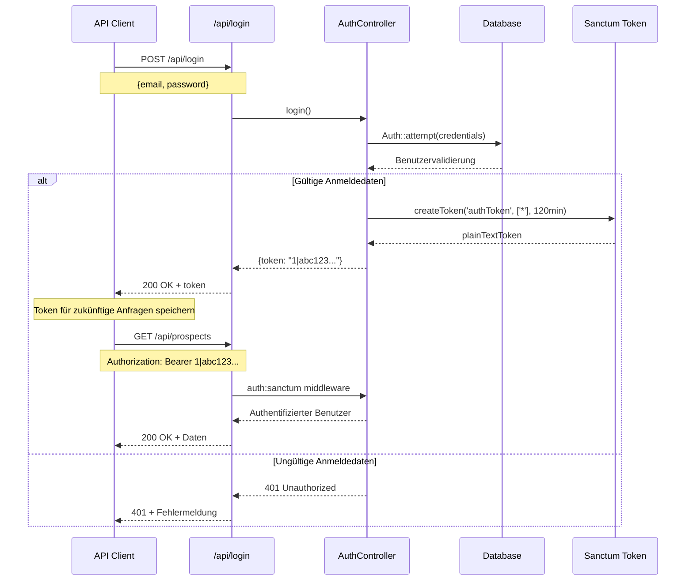
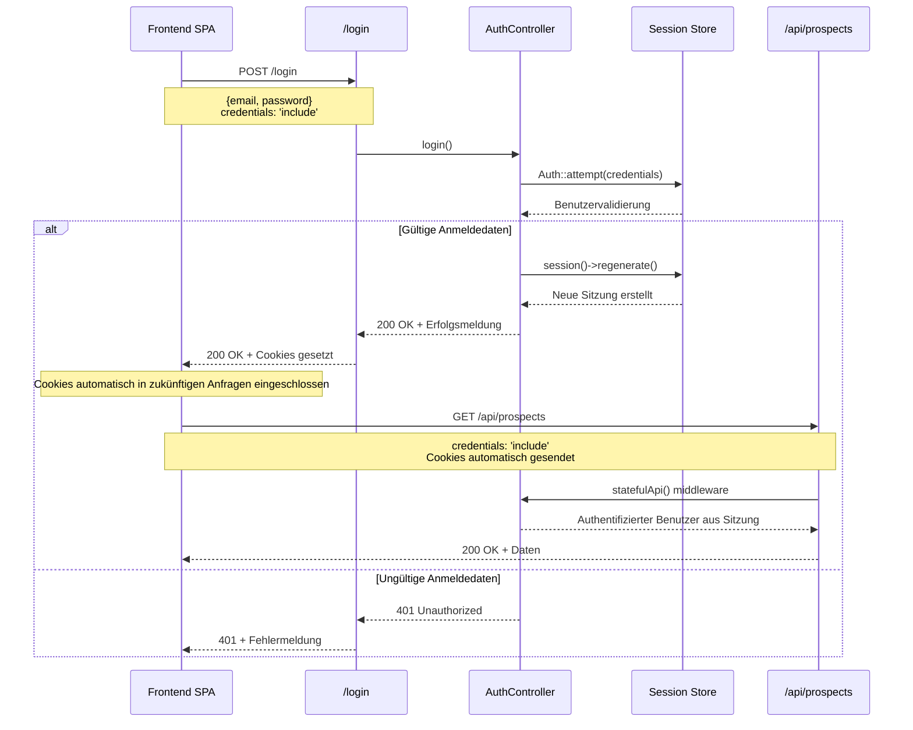

# Authentifizierungs-Dokumentation

Diese Dokumentation beschreibt das Authentifizierungssystem der APDE Backend-Anwendung, das sowohl token-basierte als auch cookie-/sitzungsbasierte Authentifizierungsmethoden unterstützt.

## Überblick

Die Anwendung verwendet Laravel Sanctum für die API-Authentifizierung und unterstützt zwei Authentifizierungsmethoden:
1. **Token-basierte Authentifizierung** - Für traditionelle API-Clients
2. **Cookie-/Sitzungsbasierte Authentifizierung** - Für Single Page Applications (SPAs)

## Authentifizierungs-Flows

### Token-basierter Authentifizierungs-Flow



### Cookie-/Sitzungsbasierter Authentifizierungs-Flow



## Konfiguration

### Sanctum Konfiguration

Die Anwendung ist konfiguriert, um stateful API-Authentifizierung für SPAs zu unterstützen. Dies wird in `bootstrap/app.php` konfiguriert:

```php
$middleware->statefulApi();
```

Diese Konfiguration ermöglicht es, dass cookie-/sitzungsbasierte Authentifizierung mit `/api`-Endpunkten funktioniert, was für SPA-Anwendungen essentiell ist, die den Authentifizierungsstatus über Anfragen hinweg beibehalten müssen.

### Sanctum Einstellungen

Wichtige Konfiguration in `config/sanctum.php`:

- **Stateful Domains**: Konfiguriert für stateful Authentifizierung von localhost und Entwicklungsdomänen
- **Guard**: Verwendet den 'web' Guard für sitzungsbasierte Authentifizierung
- **Token Expiration**: Auf `null` gesetzt (standardmässig kein Ablauf)
- **Middleware**: Beinhaltet Sitzungsauthentifizierung, Cookie-Verschlüsselung und CSRF-Validierung

## Authentifizierungsmethoden

### 1. Token-basierte Authentifizierung

#### Login-Endpunkt
- **URL**: `POST /api/login`
- **Controller**: `App\Http\Controllers\Api\AuthController`
- **Methode**: `login()`

**Request Body:**
```json
{
    "email": "user@example.com",
    "password": "password"
}
```

**Response:**
```json
{
    "token": "1|abc123def456..."
}
```

**Implementierungsdetails:**
- Verwendet `Auth::attempt()` zur Validierung der Anmeldedaten
- Erstellt einen Sanctum-Token mit allen Fähigkeiten (`*`)
- Token läuft in 120 Minuten ab
- Gibt den Klartext-Token für API-Clients zurück

#### Token verwenden
Token im Authorization-Header einschliessen:
```
Authorization: Bearer 1|abc123def456...
```

#### User-Endpunkt
- **URL**: `GET /api/user`
- **Authentication**: Erforderlich (Bearer token)
- **Controller**: `App\Http\Controllers\Api\AuthController`
- **Methode**: `user()`

**Response:**
```json
{
    "id": "507f1f77bcf86cd799439011",
    "name": "John Doe",
    "email": "user@example.com",
    "created_at": "2023-01-01T00:00:00.000000Z",
    "updated_at": "2023-01-01T00:00:00.000000Z"
}
```

#### Logout-Endpunkt
- **URL**: `POST /api/logout`
- **Authentication**: Erforderlich (Bearer token)
- **Controller**: `App\Http\Controllers\Api\AuthController`
- **Methode**: `logout()`

**Response:**
```json
{
    "message": "Logged out successfully"
}
```

**Implementierungsdetails:**
- Löscht das aktuelle Access-Token
- Benötigt Authentifizierungs-Middleware (`auth:sanctum`)

### 2. Cookie-/Sitzungsbasierte Authentifizierung

#### Login-Endpunkt
- **URL**: `POST /login`
- **Controller**: `App\Http\Controllers\AuthController`
- **Methode**: `login()`

**Request Body:**
```json
{
    "email": "user@example.com",
    "password": "password"
}
```

**Response:**
```json
{
    "message": "Logged in successfully"
}
```

**Implementierungsdetails:**
- Verwendet `Auth::attempt()` zur Validierung der Anmeldedaten
- Regeneriert Sitzung aus Sicherheitsgründen
- Setzt Authentifizierungs-Cookies automatisch
- Funktioniert sowohl mit web- als auch API-Routen aufgrund der `statefulApi()`-Konfiguration

#### Logout-Endpunkt
- **URL**: `POST /logout`
- **Authentication**: Erforderlich (Sitzung)
- **Controller**: `App\Http\Controllers\AuthController`
- **Methode**: `logout()`

**Response:**
```json
{
    "message": "Logged out successfully"
}
```

**Implementierungsdetails:**
- Meldet den Benutzer ab
- Invalidiert und regeneriert Sitzung
- Löscht Authentifizierungs-Cookies

## Geschützte Routen

### API-Routen (Token-basiert)
Alle API-Routen sind mit der `auth:sanctum`-Middleware geschützt:

```php
Route::middleware(['auth:sanctum'])->group(function () {
    Route::get('/user', [AuthController::class, 'user']);
    Route::post('/logout', [AuthController::class, 'logout']);
    Route::get('/{model}/filter', [GenericFilterController::class, 'filter']);
    Route::get('/{model}/search-criteria', [GenericFilterController::class, 'searchCriteria']);
    Route::apiResource('prospects', ProspectController::class)->only(['index', 'show']);
    Route::apiResource('campaigns', CampaignController::class);
    Route::apiResource('landingpages', LandingpageController::class);
    Route::get('/campaigns/{campaign}/analytics', [CampaignAnalyticsController::class, 'show']);
    Route::get('/campaigns/{campaign}/send-emails/sent', [CampaignAnalyticsController::class, 'emailStatistics']);
    Route::post('/campaigns/{campaign}/send-emails', [CampaignEmailController::class, 'send']);
});
```

### Web-Routen (Sitzungsbasiert)
Web-Routen sind mit der `web`- und `auth`-Middleware geschützt:

```php
Route::middleware(['web', 'auth'])->group(function () {
    Route::post('/logout', [AuthController::class, 'logout']);
    Route::get('/cp-cookie', function () {
        return App\Models\Campaign::all();
    });
});
```

## Token-Fähigkeiten

Die Anwendung unterstützt Token-Fähigkeiten für granulare Zugriffskontrolle:

### Beispiel: CP-Cookie-Endpunkt
```php
Route::get('/cp-cookie', function () {
    return response()->json(App\Models\Campaign::all());
})->middleware(['abilities:view-cp']);
```

Dieser Endpunkt benötigt einen Token mit der `view-cp`-Fähigkeit oder der globalen `*`-Fähigkeit.

## Models

### User Model
- **Standort**: `app/Models/User.php`
- **Traits**: Verwendet `HasApiTokens` für Sanctum-Funktionalität
- **Datenbank**: MongoDB (erweitert `MongoDB\Laravel\Auth\User`)
- **Versteckte Felder**: `password`, `remember_token`

### Personal Access Token Model
- **Standort**: `app/Models/PersonalAccessToken.php`
- **Datenbank**: MongoDB
- **Schlüsseltyp**: String (MongoDB ObjectId)

## SPA-Konfiguration

Die `statefulApi()`-Middleware-Konfiguration in `bootstrap/app.php` ist entscheidend für SPA-Anwendungen:

- Ermöglicht, dass Cookie-/Sitzungsauthentifizierung mit `/api`-Endpunkten funktioniert
- Ermöglicht nahtlose Authentifizierung für Frontend-Anwendungen
- Behält Sitzungsstatus über API-Anfragen hinweg bei
- Unterstützt beide Authentifizierungsmethoden gleichzeitig

## Sicherheitsfeatures

1. **Sitzungsregeneration**: Sitzungen werden beim Login regeneriert, um Session-Fixation-Angriffe zu verhindern
2. **CSRF-Schutz**: Aktiviert für stateful Authentifizierung
3. **Cookie-Verschlüsselung**: Alle Cookies sind verschlüsselt
4. **Token-Ablauf**: Konfigurierbare Token-Ablaufzeit (Standard: 120 Minuten)
5. **Fähigkeitsbasierter Zugriff**: Feinabgestimmte Berechtigungen durch Token-Fähigkeiten

## Fehler-Responses

### Authentifizierungsfehler
```json
{
    "message": "Invalid login credentials"
}
```
**Status Code**: 401

### Validierungsfehler
```json
{
    "message": "The given data was invalid.",
    "errors": {
        "email": ["The email field is required."],
        "password": ["The password field is required."]
    }
}
```
**Status Code**: 422

## Verwendungsbeispiele

### Frontend SPA (Sitzungsbasiert)
```javascript
// Login
const response = await fetch('/login', {
    method: 'POST',
    headers: {
        'Content-Type': 'application/json',
        'Accept': 'application/json',
    },
    credentials: 'include', // Wichtig für Cookies
    body: JSON.stringify({
        email: 'user@example.com',
        password: 'password'
    })
});

// API-Aufrufe (Cookies automatisch eingeschlossen)
const data = await fetch('/api/prospects', {
    credentials: 'include'
});
```

### API Client (Token-basiert)
```javascript
// Login
const response = await fetch('/api/login', {
    method: 'POST',
    headers: {
        'Content-Type': 'application/json',
        'Accept': 'application/json',
    },
    body: JSON.stringify({
        email: 'user@example.com',
        password: 'password'
    })
});

const { token } = await response.json();

// API-Aufrufe mit Token
const data = await fetch('/api/prospects', {
    headers: {
        'Authorization': `Bearer ${token}`,
        'Accept': 'application/json',
    }
});

// Benutzerinformationen abrufen
const userResponse = await fetch('/api/user', {
    headers: {
        'Authorization': `Bearer ${token}`,
        'Accept': 'application/json',
    }
});
const user = await userResponse.json();
```

## Umgebungsvariablen

Die folgenden Umgebungsvariablen können konfiguriert werden:

- `SANCTUM_STATEFUL_DOMAINS`: Kommagetrennte Liste von Domains für stateful Authentifizierung
- `SANCTUM_TOKEN_PREFIX`: Präfix für generierte Token
- `AUTH_GUARD`: Standard-Authentifizierungs-Guard (Standard: 'web')
- `AUTH_MODEL`: User-Model-Klasse (Standard: 'App\Models\User')