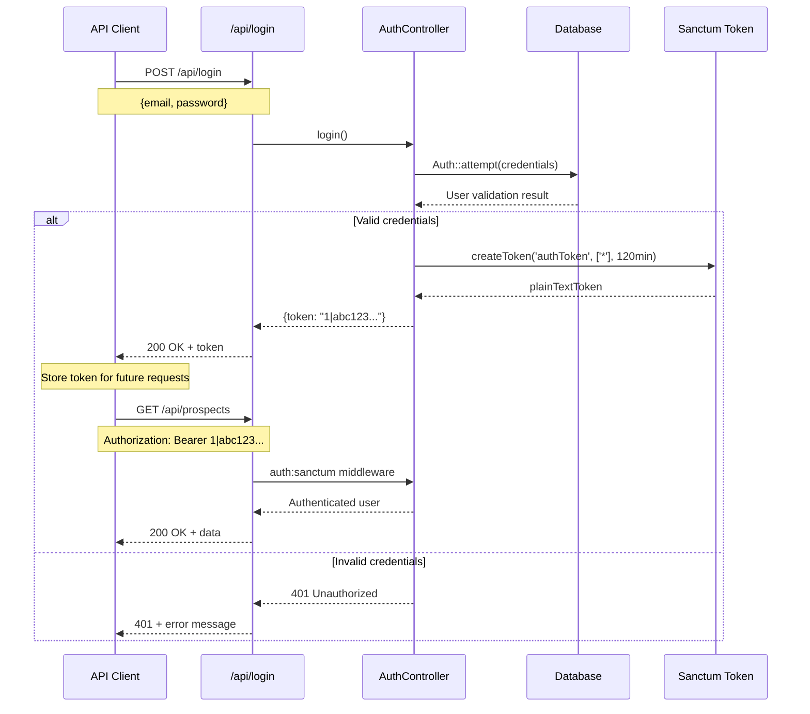
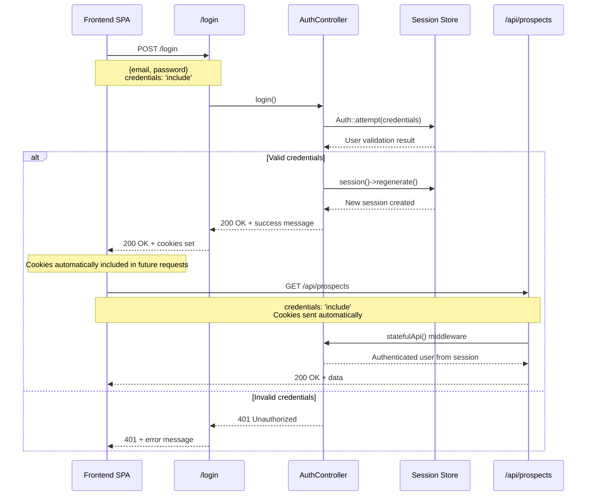

# Authentication Documentation

This document describes the authentication system implemented in the APDE backend application, which supports both token-based and cookie/session-based authentication methods.

## Overview

The application uses Laravel Sanctum for API authentication, supporting two authentication methods:
1. **Token-based authentication** - For traditional API clients
2. **Cookie/Session-based authentication** - For Single Page Applications (SPAs)

## Authentication Flows

### Token-Based Authentication Flow



### Cookie/Session-Based Authentication Flow



## Configuration

### Sanctum Configuration

The application is configured to support stateful API authentication for SPAs. This is configured in `bootstrap/app.php`:

```php
$middleware->statefulApi();
```

This configuration allows cookie/session-based authentication to work with `/api` endpoints, which is essential for SPA applications that need to maintain authentication state across requests.

### Sanctum Settings

Key configuration in `config/sanctum.php`:

- **Stateful Domains**: Configured to allow stateful authentication from localhost and development domains
- **Guard**: Uses the 'web' guard for session-based authentication
- **Token Expiration**: Set to `null` (no expiration by default)
- **Middleware**: Includes session authentication, cookie encryption, and CSRF validation

## Authentication Methods

### 1. Token-Based Authentication

#### Login Endpoint
- **URL**: `POST /api/login`
- **Controller**: `App\Http\Controllers\Api\AuthController`
- **Method**: `login()`

**Request Body:**
```json
{
    "email": "user@example.com",
    "password": "password"
}
```

**Response:**
```json
{
    "token": "1|abc123def456..."
}
```

**Implementation Details:**
- Uses `Auth::attempt()` to validate credentials
- Creates a Sanctum token with all abilities (`*`)
- Token expires in 120 minutes
- Returns the plain text token for API clients

#### Using the Token
Include the token in the Authorization header:
```
Authorization: Bearer 1|abc123def456...
```

#### Logout Endpoint
- **URL**: `POST /api/logout`
- **Authentication**: Required (Bearer token)
- **Controller**: `App\Http\Controllers\Api\AuthController`
- **Method**: `logout()`

**Response:**
```json
{
    "message": "Logged out successfully"
}
```

**Implementation Details:**
- Deletes the current access token
- Requires authentication middleware (`auth:sanctum`)

### 2. Cookie/Session-Based Authentication

#### Login Endpoint
- **URL**: `POST /login`
- **Controller**: `App\Http\Controllers\AuthController`
- **Method**: `login()`

**Request Body:**
```json
{
    "email": "user@example.com",
    "password": "password"
}
```

**Response:**
```json
{
    "message": "Logged in successfully"
}
```

**Implementation Details:**
- Uses `Auth::attempt()` to validate credentials
- Regenerates session for security
- Sets authentication cookies automatically
- Works with both web and API routes due to `statefulApi()` configuration

#### Logout Endpoint
- **URL**: `POST /logout`
- **Authentication**: Required (session)
- **Controller**: `App\Http\Controllers\AuthController`
- **Method**: `logout()`

**Response:**
```json
{
    "message": "Logged out successfully"
}
```

**Implementation Details:**
- Logs out the user
- Invalidates and regenerates session
- Clears authentication cookies

## Protected Routes

### API Routes (Token-based)
All API routes are protected with the `auth:sanctum` middleware:

```php
Route::middleware(['auth:sanctum'])->group(function () {
    Route::post('/logout', [AuthController::class, 'logout']);
    Route::get('/{model}/filter', [GenericFilterController::class, 'filter']);
    Route::get('/{model}/search-criteria', [GenericFilterController::class, 'searchCriteria']);
    Route::apiResource('prospects', ProspectController::class)->only(['index', 'show']);
});
```

### Web Routes (Session-based)
Web routes are protected with the `web` and `auth` middleware:

```php
Route::middleware(['web', 'auth'])->group(function () {
    Route::post('/logout', [AuthController::class, 'logout']);
    Route::get('/cp-cookie', function () {
        return App\Models\Campaign::all();
    });
});
```

## Token Abilities

The application supports token abilities for fine-grained access control:

### Example: CP-Cookie Endpoint
```php
Route::get('/cp-cookie', function () {
    return response()->json(App\Models\Campaign::all());
})->middleware(['abilities:view-cp']);
```

This endpoint requires a token with the `view-cp` ability or the global `*` ability.

## Models

### User Model
- **Location**: `app/Models/User.php`
- **Traits**: Uses `HasApiTokens` for Sanctum functionality
- **Database**: MongoDB (extends `MongoDB\Laravel\Auth\User`)
- **Hidden Fields**: `password`, `remember_token`

### Personal Access Token Model
- **Location**: `app/Models/PersonalAccessToken.php`
- **Database**: MongoDB
- **Key Type**: String (MongoDB ObjectId)

## SPA Configuration

The `statefulApi()` middleware configuration in `bootstrap/app.php` is crucial for SPA applications:

- Allows cookie/session authentication to work with `/api` endpoints
- Enables seamless authentication for frontend applications
- Maintains session state across API requests
- Supports both authentication methods simultaneously

## Security Features

1. **Session Regeneration**: Sessions are regenerated on login to prevent session fixation attacks
2. **CSRF Protection**: Enabled for stateful authentication
3. **Cookie Encryption**: All cookies are encrypted
4. **Token Expiration**: Configurable token expiration (default: 120 minutes)
5. **Ability-based Access**: Fine-grained permissions through token abilities

## Error Responses

### Authentication Errors
```json
{
    "message": "Invalid login credentials"
}
```
**Status Code**: 401

### Validation Errors
```json
{
    "message": "The given data was invalid.",
    "errors": {
        "email": ["The email field is required."],
        "password": ["The password field is required."]
    }
}
```
**Status Code**: 422

## Usage Examples

### Frontend SPA (Session-based)
```javascript
// Login
const response = await fetch('/login', {
    method: 'POST',
    headers: {
        'Content-Type': 'application/json',
        'Accept': 'application/json',
    },
    credentials: 'include', // Important for cookies
    body: JSON.stringify({
        email: 'user@example.com',
        password: 'password'
    })
});

// API calls (cookies automatically included)
const data = await fetch('/api/prospects', {
    credentials: 'include'
});
```

### API Client (Token-based)
```javascript
// Login
const response = await fetch('/api/login', {
    method: 'POST',
    headers: {
        'Content-Type': 'application/json',
        'Accept': 'application/json',
    },
    body: JSON.stringify({
        email: 'user@example.com',
        password: 'password'
    })
});

const { token } = await response.json();

// API calls with token
const data = await fetch('/api/prospects', {
    headers: {
        'Authorization': `Bearer ${token}`,
        'Accept': 'application/json',
    }
});
```

## Environment Variables

The following environment variables can be configured:

- `SANCTUM_STATEFUL_DOMAINS`: Comma-separated list of domains for stateful authentication
- `SANCTUM_TOKEN_PREFIX`: Prefix for generated tokens
- `AUTH_GUARD`: Default authentication guard (default: 'web')
- `AUTH_MODEL`: User model class (default: 'App\Models\User')
