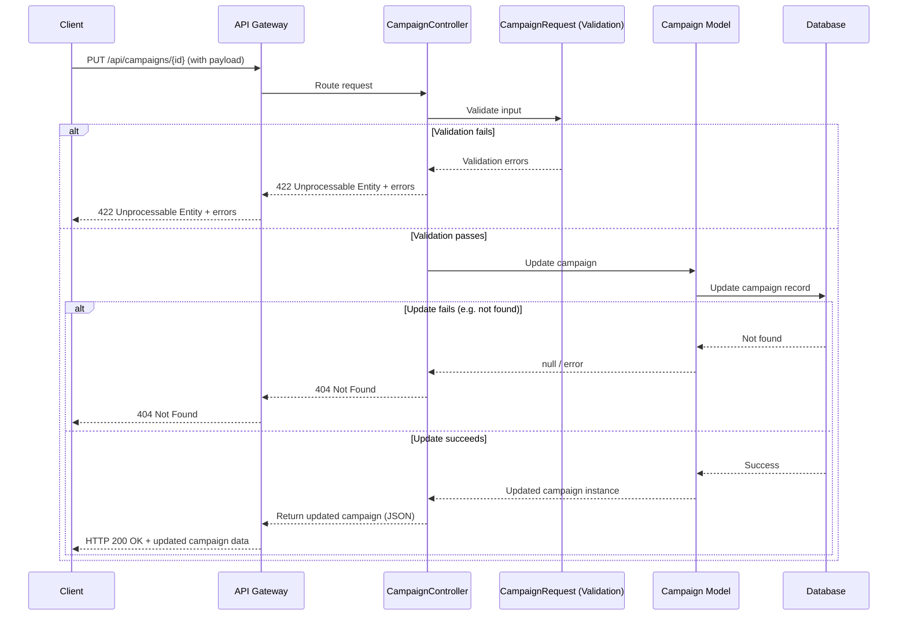

# CRUD Operations Documentation

This document provides comprehensive documentation for CRUD (Create, Read, Update, Delete) operations for Campaign and Landingpage models in the APDE backend API.

## Table of Contents

- [Campaign CRUD Operations](#campaign-crud-operations)
- [Landingpage CRUD Operations](#landingpage-crud-operations)
- [Input Validation](#input-validation)
- [Edge Cases](#edge-cases)
- [API Endpoints](#api-endpoints)

## Campaign CRUD Operations

### Campaign Model Overview

The Campaign model represents marketing campaigns with the following properties:

```php
/**
 * @property string $id
 * @property string|null $landingpage_id
 * @property string $title
 * @property string $slug
 * @property string|null $description
 * @property CampaignStatus $status
 * @property \Illuminate\Support\Carbon|null $start_date
 * @property \Illuminate\Support\Carbon|null $end_date
 * @property \Illuminate\Support\Carbon|null $created_at
 * @property \Illuminate\Support\Carbon|null $updated_at
 * @property \Illuminate\Support\Carbon|null $deleted_at
 * @property array<string, mixed>|null $prospect_filter
 */
```

**Relationship:** Campaign belongs to Landingpage (via `landingpage_id`). Multiple campaigns can share the same landingpage.

### Campaign Status Enum

Available campaign statuses:
- `draft` - Campaign is in draft state
- `active` - Campaign is currently running
- `paused` - Campaign is temporarily paused
- `completed` - Campaign has finished

### Campaign CRUD Endpoints

#### 1. List Campaigns (GET /api/campaigns)

**Description:** Retrieve a paginated list of all campaigns with their associated landing pages.

**Response:**
```json
{
  "data": [
    {
      "id": "campaign-uuid",
      "title": "Summer Sale Campaign",
      "slug": "summer-sale-campaign",
      "description": "Promotional campaign for summer products",
      "start_date": "2024-06-01T00:00:00.000000Z",
      "end_date": "2024-08-31T23:59:59.000000Z",
      "status": "active",
      "prospect_filter": [],
      "landingpage": {
        "id": "landingpage-uuid",
        "title": "Summer Sale Landing Page",
        "headline": "Get 50% Off This Summer!",
        "subline": "Limited time offer on selected items",
        "sections": []
      }
    }
  ],
  "links": {
    "first": "http://localhost/api/campaigns?page=1",
    "last": "http://localhost/api/campaigns?page=1",
    "prev": null,
    "next": null
  },
  "meta": {
    "current_page": 1,
    "from": 1,
    "last_page": 1,
    "per_page": 10,
    "to": 1,
    "total": 1
  }
}
```

**Note:** The response structure includes conditional fields based on user permissions. The `start_date`, `end_date`, `status`, and `prospect_filter` fields are only included if the user has permission to view campaign details.

#### 2. Create Campaign (POST /api/campaigns)

**Description:** Create a new campaign.

**Request Body:**
```json
{
  "title": "New Campaign",
  "landingpage_id": "landingpage-uuid",
  "description": "Campaign description",
  "status": "draft",
  "start_date": "2024-06-01",
  "end_date": "2024-08-31",
  "prospect_filter": {
    "min_age": 18,
    "max_age": 65,
    "gender": "female",
    "source": "erp"
  }
}
```

**Note:** The `slug` field is automatically generated from the `title` field using Laravel's `Str::slug()` helper in the `prepareForValidation()` method.

**Response:** Returns the created campaign with HTTP 201 status.

#### 3. Show Campaign (GET /api/campaigns/{id})

**Description:** Retrieve a specific campaign by ID with its associated landing page.

**Response:**
```json
{
  "data": {
    "id": "campaign-uuid",
    "title": "Summer Sale Campaign",
    "slug": "summer-sale-campaign",
    "description": "Promotional campaign for summer products",
    "start_date": "2024-06-01T00:00:00.000000Z",
    "end_date": "2024-08-31T23:59:59.000000Z",
    "status": "active",
    "prospect_filter": [],
    "landingpage": {
      "id": "landingpage-uuid",
      "title": "Summer Sale Landing Page",
      "headline": "Get 50% Off This Summer!",
      "subline": "Limited time offer on selected items",
      "sections": []
    }
  }
}
```

#### 4. Update Campaign (PUT/PATCH /api/campaigns/{id})

**Description:** Update an existing campaign.

**Request Body:** Same structure as create, but all fields are optional.

**Response:** Returns the updated campaign.

#### 5. Delete Campaign (DELETE /api/campaigns/{id})

**Description:** Soft delete a campaign (sets `deleted_at` timestamp).

**Response:** 
```json
{
  "success": true
}
```

## Landingpage CRUD Operations

### Landingpage Model Overview

The Landingpage model represents landing pages that can be shared by multiple campaigns:

```php
/**
 * @property string $id
 * @property string $title
 * @property string $headline
 * @property string|null $subline
 * @property array<int, array<string, mixed>> $sections
 * @property array<string, mixed>|null $form_fields
 * @property \Illuminate\Support\Carbon|null $created_at
 * @property \Illuminate\Support\Carbon|null $updated_at
 * @property \Illuminate\Support\Carbon|null $deleted_at
 */
```

**Relationship:** Landingpage has many Campaigns. Multiple campaigns can share the same landingpage content.

### Landingpage CRUD Endpoints

#### 1. List Landing Pages (GET /api/landingpages)

**Description:** Retrieve a paginated list of all landing pages with their associated campaigns.

**Response:**
```json
{
  "data": [
    {
      "id": "landingpage-uuid",
      "campaigns": [
        {
          "id": "campaign-uuid",
          "title": "Summer Sale Campaign",
          "slug": "summer-sale-campaign",
          "description": "Promotional campaign for summer products",
          "start_date": "2024-06-01T00:00:00.000000Z",
          "end_date": "2024-08-31T23:59:59.000000Z",
          "status": "active",
          "prospect_filter": []
        }
      ],
      "title": "Summer Sale Landing Page",
      "headline": "Get 50% Off This Summer!",
      "subline": "Limited time offer on selected items",
      "sections": [
        {
          "text": "Welcome to our amazing summer sale! Discover incredible deals on all your favorite products. Don't miss out on these limited-time offers that will make your summer unforgettable.",
          "image_url": "https://picsum.photos/800/400?random=1",
          "cta_text": "Get Started",
          "cta_url": "https://example.com/signup"
        },
        {
          "text": "Our featured products are carefully selected to provide the best value for your money. From electronics to fashion, we have everything you need for a perfect summer.",
          "image_url": "https://picsum.photos/800/400?random=2",
          "cta_text": "Learn More",
          "cta_url": "https://example.com/features"
        }
      ]
    }
  ],
  "links": {
    "first": "http://localhost/api/landingpages?page=1",
    "last": "http://localhost/api/landingpages?page=1",
    "prev": null,
    "next": null
  },
  "meta": {
    "current_page": 1,
    "from": 1,
    "last_page": 1,
    "per_page": 10,
    "to": 1,
    "total": 1
  }
}
```

#### 2. Create Landing Page (POST /api/landingpages)

**Description:** Create a new landing page.

**Request Body:**
```json
{
  "title": "New Landing Page",
  "headline": "Welcome to our new landing page",
  "subline": "Discover amazing offers",
  "campaign_id": "campaign-uuid",
  "sections": [
    {
      "text": "Welcome to our new landing page! This is the main content section that will engage your visitors and drive conversions.",
      "image_url": "https://picsum.photos/800/400?random=1",
      "cta_text": "Sign Up",
      "cta_url": "https://example.com/signup"
    },
    {
      "text": "Discover our amazing features and benefits. We provide the best solutions for your needs with unmatched quality and service.",
      "image_url": "https://picsum.photos/800/400?random=2",
      "cta_text": "Learn More",
      "cta_url": "https://example.com/features"
    }
  ],
  "form_fields": {
    "name": "required",
    "email": "required|email",
    "phone": "optional"
  }
}
```

**Note:** The `slug` field is automatically generated from the `title` field using Laravel's `Str::slug()` helper in the `prepareForValidation()` method.

**Response:** Returns the created landing page with HTTP 201 status.

#### 3. Show Landing Page (GET /api/landingpages/{identifier})

**Description:** Retrieve a specific landing page by ID or slug with its associated campaign.

**Edge Case - Dual Identification:**
The landing page can be identified by either:
- **UUID**: Direct ID lookup (e.g., `/api/landingpages/550e8400-e29b-41d4-a716-446655440000`)
- **Slug**: URL-friendly identifier (e.g., `/api/landingpages/summer-sale-landing-page`)

**Implementation Logic:**
```php
public function show(Request $request, CampaignTrackingService $campaignTrackingService, $identifier): JsonResource
{
    if ($landingpage = Landingpage::find($identifier)) {
        Gate::authorize('view', $landingpage);
        
        return $landingpage->load('campaign')->toResource();
    }

    $landingpage = Landingpage::with('campaign')
        ->where('slug', $identifier)
        ->whereHas('campaign', function ($query): void {
            $query->where('status', CampaignStatus::ACTIVE)
                ->where(function ($q): void {
                    $q->whereNull('start_date')
                        ->orWhere('start_date', '<=', now());
                })
                ->where(function ($q): void {
                    $q->whereNull('end_date')
                        ->orWhere('end_date', '>=', now());
                });
        })
        ->firstOrFail();

    $campaignTrackingService->trackLandingPageVisit($request, $landingpage);

    return $landingpage->load('campaign')->toResource();
}
```

**Access Control:**
- **UUID Access**: Requires authentication and proper authorization via Laravel Gates
- **Slug Access**: Public access with campaign validation (active status and valid date range) and automatic tracking

**Response:**
```json
{
  "data": {
    "id": "landingpage-uuid",
    "campaign": {
      "id": "campaign-uuid",
      "title": "Summer Sale Campaign",
      "description": "Promotional campaign for summer products",
      "start_date": "2024-06-01T00:00:00.000000Z",
      "end_date": "2024-08-31T23:59:59.000000Z",
      "status": "active",
      "prospect_filter": [],
      "landingpage": null
    },
    "title": "Summer Sale Landing Page",
    "slug": "summer-sale-landing-page",
    "headline": "Get 50% Off This Summer!",
    "subline": "Limited time offer on selected items",
    "sections": [
      {
        "text": "Welcome to our amazing summer sale! Discover incredible deals on all your favorite products. Don't miss out on these limited-time offers that will make your summer unforgettable.",
        "image_url": "https://picsum.photos/800/400?random=1",
        "cta_text": "Get Started",
        "cta_url": "https://example.com/signup"
      },
      {
        "text": "Our featured products are carefully selected to provide the best value for your money. From electronics to fashion, we have everything you need for a perfect summer.",
        "image_url": "https://picsum.photos/800/400?random=2",
        "cta_text": "Learn More",
        "cta_url": "https://example.com/features"
      }
    ]
  }
}
```

#### 4. Update Landing Page (PUT/PATCH /api/landingpages/{id})

**Description:** Update an existing landing page by ID only (not slug).

**Request Body:** Same structure as create, but all fields are optional.

**Response:** Returns the updated landing page.

#### 5. Delete Landing Page (DELETE /api/landingpages/{id})

**Description:** Soft delete a landing page (sets `deleted_at` timestamp).

**Response:** 
```json
{
  "success": true
}
```

## Public Landing Page Access

### Public Campaign Landing Page Endpoint (GET /api/cp/{identifier})

**Description:** Public access to campaign landing pages via campaign ID or slug. This endpoint is designed for external/public consumption and has different access controls and response formatting compared to the authenticated endpoint.

**Access Control:**
- **No Authentication Required**: This endpoint is publicly accessible
- **Campaign ID or Slug Access**: Supports both campaign UUID and slug-based identification
- **Campaign Validation**: Only returns landing pages for active campaigns within valid date ranges & status = 'active'
- **Automatic Tracking**: All visits are automatically tracked via `CampaignTrackingService`

**Campaign Validation Logic:**
```php
// Try to find campaign by ID first
if ($campaign = Campaign::with('landingpage')->find($identifier)) {
    // Check if campaign is active and within date range
    abort_if($campaign->status !== CampaignStatus::ACTIVE ||
        ($campaign->start_date && $campaign->start_date > now()) ||
        ($campaign->end_date && $campaign->end_date < now()),
        404
    );
} else {
    // If not found by ID, try to find active campaign by campaign slug
    $campaign = Campaign::with('landingpage')
        ->where('slug', $identifier)
        ->where('status', CampaignStatus::ACTIVE)
        ->where(function ($q): void {
            $q->whereNull('start_date')
                ->orWhere('start_date', '<=', now());
        })
        ->where(function ($q): void {
            $q->whereNull('end_date')
                ->orWhere('end_date', '>=', now());
        })
        ->firstOrFail();
}

abort_if($campaign->landingpage === null, 404, 'Campaign does not have an associated landing page.');

$campaignTrackingService->trackLandingPageVisit($request, $campaign);
return $campaign->load('landingpage')->toResource();
```

**Campaign Resource Restrictions:**
When accessed via the public endpoint, the campaign resource exposes only a limited set of attributes for security and privacy reasons:

**Public Campaign Attributes:**
- `id` - Campaign identifier
- `title` - Campaign title
- `status` - Campaign status (always "active" for public access)

**Excluded Campaign Attributes (Private):**
- `description` - Campaign description
- `start_date` - Campaign start date
- `end_date` - Campaign end date
- `prospect_filter` - Campaign prospect filtering rules
- `created_at` - Creation timestamp
- `updated_at` - Last update timestamp
- `deleted_at` - Soft delete timestamp

**Example Public Response:**
```json
{
  "data": {
    "id": "landingpage-uuid",
    "campaign": {
      "id": "campaign-uuid",
      "title": "Summer Sale Campaign",
      "status": "active"
    },
    "title": "Summer Sale Landing Page",
    "slug": "summer-sale-landing-page",
    "headline": "Get 50% Off This Summer!",
    "subline": "Limited time offer on selected items",
    "sections": [
      {
        "text": "Welcome to our amazing summer sale!",
        "image_url": "https://picsum.photos/800/400?random=1",
        "cta_text": "Get Started",
        "cta_url": "https://example.com/signup"
      }
    ]
  }
}
```

**Error Responses:**
- **404 Not Found**: Landing page not found or associated campaign is inactive/expired
- **500 Internal Server Error**: Server-side errors

**Usage Examples:**
```bash
# Public access via campaign UUID
GET /api/cp/550e8400-e29b-41d4-a716-446655440000

# Public access via campaign slug
GET /api/cp/summer-sale-campaign

# This will return the campaign's landing page only if:
# 1. The campaign exists (by ID or slug)
# 2. The campaign is active
# 3. The campaign is within its valid date range (or has no date restrictions)
# 4. The campaign has an associated landing page
# 5. The visit will be automatically tracked
```

## Input Validation

### Campaign Validation Rules

```php
[
    'title' => [
        'required',
        'string',
        'max:255',
        Rule::unique('campaigns', 'title')
            ->ignore($this->campaign?->id)
            ->whereNull('deleted_at'),
    ],
    'slug' => [
        'required',
        'string',
        'max:255',
        Rule::unique('campaigns', 'slug')
            ->ignore($this->campaign?->id)
            ->whereNull('deleted_at'),
    ],
    'description' => 'sometimes|string|max:255',
    'status' => 'required|string|in:'.implode(',', \App\Enums\CampaignStatus::values()),
    'start_date' => 'sometimes|nullable|date',
    'end_date' => 'sometimes|nullable|date|after:start_date',
    'landingpage_id' => 'sometimes|nullable|exists:landingpages,id',
    'prospect_filter' => 'sometimes|array',
]
```

**Validation Details:**
- **title**: Required, unique across non-deleted campaigns, max 255 characters
- **slug**: Required, unique across non-deleted campaigns, max 255 characters (auto-generated from title)
- **description**: Optional, max 255 characters
- **status**: Required, must be one of the defined enum values (draft, active, paused, completed)
- **start_date**: Optional, must be a valid date
- **end_date**: Optional, must be a valid date and after start_date
- **landingpage_id**: Optional, must reference an existing landingpage
- **prospect_filter**: Optional, must be an array

**Auto-generation:** The slug is automatically generated from the title using `Str::slug()` in the `prepareForValidation()` method.

### Landing Page Validation Rules

```php
[
    'title' => [
        'required',
        'string',
        'max:255',
        Rule::unique('landingpages', 'title')
            ->ignore($this->landingpage?->id)
            ->whereNull('deleted_at'),
    ],
    'headline' => 'required|string|max:255',
    'subline' => 'sometimes|nullable|string|max:255',
    'sections' => 'required|array',
    // 'form_fields' => 'required|array', // Currently commented out
]
```

**Validation Details:**
- **title**: Required, unique across non-deleted landing pages, max 255 characters
- **headline**: Required, max 255 characters
- **subline**: Optional, max 255 characters
- **sections**: Required, must be an array
- **form_fields**: Currently commented out in validation rules

**Note:** The slug field has been moved to the Campaign model. Landing pages no longer have slugs as they are accessed through campaigns.

## Resource Transformation

### CampaignResource Implementation

The `CampaignResource` includes conditional field inclusion based on user permissions:

```php
public function toArray(Request $request): array
{
    /** @var Campaign $campaign */
    $campaign = $this->resource;

    return [
        'id' => $campaign->id,
        'title' => $campaign->title,
        'description' => $campaign->description,
        $this->mergeWhen(Gate::allows('viewAny', Campaign::class), [
            'start_date' => $campaign->start_date,
            'end_date' => $campaign->end_date,
            'status' => $campaign->status->label(),
            'prospect_filter' => $campaign->prospect_filter ?? [],
        ]),
        'landingpage' => new LandingpageResource($this->whenLoaded('landingpage')),
    ];
}
```

### LandingpageResource Implementation

The `LandingpageResource` includes the associated campaign:

```php
public function toArray(Request $request): array
{
    /** @var \App\Models\Landingpage $landingpage */
    $landingpage = $this->resource;

    return [
        'id' => $landingpage->id,
        'campaign' => new CampaignResource($this->whenLoaded('campaign')),
        'title' => $landingpage->title,
        'slug' => $landingpage->slug,
        'headline' => $landingpage->headline,
        'subline' => $landingpage->subline,
        'sections' => $landingpage->sections,
        // 'form_fields' => $landingpage->form_fields, // Currently commented out
    ];
}
```

## Edge Cases

### Landing Page Identification Edge Case

**Problem:** The landing page show endpoint needs to handle both UUID and slug-based identification.

**Solution:** The controller implements a fallback mechanism:

1. **Primary Lookup**: Attempt to find the landing page by UUID using `Landingpage::find($identifier)`
2. **Fallback Lookup**: If not found by UUID, search by slug using `Landingpage::where('slug', $identifier)->firstOrFail()`
3. **Error Handling**: If neither lookup succeeds, Laravel's `firstOrFail()` method will throw a 404 exception

**Benefits:**
- **SEO-friendly URLs**: Allows for human-readable URLs like `/api/landingpages/summer-sale-2024`
- **Backward Compatibility**: Maintains support for UUID-based lookups
- **Performance**: UUID lookup is faster and attempted first
- **Flexibility**: Supports both identification methods without separate endpoints

**Example Usage:**
```bash
# UUID-based access
GET /api/landingpages/550e8400-e29b-41d4-a716-446655440000

# Slug-based access
GET /api/landingpages/summer-sale-2024
```

**Important Notes:**
- Update and delete operations only support UUID-based identification
- The slug must be unique across all non-deleted landing pages
- Slugs are automatically generated from titles but can be manually overridden

### Missing toResource Method

**Issue:** The documentation references `toResource()` and `toResourceCollection()` methods that are not visible in the current codebase.

**Current Implementation:** The codebase appears to use Laravel's standard resource transformation methods. The `toResource()` method is likely implemented through:
- Laravel's built-in resource transformation
- Custom macros or service providers not visible in the current codebase
- Laravel 12's enhanced resource handling

**Workaround:** The actual implementation uses standard Laravel resource patterns:
```php
// Instead of $model->toResource()
return new CampaignResource($campaign);

// Instead of $collection->toResourceCollection()
return CampaignResource::collection($collection);
```

## API Endpoints Summary

### Campaign Endpoints
- `GET /api/campaigns` - List campaigns (paginated)
- `POST /api/campaigns` - Create campaign
- `GET /api/campaigns/{id}` - Show campaign
- `PUT /api/campaigns/{id}` - Update campaign
- `PATCH /api/campaigns/{id}` - Update campaign (partial)
- `DELETE /api/campaigns/{id}` - Delete campaign

### Landing Page Endpoints
- `GET /api/landingpages` - List landing pages (paginated)
- `POST /api/landingpages` - Create landing page
- `GET /api/landingpages/{identifier}` - Show landing page (by ID or slug)
- `PUT /api/landingpages/{id}` - Update landing page
- `PATCH /api/landingpages/{id}` - Update landing page (partial)
- `DELETE /api/landingpages/{id}` - Delete landing page

### Public Campaign Landing Page Endpoints
- `GET /api/cp/{identifier}` - Public access to campaign landing page (campaign ID or slug, no authentication required, automatic tracking)

### Authentication
Most endpoints require authentication via Laravel Sanctum. Include the Bearer token in the Authorization header:
```
Authorization: Bearer {your-token}
```

**Public Endpoints:**
- `GET /api/cp/{identifier}` - No authentication required

### Error Responses
- **401 Unauthorized**: Invalid or missing authentication token (for authenticated endpoints)
- **404 Not Found**: Resource not found or campaign inactive/expired (for public endpoint)
- **422 Unprocessable Entity**: Validation errors
- **500 Internal Server Error**: Server-side errors

## Sequence Diagram: Update Campaign Flow (with Validation & Error Handling)

The following sequence diagram illustrates the flow of updating a Campaign via the API, including input validation and error handling:


