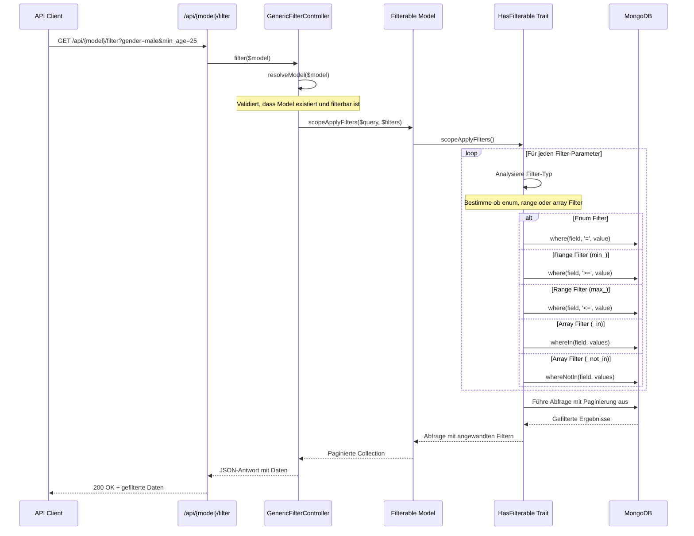
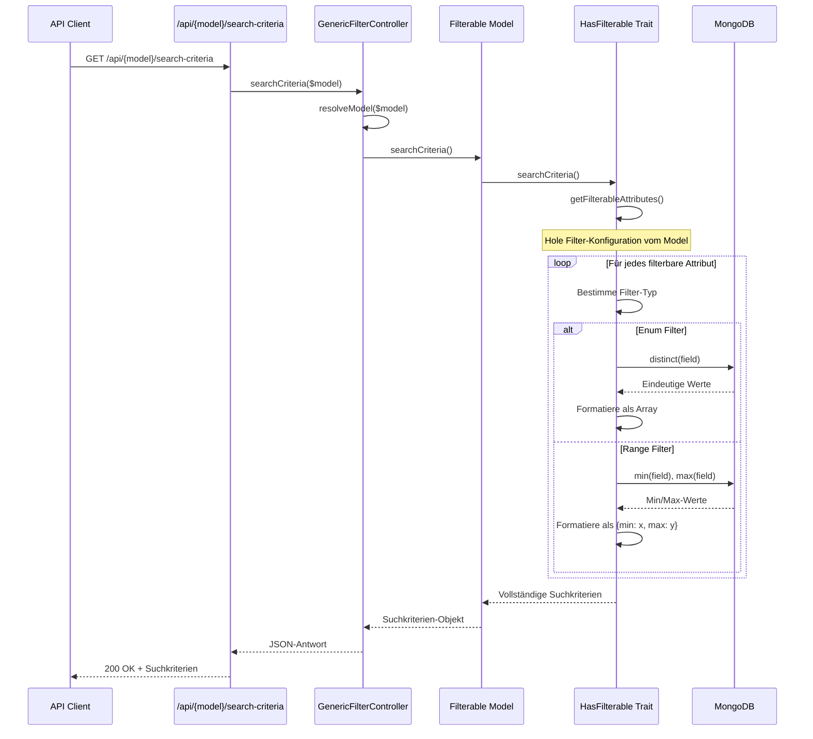
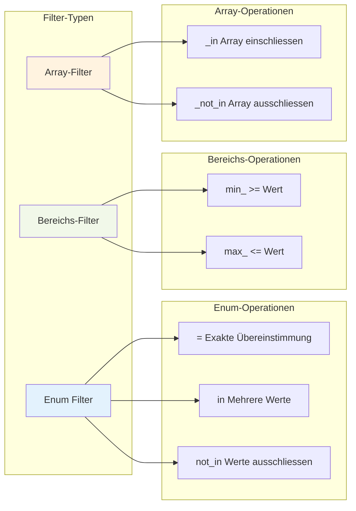
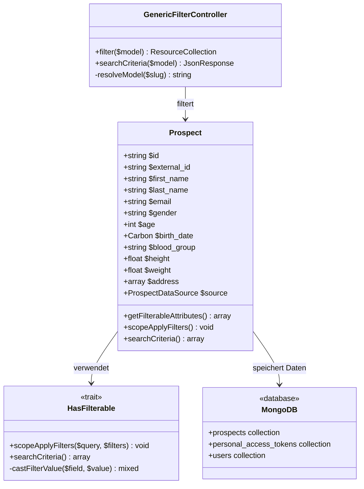
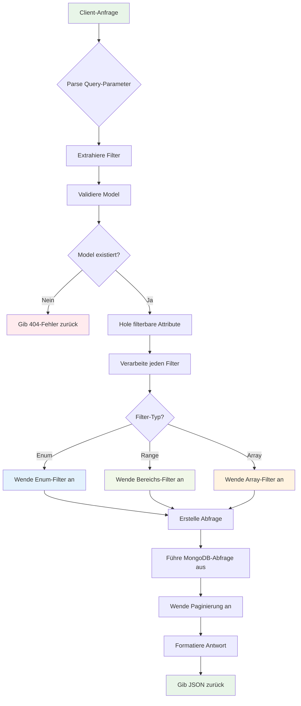

# GenericFilter System Dokumentation

## Überblick

Das GenericFilter-System ist eine flexible, wiederverwendbare Filterlösung für Laravel-Anwendungen, die dynamische Filterfähigkeiten über verschiedene Models hinweg bereitstellt. Es besteht aus einem Trait (`HasFilterable`), einem Controller (`GenericFilterController`) und unterstützender Infrastruktur, die es ermöglicht, Models mit minimaler Konfiguration einfach filterbar zu machen.

Das System ist speziell für die Arbeit mit MongoDB unter Verwendung des `mongodb/laravel` Pakets konzipiert und bietet umfassende Filterfähigkeiten für sowohl einfache als auch komplexe Datenstrukturen.

## System-Architektur

```mermaid
graph TB
    subgraph "Client-Schicht"
        Client[API Client]
    end

    subgraph "API-Schicht"
        Route[Route: /api/{model}/filter]
        Controller[GenericFilterController]
    end

    subgraph "Model-Schicht"
        Model[Filterable Model]
        Trait[HasFilterable Trait]
        Casts[Model Casts]
    end

    subgraph "Datenbank-Schicht"
        MongoDB[(MongoDB)]
        Indexes[Database Indexes]
    end

    Client --> Route
    Route --> Controller
    Controller --> Model
    Model --> Trait
    Model --> Casts
    Trait --> MongoDB
    MongoDB --> Indexes

    style Controller fill:#e1f5fe
    style Trait fill:#f3e5f5
    style MongoDB fill:#e8f5e8
```

## Filter-Verarbeitungs-Flow



## Suchkriterien-Generierungs-Flow



## Erweiterte Array-Unterstützung

Das System unterstützt nun mehrere Wege, Array-Werte für die Filterung zu übergeben:

1. **Traditionelles PHP Array-Format**: `?field_in[]=value1&field_in[]=value2`
2. **Direkte Array-Erkennung**: Wenn ein Parameter-Wert als Array erkannt wird, verwendet es automatisch den 'IN'-Operator
3. **JSON Array-Format**: `?field=["value1","value2"]` (wenn vom Client als Array geparst)

Diese Verbesserung bietet grössere Flexibilität für API-Verbraucher und behandelt Array-Werte automatisch, unabhängig davon, wie sie übergeben werden.

## Filter-Typen und Operationen



## Model-Integrations-Beispiel



## Datenfluss für komplexe Filterung



## Architektur

### Kernkomponenten

1. **HasFilterable Trait** (`app/Traits/HasFilterable.php`)
   - Stellt die zentrale Filterfunktionalität bereit
   - Implementiert `scopeApplyFilters()`-Methode für Abfrage-Filterung
   - Implementiert `searchCriteria()`-Methode für verfügbare Filter-Optionen
   - Behandelt automatisches Werte-Casting basierend auf Model-Casts
   - Unterstützt MongoDB-spezifische Abfrage-Erstellung
   - Beinhaltet Punkt-Notation-Unterstützung für verschachtelte Felder
   - Verhindert Bereichs-Operatoren auf Enum-Feldern

2. **GenericFilterController** (`app/Http/Controllers/Api/GenericFilterController.php`)
   - Stellt REST-API-Endpunkte für Filterung bereit
   - Behandelt Model-Auflösung und Validierung
   - Gibt paginierte Ergebnisse mit Laravels Resource Collections zurück
   - Implementiert ordnungsgemässe Fehlerbehandlung für nicht existierende oder nicht filterbare Models
   - Verwendet Laravels Gate-Autorisierungssystem
   - Unterstützt derzeit nur das `prospects`-Model

3. **Model-Integration**
   - Models verwenden das `HasFilterable` Trait
   - Definieren filterbare Attribute über die `getFilterableAttributes()`-Methode
   - Unterstützung für verschiedene Filter-Typen (enum, range)
   - Derzeit implementiert nur das `Prospect`-Model Filterung

## Filter-Typen

### Enum-Filter
- Verwendet für Felder mit vordefinierten Wertesätzen
- Unterstützt exakte Übereinstimmung `=` und `in`/`not_in` Operationen
- Generiert automatisch verfügbare Werte aus existierenden Daten
- Ideal für kategorische Daten wie Geschlecht, Quelle, Blutgruppe, etc.
- Bereichs-Operatoren (`>=`, `<=`) werden automatisch für Enum-Felder übersprungen

### Bereichs-Filter
- Verwendet für numerische und Datumsfelder
- Unterstützt `>=` (min_) und `<=` (max_) Operationen
- Berechnet automatisch Min/Max-Werte aus existierenden Daten
- Perfekt für Alter, Daten, Messungen und Koordinaten

## API-Endpunkte

### Daten filtern
```
GET /api/{model}/filter
```

**Parameter:**
- Query-Parameter für Filterung (siehe Filter-Syntax unten)
- Standard Laravel-Paginierungs-Parameter (`page`, `per_page`)

**Antwort:**
```json
{
  "data": [
    {
      "id": "507f1f77bcf86cd799439011",
      "gender": "male",
      "age": 25,
      "birthDate": "1998-05-15T00:00:00.000000Z",
      "image": "https://example.com/image.jpg",
      "bloodGroup": "A+",
      "height": 175.5,
      "weight": 70.2,
      "eyeColor": "brown",
      "hairColor": "black",
      "hairType": "straight",
      "address": {
        "city": "London",
        "state": "England",
        "country": "UK",
        "plz": "SW1A 1AA",
        "latitude": 51.5074,
        "longitude": -0.1278
      }
    }
  ],
  "current_page": 1,
  "per_page": 10,
  "total": 100,
  "last_page": 10
}
```

### Suchkriterien abrufen
```
GET /api/{model}/search-criteria
```

**Antwort:**
```json
{
  "source": ["erp", "kueba"],
  "gender": ["male", "female"],
  "age": {
    "min": 18,
    "max": 85
  },
  "birth_date": {
    "min": "1940-01-01",
    "max": "2005-12-31"
  },
  "blood_group": ["A+", "A-", "B+", "B-", "AB+", "AB-", "O+", "O-"],
  "height": {
    "min": 150.0,
    "max": 200.0
  },
  "weight": {
    "min": 45.0,
    "max": 120.0
  },
  "eye_color": ["brown", "blue", "green", "hazel"],
  "hair_color": ["black", "brown", "blonde", "red"],
  "address.city": ["London", "Berlin", "Paris", "New York"],
  "address.state": ["England", "Berlin", "Île-de-France", "New York"],
  "address.country": ["UK", "Germany", "France", "USA"],
  "address.plz": {
    "min": "1000",
    "max": "99999"
  },
  "address.latitude": {
    "min": 35.0,
    "max": 70.0
  },
  "address.longitude": {
    "min": -180.0,
    "max": 180.0
  }
}
```

## Filter-Syntax

### Grundlegende Gleichheit
```
?field=value
```

**Beispiele:**
```
?gender=male
?source=erp
?blood_group=A+
```

### Bereichs-Filter
```
?min_field=value    // >= value
?max_field=value    // <= value
```

**Beispiele:**
```
?min_age=25
?max_age=40
?min_height=170
?max_weight=80
```

### Array-Filter
```
?field_in[]=value1&field_in[]=value2    // IN Array (PHP Array-Format)
?field_not_in[]=value1&field_not_in[]=value2    // NOT IN Array (PHP Array-Format)
?field=["value1","value2"]    // IN Array (JSON Array-Format)
```

**Beispiele:**
```
?gender_in[]=male&gender_in[]=female
?source_not_in[]=erp
?blood_group_in[]=A+&blood_group_in[]=O+
?gender=["male","female"]    // Direkte Array-Wert-Unterstützung
```

### Punkt-Notation-Unterstützung
Das System unterstützt sowohl Unterstrich- als auch Punkt-Notation für verschachtelte Felder:
```
?address_city=London    // address.city Feld
?address.city=London    // Gleiches Feld, Punkt-Notation
```

**Hinweis:** PHP konvertiert automatisch Punkte zu Unterstrichen in Query-Parametern, daher funktionieren beide Notationen nahtlos. Das System konvertiert intelligent Unterstriche zurück zu Punkten beim Abgleich mit filterbaren Attributen.

## Implementierungs-Beispiel

### Ein Model filterbar machen

```php
<?php

namespace App\Models;

use App\Enums\ProspectDataSource;
use App\Traits\HasFilterable;
use MongoDB\Laravel\Eloquent\Model;
use MongoDB\Laravel\Eloquent\SoftDeletes;

/**
 * @property string $id
 * @property string $external_id
 * @property string $first_name
 * @property string $last_name
 * @property string $email
 * @property string|null $phone
 * @property string|null $gender
 * @property int|null $age
 * @property \Carbon\Carbon|null $birth_date
 * @property string|null $image
 * @property string|null $blood_group
 * @property float|null $height
 * @property float|null $weight
 * @property string|null $eye_color
 * @property string|null $hair_color
 * @property string|null $hair_type
 * @property array<string, mixed>|null $address
 * @property ProspectDataSource $source
 * @property \Carbon\Carbon $created_at
 * @property \Carbon\Carbon|null $updated_at
 * @property \Carbon\Carbon|null $deleted_at
 */
final class Prospect extends Model
{
    use HasFilterable, SoftDeletes;

    protected $fillable = [
        'id',
        'external_id',
        'first_name',
        'last_name',
        'email',
        'phone',
        'gender',
        'age',
        'birth_date',
        'image',
        'blood_group',
        'height',
        'weight',
        'eye_color',
        'hair_color',
        'hair_type',
        'address',
        'source',
        'created_at',
        'updated_at',
        'deleted_at',
    ];

    protected $casts = [
        'age' => 'integer',
        'birth_date' => 'date',
        'height' => 'float',
        'weight' => 'float',
        // 'address' => 'array', // Laravel serialisiert zu JSON-String und bricht Punkt-Notation "."
        'address.latitude' => 'float',
        'address.longitude' => 'float',
        'source' => ProspectDataSource::class,
        'created_at' => 'datetime',
        'updated_at' => 'datetime',
        'deleted_at' => 'datetime',
    ];

    /**
     * @return array<string, string>
     */
    public static function getFilterableAttributes(): array
    {
        return [
            'source' => 'enum',
            'gender' => 'enum',
            'age' => 'range',
            'birth_date' => 'range',
            'blood_group' => 'enum',
            'height' => 'range',
            'weight' => 'range',
            'eye_color' => 'enum',
            'hair_color' => 'enum',
            'address.city' => 'enum',
            'address.state' => 'enum',
            'address.country' => 'enum',
            'address.plz' => 'range',
            'address.latitude' => 'range',
            'address.longitude' => 'range',
        ];
    }
}
```

### Model zum Controller hinzufügen

```php
private function resolveModel(string $slug): string
{
    return match ($slug) {
        'prospects' => Prospect::class,
    };
}
```

## Verwendungsbeispiele

### Grundlegende Filterung
```
GET /api/prospects/filter?gender=male&source=erp
```

### Bereichs-Filterung
```
GET /api/prospects/filter?min_age=25&max_age=40
```

### Mehrere Werte
```
GET /api/prospects/filter?gender_in[]=male&gender_in[]=female
GET /api/prospects/filter?gender=["male","female"]
```

### Komplexe Filterung
```
GET /api/prospects/filter?source=erp&min_age=25&max_age=40&address_city=London
```

### Paginierung
```
GET /api/prospects/filter?gender=male&page=2&per_page=20
```

### Verschachtelte Feld-Filterung
```
GET /api/prospects/filter?address_country=UK&min_address_latitude=50.0&max_address_latitude=60.0
```

### Kombinierte Filter
```
GET /api/prospects/filter?source=kueba&min_age=30&max_age=50&blood_group_in[]=A+&blood_group_in[]=O+&address_city=Berlin
GET /api/prospects/filter?source=kueba&min_age=30&max_age=50&blood_group=["A+","O+"]&address_city=Berlin
```

## Werte-Casting

Das System castet automatisch Filter-Werte basierend auf der `$casts`-Eigenschaft des Models:

- **integer/int**: Numerische Werte zu Ganzzahlen gecastet
- **float/double**: Numerische Werte zu Gleitkommazahlen gecastet
- **boolean/bool**: String-Werte zu Booleans gecastet
- **date/datetime**: String/numerische Werte zu Carbon-Instanzen geparst
- **Enums**: Werte mit der `from()`-Methode des Enums gecastet

### Casting-Beispiele

```php
// In der $casts-Eigenschaft des Models
protected $casts = [
    'age' => 'integer',
    'birth_date' => 'date',
    'height' => 'float',
    'weight' => 'float',
    'address.latitude' => 'float',
    'address.longitude' => 'float',
    'source' => ProspectDataSource::class,
];

// Filter-Werte werden automatisch gecastet
?age=25          // Zu Integer gecastet
?birth_date=1990-01-01  // Zu Carbon-Datum gecastet
?height=175.5    // Zu Float gecastet
?source=erp      // Zu ProspectDataSource Enum gecastet
```

## Sicherheitsfeatures

- **Model-Validierung**: Nur Models, die existieren und die erforderlichen Methoden implementieren, sind zugänglich
- **Attribut-Validierung**: Nur in `getFilterableAttributes()` definierte Felder werden verarbeitet
- **Typsicherheit**: Automatisches Casting verhindert typ-bezogene Probleme
- **Authentifizierung**: Alle Endpunkte erfordern Authentifizierung über Laravel Sanctum
- **Autorisierung**: Verwendet Laravels Gate-System für Model-Level-Autorisierung
- **Input-Sanitisierung**: Query-Parameter werden ordnungsgemäss behandelt und validiert

## Fehlerbehandlung

- **404 Not Found**: Wenn Model nicht existiert oder nicht filterbar ist
- **403 Forbidden**: Wenn Benutzer keine Berechtigung hat, auf das Model zuzugreifen
- **400 Bad Request**: Wenn Filter-Syntax ungültig ist
- **500 Internal Server Error**: Wenn Casting fehlschlägt oder andere interne Fehler auftreten

### Fehler-Antwort-Beispiele

```json
{
  "message": "Model not found or not filterable"
}
```

## Performance-Überlegungen

- **Indizierung**: Stellen Sie sicher, dass filterbare Felder in MongoDB ordnungsgemäss indiziert sind
- **Paginierung**: Ergebnisse werden automatisch paginiert, um grosse Ergebnismengen zu verhindern
- **Abfrage-Optimierung**: Das System verwendet Laravels Query Builder für effiziente Datenbankabfragen
- **Resource Collections**: Verwendet Laravels Resource Collections für konsistente API-Antworten

## Systemerweiterung

### Neue Filter-Typen hinzufügen

Um neue Filter-Typen hinzuzufügen, erweitern Sie die `scopeApplyFilters()`-Methode im `HasFilterable` Trait:

```php
switch (true) {
    case Str::startsWith($key, 'min_'):
        $operator = '>=';
        $baseField = Str::replaceStart('min_', '', $key);
        break;
    case Str::startsWith($key, 'max_'):
        $operator = '<=';
        $baseField = Str::replaceStart('max_', '', $key);
        break;
    case Str::startsWith($key, 'like_'):
        $operator = 'like';
        $baseField = Str::replaceStart('like_', '', $key);
        break;
    case Str::endsWith($key, '_not_in'):
        $operator = 'not_in';
        $baseField = Str::replaceEnd('_not_in', '', $key);
        break;
    case Str::endsWith($key, '_in'):
    case is_array($value):
        $operator = 'in';
        $baseField = Str::replaceEnd('_in', '', $key);
        break;
}
```

### Neue Models hinzufügen

1. Fügen Sie das `HasFilterable` Trait zu Ihrem Model hinzu
2. Implementieren Sie die `getFilterableAttributes()`-Methode
3. Fügen Sie das Model zur `resolveModel()`-Methode in `GenericFilterController` hinzu
4. Stellen Sie sicher, dass ordnungsgemässe Casts definiert sind
5. Erstellen Sie entsprechende MongoDB-Indizes
6. Implementieren Sie die erforderliche Policy für Autorisierung

### Beispiel: Ein Movie-Model hinzufügen

```php
<?php

namespace App\Models;

use App\Traits\HasFilterable;
use MongoDB\Laravel\Eloquent\Model;

final class Movie extends Model
{
    use HasFilterable;

    protected $fillable = ['title', 'year', 'runtime', 'imdb', 'plot', 'actors'];

    protected $casts = [
        'year' => 'integer',
        'runtime' => 'integer',
        'imdb' => 'float',
        'created_at' => 'datetime',
        'published_at' => 'datetime',
    ];

    /**
     * @return array<string, string>
     */
    public static function getFilterableAttributes(): array
    {
        return [
            'year' => 'range',
            'runtime' => 'range',
            'imdb' => 'range',
        ];
    }
}
```

Dann zum Controller hinzufügen:

```php
private function resolveModel(string $slug): string
{
    return match ($slug) {
        'prospects' => Prospect::class,
        'movies' => Movie::class,
        default => '',
    };
}
```

## Best Practices

1. **Klare Filter-Typen definieren**: Verwenden Sie angemessene Filter-Typen (enum vs range) für Ihre Daten
2. **Filterbare Felder indizieren**: MongoDB-Indizes verbessern die Abfrage-Performance erheblich
3. **Input validieren**: Das System behandelt grundlegende Validierung, aber erwägen Sie zusätzliche Validierung für komplexe Szenarien
4. **Verfügbare Filter dokumentieren**: Stellen Sie klare Dokumentation verfügbarer Filter-Optionen für API-Verbraucher bereit
5. **Gründlich testen**: Stellen Sie sicher, dass alle Filter-Kombinationen wie erwartet funktionieren
6. **Ordnungsgemässes Casting verwenden**: Definieren Sie angemessene Casts für alle filterbaren Felder
7. **Abfragen optimieren**: Verwenden Sie zusammengesetzte Indizes für häufig kombinierte Filter
8. **Performance überwachen**: Verfolgen Sie Abfrage-Performance und optimieren Sie nach Bedarf
9. **Policies implementieren**: Stellen Sie sicher, dass ordnungsgemässe Autorisierungs-Policies für neue Models vorhanden sind

## Problembehandlung

### Häufige Probleme

1. **Filter funktioniert nicht**: Prüfen Sie, ob das Feld in `getFilterableAttributes()` definiert ist
2. **Type-Casting-Fehler**: Überprüfen Sie, ob die `$casts`-Eigenschaft des Models korrekt konfiguriert ist
3. **Punkt-Notation-Probleme**: Stellen Sie sicher, dass das Feld in der Datenbank existiert und ordnungsgemäss gecastet ist
4. **Performance-Probleme**: Prüfen Sie MongoDB-Indizes auf filterbaren Feldern
5. **Authentifizierungsfehler**: Stellen Sie sicher, dass ein ordnungsgemässer Sanctum-Token bereitgestellt wird
6. **Autorisierungsfehler**: Prüfen Sie, ob der Benutzer Berechtigung hat, auf das Model zuzugreifen

### Debugging

Aktivieren Sie Laravels Query-Logging, um die generierten MongoDB-Abfragen zu sehen:

```php
DB::enableQueryLog();
// ... Filter-Operation durchführen
dd(DB::getQueryLog());
```

### Häufige Debugging-Szenarien

```php
// Prüfen Sie, ob Model filterbar ist
$modelClass = Prospect::class;
$isFilterable = method_exists($modelClass, 'scopeApplyFilters');
dd($isFilterable); // Sollte true zurückgeben

// Verfügbare filterbare Attribute prüfen
$attributes = Prospect::getFilterableAttributes();
dd($attributes);

// Suchkriterien prüfen
$criteria = Prospect::searchCriteria();
dd($criteria);
```

## API-Testing

### Postman verwenden

Das System beinhaltet eine Postman-Collection (`docs/APDE.postman_collection.json`) mit Beispielen zum Testen der GenericFilter-Endpunkte.

### Beispiel cURL-Befehle

```bash
# Suchkriterien abrufen
curl -X GET "http://localhost:8000/api/prospects/search-criteria" \
  -H "Authorization: Bearer YOUR_TOKEN" \
  -H "Accept: application/json"

# Prospekte filtern
curl -X GET "http://localhost:8000/api/prospects/filter?gender=male&min_age=25" \
  -H "Authorization: Bearer YOUR_TOKEN" \
  -H "Accept: application/json"

# Komplexe Filterung mit Paginierung
curl -X GET "http://localhost:8000/api/prospects/filter?source=erp&min_age=30&max_age=50&page=1&per_page=20" \
  -H "Authorization: Bearer YOUR_TOKEN" \
  -H "Accept: application/json"
```

## Versions-Kompatibilität

- **Laravel**: 10.x oder höher
- **MongoDB**: 4.4 oder höher
- **PHP**: 8.1 oder höher
- **Paket**: `mongodb/laravel`