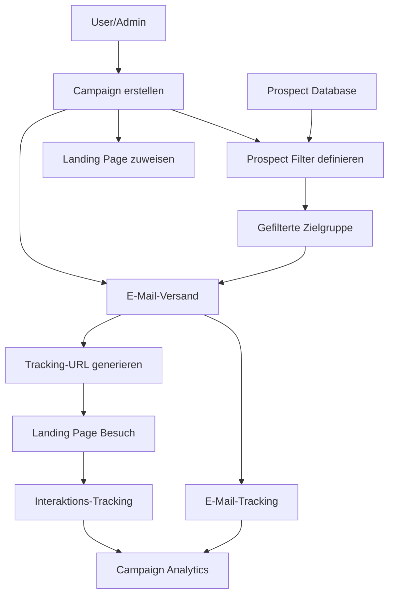

# Grundidee - APDE Backend System

## Überblick

Das **APDE (Automated Prospect Data and Email campaign) Backend System** ist eine Laravel 12-basierte Plattform für E-Mail-Kampagnen-Management. Das System ermöglicht es Benutzern, zielgerichtete Marketing-Kampagnen zu erstellen, Prospects zu verwalten und umfassende Analytics zu verfolgen.

## Zentrale Datenmodelle

### 1. **Campaign** - Kampagnen-Management
```php
Campaign {
    string $id
    string|null $landingpage_id     // Verknüpfung zur Landing Page
    string $title                   // Kampagnentitel
    string $slug                    // URL-freundlicher Identifier
    string|null $description        // Kampagnenbeschreibung
    CampaignStatus $status          // draft, active, paused, completed
    DateTime|null $start_date       // Kampagnen-Startdatum
    DateTime|null $end_date         // Kampagnen-Enddatum
    array|null $prospect_filter     // Filterkriterien für Prospects
}
```

**Zweck:** Eine Campaign repräsentiert eine Marketing-Kampagne, die ein Benutzer erstellen und verwalten kann. Sie umfasst:
- **Grunddaten:** Titel, Beschreibung und zeitliche Eingrenzung
- **Status-Management:** Lebenszyklus von Draft bis Completed
- **Prospect-Filterung:** Definiert welche Prospects angesprochen werden sollen
- **Landing Page-Zuordnung:** Verknüpfung zu einer wiederverwendbaren Landing Page

**Filterlogik:** Das `prospect_filter`-Feld enthält JSON-Filterkriterien wie:
```json
{
    "min_age": 25,
    "max_age": 40,
    "gender": "female",
    "source": "erp",
    "address_city": "Berlin"
}
```

### 2. **Landingpage** - Dynamische Seiten-Templates
```php
Landingpage {
    string $id
    string $title                          // Template-Name
    string $headline                       // Haupt-überschrift
    string|null $subline                   // Unter-überschrift
    array $sections                        // Dynamische Sektionen (JSON)
    array|null $form_fields               // Formular-Konfiguration (JSON)
}
```

**Zweck:** Landing Pages sind wiederverwendbare Templates, die dynamisch für Kampagnen konfiguriert werden können:
- **Template-System:** Mehrere Kampagnen können dieselbe Landing Page verwenden
- **Dynamische Sections:** JSON-basierte Konfiguration für Frontend-Flexibilität
- **Formular-Integration:** Konfigurierbare Formularfelder für Lead-Capture

**Sections-Struktur:** Das `sections`-Feld ermöglicht es dem Frontend, beliebige Sektionen zu definieren:
```json
[
    {
        "type": "hero",
        "title": "Exklusive Angebote",
        "background_image": "hero.jpg",
        "cta_text": "Jetzt buchen"
    },
    {
        "type": "features",
        "items": [
            {"title": "Wellness", "description": "Spa & Entspannung"},
            {"title": "Kulinarik", "description": "Regionale Küche"}
        ]
    }
]
```

### 3. **Prospect** - Zielgruppen-Verwaltung
```php
Prospect {
    string $id
    string $external_id               // Externe System-ID
    string $first_name, $last_name    // Persönliche Daten
    string $email                     // Kontakt-Information
    string|null $phone, $gender       // Zusätzliche Attribute
    int|null $age                     // Demografische Daten
    DateTime|null $birth_date
    array|null $address               // Adress-Informationen (JSON)
    ProspectDataSource $source        // Datenquelle (erp, kueba)
    // Physische Attribute für detaillierte Segmentierung
    float|null $height, $weight
    string|null $eye_color, $hair_color, $blood_group
}
```

**Zweck:** Prospects repräsentieren die Zielgruppe für Marketing-Kampagnen:
- **Multi-Source-Integration:** Import aus verschiedenen Datenquellen (ERP, Kueba)
- **Umfassende Profile:** Demografische, geografische und physische Attribute
- **Filterbare Attribute:** über 10 verschiedene Filterkriterien verfügbar
- **HasFilterable-Trait:** Generisches Filtersystem für komplexe Abfragen

**Filterable Attributes:**
```php
'source' => 'enum',           // erp, kueba
'gender' => 'enum',           // male, female
'age' => 'range',             // min_age, max_age
'address.city' => 'enum',     // Zürich, Bern, etc.
'address.latitude' => 'range', // Geo-Koordinaten
'height' => 'range',          // Physische Attribute
'eye_color' => 'enum'         // Detaillierte Segmentierung
```

### 4. **User** - Benutzer-Verwaltung
```php
User {
    string $id
    string $name, $email
    string $password              // Hashed
    UserRole $role               // ADMIN, SUPER_ADMIN
    string|null $remember_token
}
```

**Zweck:** Benutzer-Authentifizierung und rollenbasierte Autorisierung:
- **Laravel Sanctum:** Token-basierte API-Authentifizierung
- **Rollen-System:** Granulare Berechtigungen für verschiedene Aktionen
- **Policy-Integration:** Ressourcen-spezifische Zugriffskontrolle

## Beziehungsmodelle

### **CampaignProspect** - E-Mail-Tracking
```php
CampaignProspect {
    string $campaign_id
    string $prospect_id
    DateTime $created_at         // Zeitpunkt des E-Mail-Versands
}
```

**Zweck:** Verfolgt jeden einzelnen E-Mail-Versand und ermöglicht:
- **Duplikatsprävention:** Verhindert mehrfache Kontaktierung
- **E-Mail-Historie:** Vollständige Aufzeichnung aller Versendungen
- **Analytics-Grundlage:** Basis für Kampagnen-Statistiken

### **CampaignTracking** - Interaktions-Analytics
```php
CampaignTracking {
    string $campaign_id, $landingpage_id
    string|null $prospect_id         // Wenn von E-Mail-Link
    string $ip_address, $user_agent  // Technische Daten
    string|null $utm_source, $utm_medium, $utm_campaign
    array $tracking_data             // Erweiterte Analytics (JSON)
}
```

**Zweck:** Detailliertes Tracking aller Kampagnen-Interaktionen:
- **Besuchs-Tracking:** Automatische Erfassung bei Landing Page-Besuchen
- **UTM-Parameter:** Vollständige Marketing-Attribution
- **Device-Analytics:** Browser, OS, Gerätetyp-Erkennung
- **Unique Visitor-Calculation:** IP + User Agent-basierte Deduplizierung

## System-Architektur

### Datenfluss-Übersicht



### Kern-Beziehungen

1. **Campaign - Landingpage**
   - `Campaign belongsTo Landingpage`
   - `Landingpage hasMany Campaigns`
   - **Vorteil:** Wiederverwendbarkeit von Landing Page-Templates

2. **Campaign - Prospect (via CampaignProspect)**
   - Many-to-Many-Beziehung über Pivot-Tabelle
   - **Zweck:** E-Mail-Versand-Tracking und Duplikatsprävention

3. **Campaign - CampaignTracking**
   - One-to-Many für alle Kampagnen-Interaktionen
   - **Zweck:** Umfassende Analytics und Performance-Messung

## Geschäftslogik-Flow

### 1. Kampagnen-Erstellung
```
User 1. Campaign (Titel, Beschreibung, Status)
     2. Prospect Filter definieren (JSON)
     3. Landing Page zuweisen (optional)
     4. Status auf ACTIVE setzen
```

### 2. E-Mail-Versand
```
Campaign (ACTIVE) 1. Prospect Filtering (HasFilterable)
                  2. Duplicate Check (CampaignProspect)
                  3. E-Mail Generation mit Tracking-URL
                  4. CampaignProspect Record erstellen
                  5. E-Mail versenden (Queue)
```

### 3. Landing Page-Besuch
```
Prospect klickt E-Mail 1. Tracking-URL mit UTM-Parametern
                       2. CampaignTracking Record erstellen
                       3. Device/Browser-Detection
                       4. Landing Page anzeigen
```

### 4. Analytics-Generierung
```
CampaignTracking + CampaignProspect 1. Besuchs-Metriken
                                    2. E-Mail-Performance
                                    3. Device-Breakdown
                                    4. UTM-Attribution
                                    5. Click-Through-Rates
```

## Design-Prinzipien

### 1. **Flexibilität**
- **JSON-basierte Konfiguration:** Landing Page Sections und Prospect Filters
- **Enum-gesteuerte Werte:** Status, Rollen, Datenquellen für Typsicherheit
- **MongoDB-Flexibilität:** Schema-lose Datenstrukturen für Erweiterungen

### 2. **Skalierbarkeit**
- **Service-Layer-Architektur:** Business Logic getrennt von Controllern
- **Queue-System:** Asynchrone E-Mail-Verarbeitung
- **NoSQL-Optimierung:** Effiziente Queries für grosse Datenmengen

### 3. **Wartbarkeit**
- **Strict Typing:** PHP 8.4 mit durchgehender Typisierung
- **Policy-basierte Autorisierung:** Klare Trennung von Geschäftslogik und Sicherheit
- **Trait-System:** Wiederverwendbare Funktionalität (HasFilterable)

### 4. **Erweiterbarkeit**
- **Plugin-Architecture:** Neue Filter-Typen einfach hinzufügbar
- **Event-System:** Laravel Events für Hooks und Integrationen
- **API-First:** Vollständige REST-API für Frontend-Flexibilität

## Zusammenfassung

Das APDE-System basiert auf fünf Kern-Entitäten:

1. **Campaign** - Orchestriert Marketing-Kampagnen mit Filtering und Status-Management
2. **Landingpage** - Bietet wiederverwendbare, dynamisch konfigurierbare Seiten-Templates
3. **Prospect** - Verwaltet umfassende Zielgruppen-Profile mit fortgeschrittener Filterung
4. **CampaignProspect** - Trackt E-Mail-Versendungen für Analytics und Duplikatsprävention
5. **CampaignTracking** - Erfasst detaillierte Interaktions-Daten für Performance-Analyse

Die Architektur ermöglicht es Benutzern, komplexe Marketing-Kampagnen zu erstellen, präzise Zielgruppen anzusprechen und umfassende Performance-Analysen durchzuführen - alles über eine moderne, typsichere Laravel-API.