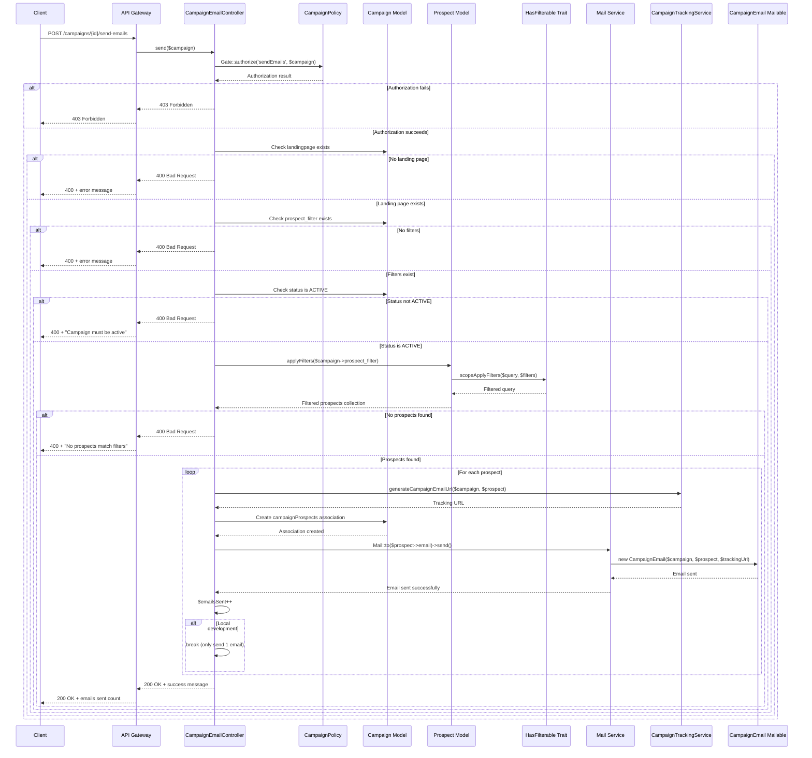

# Campaign Mailing Documentation

This document provides comprehensive documentation for the Campaign Mailing system in the APDE backend API.

## Table of Contents

- [Overview](#overview)
- [API Endpoint](#api-endpoint)
- [Authentication & Authorization](#authentication--authorization)
- [Campaign Requirements](#campaign-requirements)
- [Prospect Filtering](#prospect-filtering)
- [Email Generation](#email-generation)
- [Tracking & Analytics](#tracking--analytics)
- [Local Development Behavior](#local-development-behavior)
- [Error Handling](#error-handling)
- [Example Usage](#example-usage)
- [Sequence Diagram](#sequence-diagram)

## Overview

The Campaign Mailing system allows authorized users to send personalized emails to prospects based on campaign-specific filters. The system integrates with the prospect filtering mechanism and includes tracking capabilities for campaign analytics.

## API Endpoints

### Send Campaign Emails

**Endpoint:** `POST /api/campaigns/{campaign}/send-emails`

**Description:** Sends personalized emails to prospects matching the campaign's filter criteria. Duplicate sends to the same prospect are prevented by default.

**URL Parameters:**
- `campaign` (string, required): Campaign ID or UUID

**Query Parameters:**
- `force` (boolean, optional): Force sending emails to prospects who have already been contacted. Default: `false`

**Authentication:** Required (Bearer token)

**Authorization:** ADMIN or SUPER_ADMIN role required

### Get Email Statistics

**Endpoint:** `GET /api/campaigns/{campaign}/send-emails/sent`

**Description:** Returns email statistics for a campaign without sending any emails. Shows the same metrics as the send endpoint but only displays current statistics.

**URL Parameters:**
- `campaign` (string, required): Campaign ID or UUID

**Authentication:** Required (Bearer token)

**Authorization:** Campaign view permission required

## Authentication & Authorization

### Required Permissions

The `sendEmails` action requires ADMIN or SUPER_ADMIN role:

```php
// app/Policies/CampaignPolicy.php
public function sendEmails(User $user): bool
{
    return in_array($user->role, [
        UserRole::ADMIN,
        UserRole::SUPER_ADMIN,
    ]);
}
```

### Authentication Flow

1. User must be authenticated via Laravel Sanctum
2. User must have appropriate role (ADMIN or SUPER_ADMIN)
3. Campaign must exist and be accessible to the user

## Campaign Requirements

Before sending emails, the campaign must meet specific criteria:

### 1. Associated Landing Page

The campaign must have an associated landing page:

```php
if (! $campaign->landingpage) {
    return response()->json([
        'message' => 'Campaign must have an associated landing page to send emails.',
    ], 400);
}
```

### 2. Prospect Filters

The campaign must have prospect filters defined:

```php
if (! $campaign->prospect_filter) {
    return response()->json([
        'message' => 'Campaign must have prospect filters defined to send emails.',
    ], 400);
}
```

### 3. Active Status

The campaign must be in ACTIVE status to send emails:

```php
if ($campaign->status !== CampaignStatus::ACTIVE) {
    return response()->json([
        'message' => 'Campaign must be active to send emails.',
    ], 400);
}
```

**Available Campaign Statuses:**
- `draft` - Campaign is in draft mode
- `active` - Campaign is active and can send emails
- `paused` - Campaign is paused
- `completed` - Campaign is completed

## Prospect Filtering

The system uses the `applyFilters` method from the `HasFilterable` trait to filter prospects based on campaign criteria. The system automatically filters out prospects who have already been contacted for this campaign unless the `force` parameter is set to `true`. The system tracks each email send individually while using unique prospect IDs to prevent duplicates in default mode.

### Filter Structure

Campaign filters are stored in the `prospect_filter` field as an array:

```php
// Example campaign filter
[
    "min_age" => 39,
    "max_age" => 40,
    "source" => "erp",
    "gender" => "female"
]
```

### Available Filter Types

The Prospect model supports the following filterable attributes:

#### Enum Filters
- `source` - Data source (erp, kueba)
- `gender` - Gender (male, female)
- `blood_group` - Blood group
- `eye_color` - Eye color
- `hair_color` - Hair color
- `address.city` - City
- `address.state` - State
- `address.country` - Country

#### Range Filters
- `age` - Age (use min_age, max_age)
- `birth_date` - Birth date (use min_birth_date, max_birth_date)
- `height` - Height (use min_height, max_height)
- `weight` - Weight (use min_weight, max_weight)
- `address.plz` - Postal code (use min_address_plz, max_address_plz)
- `address.latitude` - Latitude (use min_address_latitude, max_address_latitude)
- `address.longitude` - Longitude (use min_address_longitude, max_address_longitude)

### Filter Syntax

#### Basic Filters
```php
[
    "source" => "erp",
    "gender" => "female"
]
```

#### Range Filters
```php
[
    "min_age" => 25,
    "max_age" => 40
]
```

#### Array Filters
```php
[
    "gender_in" => ["male", "female"],
    "source_not_in" => ["kueba"]
]
```

#### Nested Field Filters
```php
[
    "address_city" => "Berlin",
    "min_address_latitude" => 50.0,
    "max_address_latitude" => 60.0
]
```

## Email Generation

### Email Content

Emails are generated using the `CampaignEmail` mailable class with the following template:

```blade
@component('mail::message')
# Hello {{ $prospect->gender === 'male' ? 'Mr.' : 'Ms.' }} {{ $prospect->first_name }} {{ $prospect->last_name }}

We have an exciting offer from Hotel Grand Pilatus just for you!

{{ $campaign->description ?? 'Discover our exclusive offers and experiences designed with you in mind.' }}

@component('mail::button', ['url' => $trackingUrl])
View Exclusive Offer
@endcomponent

We look forward to welcoming you to Hotel Grand Pilatus.

Best regards,<br>
Your Hotel Grand Pilatus Team
@endcomponent
```

### Email Properties

- **Subject:** Campaign title
- **Recipient:** Prospect email address
- **Content:** Personalized message with prospect name and campaign description
- **Call-to-Action:** Tracking URL to landing page

## Tracking & Analytics

### Tracking URL Generation

Each email includes a unique tracking URL generated by the `CampaignTrackingService`:

```php
public function generateCampaignEmailUrl(Campaign $campaign, Prospect $prospect): string
{
    throw_unless($campaign->landingpage, new InvalidArgumentException('Campaign must have an associated landing page'));

    $params = [
        'identifier' => $campaign->landingpage->slug,
        'prospect' => $prospect->id,
        'utm_source' => 'mail',
        'utm_medium' => 'web',
        'utm_campaign' => $campaign->title,
    ];

    return route('lp.show', $params);
}
```

### UTM Parameters

The tracking URL includes the following UTM parameters:
- `utm_source`: "mail"
- `utm_medium`: "web"
- `utm_campaign`: Campaign title
- `prospect`: Prospect ID for tracking

### Visit Tracking

When prospects click the email link, the system tracks the visit:

```php
public function trackLandingPageVisit(Request $request, Landingpage $landingpage): CampaignTracking
{
    return CampaignTracking::create([
        'campaign_id' => $landingpage->campaign_id,
        'landingpage_id' => $landingpage->id,
        'prospect_id' => $request->get('prospect'),
        'ip_address' => $request->ip(),
        'user_agent' => $request->userAgent(),
        'referrer' => $request->header('referer'),
        'utm_source' => $request->get('utm_source'),
        'utm_medium' => $request->get('utm_medium'),
        'utm_campaign' => $request->get('utm_campaign'),
        'utm_content' => $request->get('utm_content'),
        'utm_term' => $request->get('utm_term'),
        'gclid' => $request->get('gclid'),
        'fbclid' => $request->get('fbclid'),
        'tracking_data' => $this->extractTrackingData($request),
    ]);
}
```

## Local Development Behavior

**Important:** In local development environment, the system has safety features to prevent accidental mass emails:
- **Default behavior:** Only sends **1 email** to the first matching prospect
- **Force mode:** Sends up to **3 emails** to prevent excessive testing emails

```php
foreach ($prospects as $prospect) {
    try {
        $trackingUrl = $this->trackingService->generateCampaignEmailUrl($campaign, $prospect);

        // Create association record to track this email send
        $campaign->campaignProspects()->create([
            'prospect_id' => $prospect->id,
        ]);

        Mail::to($prospect->email)->send(
            new CampaignEmail($campaign, $prospect, $trackingUrl)
        );

        $emailsSent++;

        if (! $force && app()->isLocal()) {
            break; // Only send 1 email in local development (default mode)
        }

        if ($force && app()->isLocal() && $emailsSent >= 3) {
            break; // Send up to 3 emails in local development (force mode)
        }

    } catch (Exception $e) {
        // Log the error but continue with other prospects
        logger()->error('Failed to send campaign email', [
            'campaign_id' => $campaign->id,
            'prospect_id' => $prospect->id,
            'error' => $e->getMessage(),
        ]);
    }
}
```

## Error Handling

### Validation Errors

The system performs several validations before sending emails:

1. **Campaign Authorization:** User must have permission to send emails
2. **Landing Page Required:** Campaign must have an associated landing page
3. **Filters Required:** Campaign must have prospect filters defined
4. **Active Status Required:** Campaign must be in ACTIVE status
5. **Prospects Found:** At least one prospect must match the filters

### Email Sending Errors

Individual email failures are logged but don't stop the entire process:

```php
catch (Exception $e) {
    logger()->error('Failed to send campaign email', [
        'campaign_id' => $campaign->id,
        'prospect_id' => $prospect->id,
        'error' => $e->getMessage(),
    ]);
}
```

### Response Format

**Send Emails Success Response:**
```json
{
    "message": "Campaign emails queued successfully. 1 emails sent to prospects.",
    "campaign": {
        "id": 1,
        "title": "Summer Sale 2024"
    },
    "emails_sent": 1,
    "total_emails_sent": 6,
    "notified_prospects": 5,
    "available_prospects": 94,
    "total_prospects": 100
}
```

**Email Statistics Response:**
```json
{
    "campaign": {
        "id": 1,
        "title": "Summer Sale 2024"
    },
    "total_emails_sent": 6,
    "notified_prospects": 5,
    "available_prospects": 94,
    "total_prospects": 100
}
```

### Response Fields

**Send Emails Response Fields:**
- `message`: Success message with email count
- `campaign`: Campaign information (ID and title)
- `emails_sent`: Number of emails sent in this request
- `total_emails_sent`: Total number of emails sent for this campaign (including all previous sends)
- `notified_prospects`: Number of unique prospects that have received at least one email
- `available_prospects`: Number of prospects that haven't been contacted yet
- `total_prospects`: Total number of prospects matching the campaign filters

**Email Statistics Response Fields:**
- `campaign`: Campaign information (ID and title)
- `total_emails_sent`: Total number of emails sent for this campaign
- `notified_prospects`: Number of unique prospects that have received at least one email
- `available_prospects`: Number of prospects that haven't been contacted yet
- `total_prospects`: Total number of prospects matching the campaign filters

**Error Responses:**
```json
{
    "message": "Campaign must have an associated landing page to send emails."
}
```

```json
{
    "message": "Campaign must have prospect filters defined to send emails."
}
```

```json
{
    "message": "Campaign must be active to send emails."
}
```

```json
{
    "message": "No prospects match the campaign filters or all prospects have already been contacted."
}
```

## Example Usage

### 1. Create Campaign with Filters

```php
$campaign = Campaign::create([
    'title' => 'Summer Sale 2024',
    'description' => 'Exclusive summer offers for our valued customers',
    'status' => CampaignStatus::ACTIVE,
    'prospect_filter' => [
        'min_age' => 39,
        'max_age' => 40,
        'source' => 'erp',
        'gender' => 'female'
    ]
]);
```

### 2. Send Campaign Emails

```bash
# Send emails to new prospects only (default behavior)
curl -X POST "http://localhost:8000/api/campaigns/{campaign_id}/send-emails" \
  -H "Authorization: Bearer YOUR_TOKEN" \
  -H "Accept: application/json"

# Force send emails to all prospects (including already contacted)
curl -X POST "http://localhost:8000/api/campaigns/{campaign_id}/send-emails?force=true" \
  -H "Authorization: Bearer YOUR_TOKEN" \
  -H "Accept: application/json"
```

### 3. Get Email Statistics

```bash
# Get email statistics without sending emails
curl -X GET "http://localhost:8000/api/campaigns/{campaign_id}/send-emails/sent" \
  -H "Authorization: Bearer YOUR_TOKEN" \
  -H "Accept: application/json"
```

### 4. Example Responses

**Send Emails Response:**
```json
{
    "message": "Campaign emails queued successfully. 1 emails sent to prospects.",
    "campaign": {
        "id": 1,
        "title": "Summer Sale 2024"
    },
    "emails_sent": 1,
    "total_emails_sent": 6,
    "notified_prospects": 5,
    "available_prospects": 94,
    "total_prospects": 100
}
```

**Email Statistics Response:**
```json
{
    "campaign": {
        "id": 1,
        "title": "Summer Sale 2024"
    },
    "total_emails_sent": 6,
    "notified_prospects": 5,
    "available_prospects": 94,
    "total_prospects": 100
}
```

### 5. Filter Examples

#### Basic Filter
```php
[
    "source" => "erp",
    "gender" => "female"
]
```

#### Age Range Filter
```php
[
    "min_age" => 25,
    "max_age" => 50
]
```

#### Complex Filter
```php
[
    "source" => "erp",
    "gender" => "female",
    "min_age" => 39,
    "max_age" => 40,
    "address_city" => "Berlin"
]
```

#### Multiple Values Filter
```php
[
    "gender_in" => ["male", "female"],
    "source" => "erp",
    "min_age" => 30
]
```

## Sequence Diagram



## Implementation Details

### Core Components

1. **CampaignEmailController** (`app/Http/Controllers/Api/CampaignEmailController.php`)
   - Handles the email sending endpoint
   - Delegates validation and email sending to CampaignEmailService
   - Provides thin controller layer for email operations

2. **CampaignAnalyticsController** (`app/Http/Controllers/Api/CampaignAnalyticsController.php`)
   - Handles email statistics endpoint (`/send-emails/sent`)
   - Delegates statistics calculation to CampaignAnalyticsService
   - Provides email metrics without sending emails

3. **CampaignEmailService** (`app/Services/CampaignEmailService.php`)
   - Validates campaign requirements (landing page, filters, active status)
   - Manages prospect filtering and email sending process
   - Implements local development safety limits
   - Prevents duplicate notifications using unique prospect IDs
   - Supports force parameter to override duplicate prevention
   - Tracks each email send individually for complete history

4. **CampaignAnalyticsService** (`app/Services/CampaignAnalyticsService.php`)
   - Provides comprehensive campaign analytics including email statistics
   - Calculates email metrics (sent count, notified prospects, available prospects)
   - Integrates with prospect filtering to provide accurate statistics

5. **CampainProspect Model** (`app/Models/CampainProspect.php`)
   - Manages campaign-prospect associations
   - Tracks each individual email send for complete history
   - Provides relationship methods for campaigns and prospects
   - Enables duplicate prevention using unique prospect IDs

6. **CampaignEmail Mailable** (`app/Mail/CampaignEmail.php`)
   - Laravel mailable class for campaign emails
   - Uses markdown template for email content
   - Includes campaign, prospect, and tracking URL

7. **CampaignTrackingService** (`app/Services/CampaignTrackingService.php`)
   - Generates tracking URLs with UTM parameters
   - Tracks landing page visits
   - Extracts tracking data from requests

8. **HasFilterable Trait** (`app/Traits/HasFilterable.php`)
   - Provides filtering functionality for prospects
   - Supports enum and range filters
   - Handles automatic value casting

### Email Template

The email template (`resources/views/emails/campaign.blade.php`) provides:
- Personalized greeting with prospect name
- Campaign description
- Call-to-action button with tracking URL
- Professional signature

### Tracking Integration

The system integrates with the landing page tracking system:
- Each email includes a unique tracking URL
- Click tracking via UTM parameters
- Visit analytics stored in `campaign_trackings` collection
- Device and browser detection
- Prospect-campaign associations stored in `campain_prospects` collection for email tracking and duplicate prevention

## Best Practices

1. **Test Filters First:** Use the generic filter endpoint to test your filters before creating campaigns
2. **Monitor Email Sending:** Check logs for any email sending failures
3. **Use Local Development:** Always test in local environment first (sends only 1 email)
4. **Validate Campaign Setup:** Ensure landing page and filters are properly configured
5. **Review Analytics:** Monitor campaign performance through tracking data
6. **Avoid Duplicate Sends:** Use the default behavior to prevent duplicate notifications
7. **Use Force Parameter Carefully:** Only use `force=true` when you need to resend to all prospects
8. **Check Campaign Status:** Ensure campaigns are in ACTIVE status before sending emails

## Troubleshooting

### Common Issues

1. **No Emails Sent:** Check if prospects match the filter criteria
2. **Authorization Errors:** Ensure user has ADMIN or SUPER_ADMIN role for sending emails, or appropriate view permissions for statistics
3. **Missing Landing Page:** Create and associate a landing page with the campaign
4. **Filter Syntax Errors:** Verify filter structure matches expected format
5. **Email Delivery Issues:** Check mail configuration and logs
6. **All Prospects Already Contacted:** Use `force=true` parameter to resend to all prospects
7. **Campaign Not Active:** Ensure campaign status is set to ACTIVE before sending emails
8. **Statistics Show Zero:** Ensure campaign has prospect filters defined to calculate statistics

### Debugging Steps

1. **Verify Campaign Setup:**
   ```php
   $campaign = Campaign::find($id);
   dd($campaign->landingpage, $campaign->prospect_filter, $campaign->status);
   ```

2. **Test Prospect Filters:**
   ```bash
   curl -X GET "http://localhost:8000/api/prospects/filter?source=erp&gender=female" \
     -H "Authorization: Bearer YOUR_TOKEN"
   ```

3. **Check Campaign-Prospect Associations:**
   ```php
   $campaign = Campaign::find($id);
   dd($campaign->campaignProspects()->count()); // Total emails sent
   dd($campaign->campaignProspects()->pluck('prospect_id')->unique()->count()); // Unique prospects notified
   ```

4. **Check Email Logs:**
   ```bash
   tail -f storage/logs/laravel.log
   ```

5. **Verify Local Development:**
   ```php
   dd(app()->isLocal()); // Should return true in local environment
   ```

6. **Check Campaign Status:**
   ```php
   $campaign = Campaign::find($id);
   dd($campaign->status); // Should be CampaignStatus::ACTIVE
   ```
