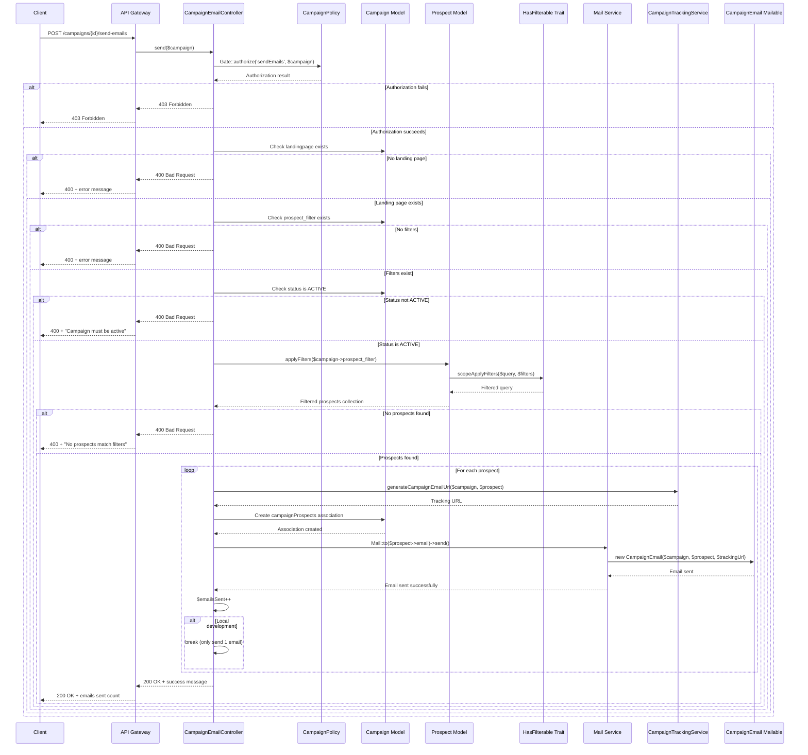

# Kampagnen-Mailing Dokumentation

Diese Dokumentation bietet eine umfassende Anleitung für das Kampagnen-Mailing-System in der APDE Backend-API.

## Inhaltsverzeichnis

- [Überblick](#überblick)
- [API-Endpunkte](#api-endpunkte)
- [Authentifizierung & Autorisierung](#authentifizierung--autorisierung)
- [Kampagnen-Anforderungen](#kampagnen-anforderungen)
- [Prospect-Filterung](#prospect-filterung)
- [E-Mail-Generierung](#e-mail-generierung)
- [Tracking & Analytics](#tracking--analytics)
- [Lokales Entwicklungsverhalten](#lokales-entwicklungsverhalten)
- [Fehlerbehandlung](#fehlerbehandlung)
- [Beispielverwendung](#beispielverwendung)
- [Sequenzdiagramm](#sequenzdiagramm)

## Überblick

Das Kampagnen-Mailing-System ermöglicht es autorisierten Benutzern, personalisierte E-Mails an Prospects basierend auf kampagnenspezifischen Filtern zu senden. Das System integriert sich mit dem Prospect-Filterungsmechanismus und verfügt über Tracking-Funktionen für Kampagnen-Analytics.

## API-Endpunkte

### Kampagnen-E-Mails senden

**Endpunkt:** `POST /api/campaigns/{campaign}/send-emails`

**Beschreibung:** Sendet personalisierte E-Mails an Prospects, die den Filterkriterien der Kampagne entsprechen. Doppelte Sendungen an denselben Prospect werden standardmäßig verhindert.

**URL-Parameter:**
- `campaign` (string, erforderlich): Kampagnen-ID oder UUID

**Query-Parameter:**
- `force` (boolean, optional): Erzwingt das Senden von E-Mails an Prospects, die bereits kontaktiert wurden. Standard: `false`

**Authentifizierung:** Erforderlich (Bearer Token)

**Autorisierung:** ADMIN oder SUPER_ADMIN Rolle erforderlich

### E-Mail-Statistiken abrufen

**Endpunkt:** `GET /api/campaigns/{campaign}/send-emails/sent`

**Beschreibung:** Gibt E-Mail-Statistiken für eine Kampagne zurück, ohne E-Mails zu senden. Zeigt dieselben Metriken wie der Send-Endpunkt, aber nur aktuelle Statistiken.

**URL-Parameter:**
- `campaign` (string, erforderlich): Kampagnen-ID oder UUID

**Authentifizierung:** Erforderlich (Bearer Token)

**Autorisierung:** Kampagnen-Ansichtsberechtigung erforderlich

## Authentifizierung & Autorisierung

### Erforderliche Berechtigungen

Die `sendEmails`-Aktion erfordert die ADMIN- oder SUPER_ADMIN-Rolle:

```php
// app/Policies/CampaignPolicy.php
public function sendEmails(User $user): bool
{
    return in_array($user->role, [
        UserRole::ADMIN,
        UserRole::SUPER_ADMIN,
    ]);
}
```

### Authentifizierungsablauf

1. Benutzer muss über Laravel Sanctum authentifiziert sein
2. Benutzer muss die entsprechende Rolle haben (ADMIN oder SUPER_ADMIN)
3. Kampagne muss existieren und für den Benutzer zugänglich sein

## Kampagnen-Anforderungen

Bevor E-Mails gesendet werden, muss die Kampagne bestimmte Kriterien erfüllen:

### 1. Verknüpfte Landing Page

Die Kampagne muss eine verknüpfte Landing Page haben:

```php
if (! $campaign->landingpage) {
    return response()->json([
        'message' => 'Campaign must have an associated landing page to send emails.',
    ], 400);
}
```

### 2. Prospect-Filter

Die Kampagne muss definierte Prospect-Filter haben:

```php
if (! $campaign->prospect_filter) {
    return response()->json([
        'message' => 'Campaign must have prospect filters defined to send emails.',
    ], 400);
}
```

### 3. Aktiver Status

Die Kampagne muss im ACTIVE-Status sein, um E-Mails zu senden:

```php
if ($campaign->status !== CampaignStatus::ACTIVE) {
    return response()->json([
        'message' => 'Campaign must be active to send emails.',
    ], 400);
}
```

**Verfügbare Kampagnen-Status:**
- `draft` - Kampagne ist im Entwurfsmodus
- `active` - Kampagne ist aktiv und kann E-Mails senden
- `paused` - Kampagne ist pausiert
- `completed` - Kampagne ist abgeschlossen

## Prospect-Filterung

Das System verwendet die `applyFilters`-Methode vom `HasFilterable`-Trait, um Prospects basierend auf Kampagnenkriterien zu filtern. Das System filtert automatisch Prospects heraus, die bereits für diese Kampagne kontaktiert wurden, es sei denn, der `force`-Parameter ist auf `true` gesetzt. Das System verfolgt jeden E-Mail-Versand einzeln und verwendet eindeutige Prospect-IDs, um Duplikate im Standardmodus zu verhindern.

### Filter-Struktur

Kampagnenfilter werden im `prospect_filter`-Feld als Array gespeichert:

```php
// Beispiel Kampagnenfilter
[
    "min_age" => 39,
    "max_age" => 40,
    "source" => "erp",
    "gender" => "female"
]
```

### Verfügbare Filtertypen

Das Prospect-Modell unterstützt die folgenden filterbaren Attribute:

#### Enum-Filter
- `source` - Datenquelle (erp, kueba)
- `gender` - Geschlecht (male, female)
- `blood_group` - Blutgruppe
- `eye_color` - Augenfarbe
- `hair_color` - Haarfarbe
- `address.city` - Stadt
- `address.state` - Bundesland
- `address.country` - Land

#### Bereichsfilter
- `age` - Alter (verwende min_age, max_age)
- `birth_date` - Geburtsdatum (verwende min_birth_date, max_birth_date)
- `height` - Größe (verwende min_height, max_height)
- `weight` - Gewicht (verwende min_weight, max_weight)
- `address.plz` - Postleitzahl (verwende min_address_plz, max_address_plz)
- `address.latitude` - Breitengrad (verwende min_address_latitude, max_address_latitude)
- `address.longitude` - Längengrad (verwende min_address_longitude, max_address_longitude)

### Filter-Syntax

#### Grundlegende Filter
```php
[
    "source" => "erp",
    "gender" => "female"
]
```

#### Bereichsfilter
```php
[
    "min_age" => 25,
    "max_age" => 40
]
```

#### Array-Filter
```php
[
    "gender_in" => ["male", "female"],
    "source_not_in" => ["kueba"]
]
```

#### Verschachtelte Feld-Filter
```php
[
    "address_city" => "Berlin",
    "min_address_latitude" => 50.0,
    "max_address_latitude" => 60.0
]
```

## E-Mail-Generierung

### E-Mail-Inhalt

E-Mails werden mit der `CampaignEmail`-Mailable-Klasse und folgendem Template generiert:

```blade
@component('mail::message')
# Hello {{ $prospect->gender === 'male' ? 'Mr.' : 'Ms.' }} {{ $prospect->first_name }} {{ $prospect->last_name }}

We have an exciting offer from Hotel Grand Pilatus just for you!

{{ $campaign->description ?? 'Discover our exclusive offers and experiences designed with you in mind.' }}

@component('mail::button', ['url' => $trackingUrl])
View Exclusive Offer
@endcomponent

We look forward to welcoming you to Hotel Grand Pilatus.

Best regards,<br>
Your Hotel Grand Pilatus Team
@endcomponent
```

### E-Mail-Eigenschaften

- **Betreff:** Kampagnentitel
- **Empfänger:** Prospect E-Mail-Adresse
- **Inhalt:** Personalisierte Nachricht mit Prospect-Name und Kampagnenbeschreibung
- **Call-to-Action:** Tracking-URL zur Landing Page

## Tracking & Analytics

### Tracking-URL-Generierung

Jede E-Mail enthält eine eindeutige Tracking-URL, die vom `CampaignTrackingService` generiert wird:

```php
public function generateCampaignEmailUrl(Campaign $campaign, Prospect $prospect): string
{
    throw_unless($campaign->landingpage, new InvalidArgumentException('Campaign must have an associated landing page'));

    $params = [
        'identifier' => $campaign->landingpage->slug,
        'prospect' => $prospect->id,
        'utm_source' => 'mail',
        'utm_medium' => 'web',
        'utm_campaign' => $campaign->title,
    ];

    return route('lp.show', $params);
}
```

### UTM-Parameter

Die Tracking-URL enthält folgende UTM-Parameter:
- `utm_source`: "mail"
- `utm_medium`: "web"
- `utm_campaign`: Kampagnentitel
- `prospect`: Prospect-ID für Tracking

### Besuchs-Tracking

Wenn Prospects auf den E-Mail-Link klicken, verfolgt das System den Besuch:

```php
public function trackLandingPageVisit(Request $request, Landingpage $landingpage): CampaignTracking
{
    return CampaignTracking::create([
        'campaign_id' => $landingpage->campaign_id,
        'landingpage_id' => $landingpage->id,
        'prospect_id' => $request->get('prospect'),
        'ip_address' => $request->ip(),
        'user_agent' => $request->userAgent(),
        'referrer' => $request->header('referer'),
        'utm_source' => $request->get('utm_source'),
        'utm_medium' => $request->get('utm_medium'),
        'utm_campaign' => $request->get('utm_campaign'),
        'utm_content' => $request->get('utm_content'),
        'utm_term' => $request->get('utm_term'),
        'gclid' => $request->get('gclid'),
        'fbclid' => $request->get('fbclid'),
        'tracking_data' => $this->extractTrackingData($request),
    ]);
}
```

## Lokales Entwicklungsverhalten

**Wichtig:** In der lokalen Entwicklungsumgebung hat das System Sicherheitsfeatures, um versehentliche Massen-E-Mails zu verhindern:
- **Standardverhalten:** Sendet nur **1 E-Mail** an den ersten passenden Prospect
- **Force-Modus:** Sendet bis zu **3 E-Mails**, um übermäßige Test-E-Mails zu verhindern

```php
foreach ($prospects as $prospect) {
    try {
        $trackingUrl = $this->trackingService->generateCampaignEmailUrl($campaign, $prospect);

        // Erstelle Verknüpfungsrecord zum Verfolgen dieses E-Mail-Versands
        $campaign->campaignProspects()->create([
            'prospect_id' => $prospect->id,
        ]);

        Mail::to($prospect->email)->send(
            new CampaignEmail($campaign, $prospect, $trackingUrl)
        );

        $emailsSent++;

        if ($this->shouldStopSending($force, $emailsSent)) {
            break;
        }

    } catch (Exception $e) {
        // Logge den Fehler, aber setze mit anderen Prospects fort
        logger()->error('Failed to send campaign email', [
            'campaign_id' => $campaign->id,
            'prospect_id' => $prospect->id,
            'error' => $e->getMessage(),
        ]);
    }
}
```

## Fehlerbehandlung

### Validierungsfehler

Das System führt mehrere Validierungen durch, bevor E-Mails gesendet werden:

1. **Kampagnen-Autorisierung:** Benutzer muss Berechtigung zum Senden von E-Mails haben
2. **Landing Page erforderlich:** Kampagne muss eine verknüpfte Landing Page haben
3. **Filter erforderlich:** Kampagne muss definierte Prospect-Filter haben
4. **Aktiver Status erforderlich:** Kampagne muss im ACTIVE-Status sein
5. **Prospects gefunden:** Mindestens ein Prospect muss den Filtern entsprechen

### E-Mail-Versandfehler

Einzelne E-Mail-Fehler werden protokolliert, stoppen aber nicht den gesamten Prozess:

```php
catch (Exception $e) {
    logger()->error('Failed to send campaign email', [
        'campaign_id' => $campaign->id,
        'prospect_id' => $prospect->id,
        'error' => $e->getMessage(),
    ]);
}
```

### Antwortformat

**E-Mails senden Erfolgsantwort:**
```json
{
    "message": "Campaign emails queued successfully. 1 emails sent to prospects.",
    "campaign": {
        "id": 1,
        "title": "Summer Sale 2024"
    },
    "emails_sent": 1,
    "total_emails_sent": 6,
    "notified_prospects": 5,
    "available_prospects": 94,
    "total_prospects": 100
}
```

**E-Mail-Statistiken Antwort:**
```json
{
    "campaign": {
        "id": 1,
        "title": "Summer Sale 2024"
    },
    "total_emails_sent": 6,
    "notified_prospects": 5,
    "available_prospects": 94,
    "total_prospects": 100
}
```

### Antwortfelder

**E-Mails senden Antwortfelder:**
- `message`: Erfolgsmeldung mit E-Mail-Anzahl
- `campaign`: Kampagneninformationen (ID und Titel)
- `emails_sent`: Anzahl der in dieser Anfrage gesendeten E-Mails
- `total_emails_sent`: Gesamtanzahl der für diese Kampagne gesendeten E-Mails (einschließlich aller vorherigen Sendungen)
- `notified_prospects`: Anzahl der eindeutigen Prospects, die mindestens eine E-Mail erhalten haben
- `available_prospects`: Anzahl der Prospects, die noch nicht kontaktiert wurden
- `total_prospects`: Gesamtanzahl der Prospects, die den Kampagnenfiltern entsprechen

**E-Mail-Statistiken Antwortfelder:**
- `campaign`: Kampagneninformationen (ID und Titel)
- `total_emails_sent`: Gesamtanzahl der für diese Kampagne gesendeten E-Mails
- `notified_prospects`: Anzahl der eindeutigen Prospects, die mindestens eine E-Mail erhalten haben
- `available_prospects`: Anzahl der Prospects, die noch nicht kontaktiert wurden
- `total_prospects`: Gesamtanzahl der Prospects, die den Kampagnenfiltern entsprechen

**Fehlerantworten:**
```json
{
    "message": "Campaign must have an associated landing page to send emails."
}
```

```json
{
    "message": "Campaign must have prospect filters defined to send emails."
}
```

```json
{
    "message": "Campaign must be active to send emails."
}
```

```json
{
    "message": "No prospects match the campaign filters or all prospects have already been contacted."
}
```

## Beispielverwendung

### 1. Kampagne mit Filtern erstellen

```php
$campaign = Campaign::create([
    'title' => 'Summer Sale 2024',
    'description' => 'Exklusive Sommerangebote für unsere geschätzten Kunden',
    'status' => CampaignStatus::ACTIVE,
    'prospect_filter' => [
        'min_age' => 39,
        'max_age' => 40,
        'source' => 'erp',
        'gender' => 'female'
    ]
]);
```

### 2. Kampagnen-E-Mails senden

```bash
# E-Mails nur an neue Prospects senden (Standardverhalten)
curl -X POST "http://localhost:8000/api/campaigns/{campaign_id}/send-emails" \
  -H "Authorization: Bearer YOUR_TOKEN" \
  -H "Accept: application/json"

# E-Mails an alle Prospects zwingen (einschließlich bereits kontaktierter)
curl -X POST "http://localhost:8000/api/campaigns/{campaign_id}/send-emails?force=true" \
  -H "Authorization: Bearer YOUR_TOKEN" \
  -H "Accept: application/json"
```

### 3. E-Mail-Statistiken abrufen

```bash
# E-Mail-Statistiken abrufen ohne E-Mails zu senden
curl -X GET "http://localhost:8000/api/campaigns/{campaign_id}/send-emails/sent" \
  -H "Authorization: Bearer YOUR_TOKEN" \
  -H "Accept: application/json"
```

### 4. Filter-Beispiele

#### Grundlegender Filter
```php
[
    "source" => "erp",
    "gender" => "female"
]
```

#### Altersbereich-Filter
```php
[
    "min_age" => 25,
    "max_age" => 50
]
```

#### Komplexer Filter
```php
[
    "source" => "erp",
    "gender" => "female",
    "min_age" => 39,
    "max_age" => 40,
    "address_city" => "Berlin"
]
```

#### Mehrwerte-Filter
```php
[
    "gender_in" => ["male", "female"],
    "source" => "erp",
    "min_age" => 30
]
```

## Sequenzdiagramm



## Implementierungsdetails

### Kernkomponenten

1. **CampaignEmailController** (`app/Http/Controllers/Api/CampaignEmailController.php`)
   - **Zweck:** Behandelt den E-Mail-Versand-Endpunkt `POST /api/campaigns/{campaign}/send-emails`
   - **Funktionalität:**
     - Autorisierungsprüfung über Gate::authorize('sendEmails', $campaign)
     - Delegiert Kampagnen-Validierung an CampaignEmailService
     - Verarbeitet den 'force' Query-Parameter für erneutes Senden
     - Orchestriert den E-Mail-Versandprozess
     - Formatiert API-Antworten mit detaillierten Statistiken
   - **Architektur:** Dünne Controller-Schicht, die ausschließlich HTTP-Logik behandelt
   - **Sicherheit:** Implementiert lokale Entwicklungslimits (1-3 E-Mails max)
   - **Antwortformat:** Strukturierte JSON-Antworten mit Kampagnen-ID, Titel und E-Mail-Statistiken

2. **CampaignAnalyticsController** (`app/Http/Controllers/Api/CampaignAnalyticsController.php`)
   - **Zweck:** Behandelt E-Mail-Statistiken-Endpunkt `GET /api/campaigns/{campaign}/send-emails/sent`
   - **Funktionalität:**
     - Autorisierungsprüfung über Gate::authorize('view', $campaign)
     - Delegiert Statistikberechnung an CampaignAnalyticsService
     - Bietet E-Mail-Metriken ohne tatsächlichen E-Mail-Versand
   - **Anwendungsfall:** Vorschau der E-Mail-Statistiken vor dem Versand

3. **CampaignEmailService** (`app/Services/CampaignEmailService.php`)
   - **Kernfunktionalitäten:**
     - `validateCampaignForSending()`: Prüft Landing Page, Filter und ACTIVE-Status
     - `getProspectsToEmail()`: Filtert Prospects und schließt bereits kontaktierte aus (außer bei force=true)
     - `sendEmailsToProspects()`: Hauptlogik für E-Mail-Versand mit Tracking und Fehlerbehandlung
     - `getTotalProspectsCount()`: Berechnet Gesamtanzahl passender Prospects
   - **Sicherheitsfeatures:**
     - Lokale Entwicklungslimits: 1 E-Mail (Standard), 3 E-Mails (Force-Modus)
     - Duplikatsprävention über eindeutige Prospect-IDs
     - Individuelle Fehlerbehandlung pro E-Mail ohne Prozessabbruch
   - **Tracking:** Erstellt CampaignProspect-Verknüpfungen für jeden Versand

4. **CampaignAnalyticsService** (`app/Services/CampaignAnalyticsService.php`)
   - **E-Mail-Statistiken:**
     - `getEmailStatistics()`: Berechnet detaillierte E-Mail-Metriken
     - Unterscheidet zwischen gesendeten E-Mails und eindeutigen benachrichtigten Prospects
     - Berechnet verfügbare Prospects (noch nicht kontaktiert)
   - **Integration:** Arbeitet mit Prospect-Filterung für präzise Statistiken
   - **Datenquellen:** CampaignProspect-Verknüpfungen und Prospect-Filter

5. **CampaignProspect Modell** (`app/Models/CampaignProspect.php`)
   - **Datenschema:** MongoDB-Dokument mit campaign_id, prospect_id, Timestamps
   - **Zweck:**
     - Verfolgt jeden einzelnen E-Mail-Versand (nicht nur eindeutige Contacts)
     - Ermöglicht Duplikatsprävention durch Prospect-ID-Abfragen
     - Basis für E-Mail-Statistiken und Analytics
   - **Relationships:** BelongsTo zu Campaign und Prospect
   - **Besonderheit:** Modellname hat Tippfehler "CampainProspect" (aber funktional korrekt)

6. **CampaignEmail Mailable** (`app/Mail/CampaignEmail.php`)
   - **Laravel Mailable:** Implementiert ShouldQueue für asynchronen Versand
   - **Template:** Verwendet `emails.campaign` Markdown-View
   - **Datenstruktur:**
     - Campaign-Objekt für Titel und Beschreibung
     - Prospect-Objekt für Personalisierung
     - Tracking-URL für Click-Analytics
   - **Features:** Automatisches Queuing, Serialisierung für Background-Jobs

7. **CampaignTrackingService** (`app/Services/CampaignTrackingService.php`)
   - **URL-Generierung:**
     - `generateCampaignEmailUrl()`: Erstellt Landing Page-URLs mit UTM-Parametern
     - Verwendet Landing Page Slug und Prospect-ID
     - Fügt automatisch utm_source=mail, utm_medium=web hinzu
   - **Tracking:** Verfolgt Klicks und Landing Page-Besuche
   - **Datenextraktion:** Sammelt Browser, Gerät und Referrer-Informationen

8. **HasFilterable Trait** (`app/Traits/HasFilterable.php`)
   - **Filterlogik:** Zentrale Prospect-Filterung für das gesamte System
   - **Unterstützte Filter:**
     - Enum-Filter: source, gender, blood_group, eye_color, etc.
     - Bereichsfilter: age, height, weight, birth_date mit min/max-Syntax
     - Nested-Felder: address.city, address.latitude mit Präfix-Notation
   - **Integration:** Wird von Campaign.prospect_filter und GenericFilterController verwendet

### E-Mail-Template

Das E-Mail-Template (`resources/views/emails/campaign.blade.php`) bietet:
- Personalisierte Begrüßung mit Prospect-Name
- Kampagnenbeschreibung
- Call-to-Action-Button mit Tracking-URL
- Professionelle Signatur

### Tracking-Integration

Das System integriert sich mit dem Landing Page-Tracking-System:
- Jede E-Mail enthält eine eindeutige Tracking-URL
- Klick-Tracking über UTM-Parameter
- Besuchs-Analytics gespeichert in `campaign_trackings`-Collection
- Geräte- und Browser-Erkennung
- Prospect-Kampagnen-Verknüpfungen gespeichert in `campaign_prospects`-Collection für E-Mail-Tracking und Duplikatsprävention

## Best Practices

1. **Filter zuerst testen:** Verwende den generischen Filter-Endpunkt, um deine Filter zu testen, bevor du Kampagnen erstellst
2. **E-Mail-Versand überwachen:** Überprüfe Logs auf E-Mail-Versandfehler
3. **Lokale Entwicklung nutzen:** Teste immer zuerst in der lokalen Umgebung (sendet nur 1 E-Mail)
4. **Kampagnen-Setup validieren:** Stelle sicher, dass Landing Page und Filter ordnungsgemäß konfiguriert sind
5. **Analytics überprüfen:** Überwache Kampagnen-Performance durch Tracking-Daten
6. **Duplikate vermeiden:** Verwende das Standardverhalten, um doppelte Benachrichtigungen zu verhindern
7. **Force-Parameter vorsichtig verwenden:** Verwende `force=true` nur, wenn du an alle Prospects erneut senden musst
8. **Kampagnen-Status überprüfen:** Stelle sicher, dass Kampagnen im ACTIVE-Status sind, bevor E-Mails gesendet werden

## Fehlerbehebung

### Häufige Probleme

1. **Keine E-Mails gesendet:** Überprüfe, ob Prospects den Filterkriterien entsprechen
2. **Autorisierungsfehler:** Stelle sicher, dass der Benutzer ADMIN- oder SUPER_ADMIN-Rolle für E-Mail-Versand hat, oder entsprechende Ansichtsberechtigungen für Statistiken
3. **Fehlende Landing Page:** Erstelle und verknüpfe eine Landing Page mit der Kampagne
4. **Filter-Syntaxfehler:** Überprüfe, ob die Filterstruktur dem erwarteten Format entspricht
5. **E-Mail-Zustellungsprobleme:** Überprüfe Mail-Konfiguration und Logs
6. **Alle Prospects bereits kontaktiert:** Verwende `force=true`-Parameter, um an alle Prospects erneut zu senden
7. **Kampagne nicht aktiv:** Stelle sicher, dass der Kampagnenstatus auf ACTIVE gesetzt ist, bevor E-Mails gesendet werden
8. **Statistiken zeigen Null:** Stelle sicher, dass die Kampagne Prospect-Filter definiert hat, um Statistiken zu berechnen

### Debugging-Schritte

1. **Kampagnen-Setup überprüfen:**
   ```php
   $campaign = Campaign::find($id);
   dd($campaign->landingpage, $campaign->prospect_filter, $campaign->status);
   ```

2. **Prospect-Filter testen:**
   ```bash
   curl -X GET "http://localhost:8000/api/prospects/filter?source=erp&gender=female" \
     -H "Authorization: Bearer YOUR_TOKEN"
   ```

3. **Kampagnen-Prospect-Verknüpfungen überprüfen:**
   ```php
   $campaign = Campaign::find($id);
   dd($campaign->campaignProspects()->count()); // Gesendete E-Mails insgesamt
   dd($campaign->campaignProspects()->pluck('prospect_id')->unique()->count()); // Eindeutige benachrichtigte Prospects
   ```

4. **E-Mail-Logs überprüfen:**
   ```bash
   tail -f storage/logs/laravel.log
   ```

5. **Lokale Entwicklung überprüfen:**
   ```php
   dd(app()->isLocal()); // Sollte true in lokaler Umgebung zurückgeben
   ```

6. **Kampagnen-Status überprüfen:**
   ```php
   $campaign = Campaign::find($id);
   dd($campaign->status); // Sollte CampaignStatus::ACTIVE sein
   ```