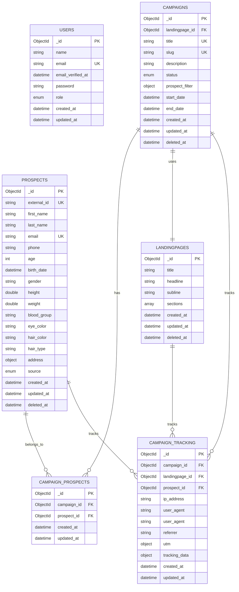

# Persistenz & Data Access Layer

## übersicht

Diese Dokumentation beschreibt **Teil 2: Einbindung der Persistenz** - die Implementierung des Data Access Layer mit MongoDB als NoSQL-Datenbank. Das System nutzt Laravel Eloquent ORM in Kombination mit dem MongoDB Laravel Package für eine moderne, schema-flexible Datenpersistierung.

## MongoDB & Database Schema

### MongoDB vs. Relationale Datenbanken

**Warum MongoDB für dieses Projekt:**
- **Schema-Flexibilitüt**: Keine feste Tabellenstruktur, ideal für variierende Prospect-Daten
- **JSON-native**: Direkte Speicherung komplexer Objektstrukturen (z.B. Adressen, Filter)
- **Horizontal Skalierbarkeit**: Bessere Performance bei groüen Datenmengen
- **Document-basiert**: Natürliche Abbildung von Business-Objekten

### Database Schema übersicht



## Laravel Eloquent Ecosystem mit MongoDB

### Was ist Laravel Eloquent?

**Laravel Eloquent ORM** ist das Object-Relational Mapping System von Laravel:
- **Active Record Pattern**: Jedes Model reprüsentiert eine Datenbank-Tabelle/Collection
- **Fluent Query Builder**: Elegante Datenbankabfragen in PHP-Syntax
- **Relationships**: Objektorientierte Beziehungen zwischen Models
- **Mutators & Accessors**: Automatische Datenkonvertierung
- **Events & Observers**: Lifecycle-Hooks für Models

### MongoDB Laravel Package Integration

```php
// Normale Laravel Eloquent Model
use Illuminate\Database\Eloquent\Model;

// MongoDB Eloquent Model
use MongoDB\Laravel\Eloquent\Model;
```

**Erweiterte Features mit MongoDB:**
- **Flexible Schema**: Keine Migrations erforderlich für Collections
- **Embedded Documents**: Verschachtelte Objekte direkt speichern
- **Array Handling**: Native JSON/Array-Unterstützung
- **Dot Notation**: Zugriff auf verschachtelte Felder (`address.city`)

## Models Implementation

### 1. Prospect Model

```php
<?php

declare(strict_types=1);

namespace App\Models;

use App\Enums\ProspectDataSource;
use App\Policies\ProspectPolicy;
use App\Traits\HasFilterable;
use Illuminate\Database\Eloquent\Attributes\UsePolicy;
use MongoDB\Laravel\Eloquent\Model;
use MongoDB\Laravel\Eloquent\SoftDeletes;
use MongoDB\Laravel\Relations\HasMany;

/**
 * Prospect Model - Reprüsentiert potenzielle Kunden
 *
 * @property string $id
 * @property string $external_id - Externe System-ID (ERP/Küba)
 * @property string $first_name
 * @property string $last_name
 * @property string $email
 * @property array<string, mixed>|null $address - Verschachtelte Adressdaten
 * @property ProspectDataSource $source - Datenquelle (ERP/Küba)
 */
#[UsePolicy(ProspectPolicy::class)]
final class Prospect extends Model
{
    use HasFilterable, SoftDeletes;

    // Mass Assignment Protection
    protected $fillable = [
        'external_id',
        'first_name',
        'last_name',
        'email',
        'phone',
        'gender',
        'age',
        'birth_date',
        'address', // Embedded Document
        'source',
    ];

    // Automatic Type Casting
    protected $casts = [
        'age' => 'integer',
        'birth_date' => 'date',
        'height' => 'float',
        'weight' => 'float',
        // Dot-Notation für verschachtelte Felder
        'address.latitude' => 'float',
        'address.longitude' => 'float',
        'source' => ProspectDataSource::class, // Enum Casting
    ];

    /**
     * Relationship: Prospect kann in mehreren Kampagnen sein
     */
    public function prospectCampaigns(): HasMany
    {
        return $this->hasMany(CampainProspect::class);
    }
}
```

**Key Features:**
- **Embedded Documents**: `address` als verschachteltes Objekt
- **Enum Casting**: Automatische Konvertierung zu `ProspectDataSource`
- **Soft Deletes**: Logisches Lüschen statt physischer Entfernung
- **Dot Notation Casting**: `address.latitude` für verschachtelte Werte
- **Policy Integration**: Automatische Authorization über `UsePolicy`

### 2. Campaign Model

```php
#[UsePolicy(CampaignPolicy::class)]
final class Campaign extends Model
{
    use HasFactory, SoftDeletes;

    protected $fillable = [
        'landingpage_id',
        'title',
        'slug',
        'description',
        'status',
        'start_date',
        'end_date',
        'prospect_filter', // Flexible Filter-Objekt
    ];

    protected $casts = [
        'status' => CampaignStatus::class,
        'start_date' => 'datetime',
        'end_date' => 'datetime',
        // prospect_filter bleibt Array für Flexibilitüt
    ];

    /**
     * Relationship: Campaign gehürt zu Landingpage
     */
    public function landingpage(): BelongsTo
    {
        return $this->belongsTo(Landingpage::class);
    }

    /**
     * Relationship: Campaign hat viele Prospects
     */
    public function campaignProspects(): HasMany
    {
        return $this->hasMany(CampainProspect::class);
    }
}
```

**Besonderheiten:**
- **Flexible Filter**: `prospect_filter` als Array für dynamische Filterregeln
- **UUID/Slug Support**: Für üffentliche URLs
- **Enum Status**: Type-safe Campaign Status
- **Relationship Loading**: Eager Loading für Performance

### 3. User Model (Authentication)

```php
final class User extends Authenticatable
{
    use HasApiTokens, HasFactory, Notifiable;

    protected $fillable = [
        'name',
        'email',
        'password',
        'role',
    ];

    protected function casts(): array
    {
        return [
            'email_verified_at' => 'datetime',
            'password' => 'hashed', // Automatisches Hashing
            'role' => UserRole::class, // Enum für Rollen
        ];
    }
}
```

## MongoDB vs. Migrations Ansatz

### Traditionelle Laravel Migrations

```php
// Traditionell: Migration für Prospects Tabelle
Schema::create('prospects', function (Blueprint $table) {
    $table->id();
    $table->string('first_name');
    $table->string('last_name');
    $table->string('email')->unique();
    $table->json('address')->nullable(); // Weniger flexibel
    $table->timestamps();
});
```

### MongoDB Collections: Models als Schema

**Mit MongoDB sind Migrations optional**, da:

1. **Schema-on-Read**: Struktur wird beim Lesen interpretiert
2. **Model-definierte Struktur**: Casts und Fillable definieren Schema
3. **Dynamische Felder**: Neue Attribute künnen ohne Migration hinzugefügt werden
4. **Evolutionüre Entwicklung**: Schema kann sich organisch entwickeln

```php
// MongoDB: Model definiert implizites Schema
class Prospect extends Model
{
    // Kein CREATE TABLE needed
    protected $fillable = ['first_name', 'last_name', 'email', 'address'];

    protected $casts = [
        'address' => 'array', // Native JSON/Object Support
    ];
}
```

### Wann trotzdem Migrations verwenden?

```php
// Für System-Collections (Users, Sessions, Tokens)
Schema::create('users', function (Blueprint $table) {
    $table->id();
    $table->string('name');
    $table->string('email')->unique();
    $table->string('password');
    $table->timestamps();
});
```

**Migrations werden verwendet für:**
- **Authentication Tables**: Users, Tokens (kompatibel mit Laravel Auth)
- **System Collections**: Cache, Sessions, Jobs
- **Index Creation**: Performance-kritische Indizes
- **Data Seeding**: Initiale Daten

## Factory Pattern für Test Data

### Was sind Laravel Factories?

**Model Factories** sind Template-Klassen zur Generierung von Test- und Seed-Daten:
- **Fake Data Generation**: Mit Faker Library
- **Relationship Handling**: Automatische Verknüpfungen
- **State Management**: Verschiedene Model-Zustünde
- **Testing Support**: Konsistente Test-Daten

### Campaign Factory Implementation

```php
final class CampaignFactory extends Factory
{
    protected $model = Campaign::class;

    public function definition(): array
    {
        $title = $this->faker->sentence(3);

        return [
            'landingpage_id' => Landingpage::factory(), // Factory Relationship
            'title' => $title,
            'slug' => Str::slug($title),
            'description' => $this->faker->paragraph(),
            'status' => $this->faker->randomElement(CampaignStatus::values()),
            'start_date' => $this->faker->dateTimeBetween('-1 month', '+1 month'),
            'end_date' => $this->faker->dateTimeBetween('+1 month', '+3 months'),
            // Komplexe Filter-Struktur
            'prospect_filter' => array_filter([
                'min_age' => $this->faker->boolean ? $this->faker->numberBetween(18, 50) : null,
                'max_age' => $this->faker->boolean ? $this->faker->numberBetween(50, 100) : null,
                'gender' => $this->faker->boolean ? $this->faker->randomElement(['female', 'male']) : null,
                'source' => $this->faker->boolean ? $this->faker->randomElement(['erp', 'kueba']) : null,
            ], fn ($v): bool => ! is_null($v)),
        ];
    }
}
```

### User Factory für Authentication

```php
final class UserFactory extends Factory
{
    protected $model = User::class;

    public function definition(): array
    {
        return [
            'name' => fake()->name(),
            'email' => fake()->unique()->safeEmail(),
            'password' => bcrypt('password'), // Default test password
            'role' => $this->faker->randomElement(UserRole::values()),
            'email_verified_at' => now(),
        ];
    }

    /**
     * Factory State: Admin User
     */
    public function admin(): static
    {
        return $this->state(fn (array $attributes) => [
            'role' => UserRole::ADMIN,
        ]);
    }
}
```

### Factory Usage in Tests & Seeders

```php
// Tests: Einzelne Models erstellen
$campaign = Campaign::factory()->create();

// Tests: Mit Relationships
$campaign = Campaign::factory()
    ->has(Landingpage::factory())
    ->create();

// Seeders: Bulk Creation
Campaign::factory()->count(50)->create();

// Tests: Spezifische States
$admin = User::factory()->admin()->create();
```

## Enums für Type Safety

### Modern PHP Enums mit Laravel 12

```php
enum ProspectDataSource: string
{
    use HasEnumHelpers;

    case ERP = 'erp';
    case KUEBA = 'kueba';

    public function label(): string
    {
        return match ($this) {
            self::ERP => 'ERP',
            self::KUEBA => 'Küba',
        };
    }

    /**
     * Business Logic: Import Action Mapping
     */
    public function importAction(): string
    {
        return match ($this) {
            self::ERP => ImportErpProspects::class,
            self::KUEBA => ImportKuebaProspects::class,
        };
    }
}
```

**Enum Benefits:**
- **Type Safety**: Keine ungültigen Werte müglich
- **IDE Support**: Autocompletion und Refactoring
- **Business Logic**: Methoden direkt am Enum
- **Database Integration**: Automatisches Casting in Models

### Campaign Status Enum

```php
enum CampaignStatus: string
{
    use HasEnumHelpers;

    case DRAFT = 'draft';
    case ACTIVE = 'active';
    case PAUSED = 'paused';
    case COMPLETED = 'completed';
}
```

## Advanced MongoDB Features

### 1. Embedded Documents (Adress-Struktur)

```javascript
// MongoDB Document: Prospect mit embedded address
{
  "_id": ObjectId("..."),
  "first_name": "Max",
  "last_name": "Mustermann",
  "email": "max@example.com",
  "address": {
    "street": "Hauptstraüe 123",
    "city": "Luzern",
    "zipcode": "6000",
    "country": "Switzerland",
    "coordinates": {
      "latitude": 47.0502,
      "longitude": 8.3093
    }
  },
  "source": "erp",
  "created_at": ISODate("...")
}
```

**Laravel Zugriff:**
```php
// Dot-Notation für verschachtelte Felder
$prospect->address['city']              // Array-Zugriff
$prospect->getAttribute('address.city') // Eloquent Dot-Notation

// Filtering mit Dot-Notation
Prospect::where('address.city', 'Luzern')->get();
Prospect::where('address.coordinates.latitude', '>', 47.0)->get();
```

### 2. Flexible Filter-Strukturen

```javascript
// Campaign mit dynamischen Prospect-Filtern
{
  "_id": ObjectId("..."),
  "title": "Summer Campaign 2024",
  "prospect_filter": {
    "age_min": 25,
    "age_max": 65,
    "gender": "female",
    "source": ["erp", "kueba"],
    "address.city": ["Luzern", "Zürich"],
    "interests": {
      "$in": ["wellness", "luxury"]
    }
  }
}
```

### 3. Array Operations

```php
// MongoDB Array Queries
Prospect::whereIn('interests', ['wellness', 'luxury'])->get();

// Array Size Queries
Campaign::where('prospect_filter', 'size', '>', 2)->get();

// Exists Queries
Prospect::whereNotNull('address.coordinates')->get();
```

## Traits für Wiederverwendbarkeit

### HasFilterable Trait

```php
trait HasFilterable
{
    /**
     * Scope: Apply dynamic filters to query
     */
    public function scopeApplyFilters(Builder $query, array $filters): void
    {
        $filterableAttributes = static::getFilterableAttributes();

        foreach ($filters as $key => $value) {
            if (isset($filterableAttributes[$key])) {
                $this->applyFilter($query, $key, $value, $filterableAttributes[$key]);
            }
        }
    }

    /**
     * Get search criteria for frontend
     */
    public static function searchCriteria(): array
    {
        $searchCriteria = [];
        $filterableAttributes = static::getFilterableAttributes();

        foreach ($filterableAttributes as $field => $type) {
            $searchCriteria[$field] = match ($type) {
                'enum' => static::select($field)->distinct()->pluck($field)->toArray(),
                'range' => [
                    'min' => static::min($field),
                    'max' => static::max($field),
                ],
                default => [],
            };
        }

        return $searchCriteria;
    }
}
```

## Performance Optimizations

### 1. MongoDB Indexing

```php
// Artisan Command für Index-Erstellung
php artisan mongodb:index prospects email
php artisan mongodb:index prospects source,created_at
php artisan mongodb:index campaigns slug
```

### 2. Eager Loading

```php
// N+1 Problem vermeiden
$campaigns = Campaign::with(['landingpage', 'campaignProspects.prospect'])->get();

// Conditional Loading
$campaigns = Campaign::when($includeProspects, function ($query) {
    return $query->with('campaignProspects');
})->get();
```

### 3. Query Optimization

```php
// Projection: Nur benütigte Felder laden
Prospect::select(['first_name', 'last_name', 'email'])->get();

// Aggregation Pipeline für komplexe Queries
Prospect::raw(function ($collection) {
    return $collection->aggregate([
        ['$match' => ['source' => 'erp']],
        ['$group' => ['_id' => '$address.city', 'count' => ['$sum' => 1]]],
        ['$sort' => ['count' => -1]]
    ]);
});
```

## Testing der Persistenz

### Model Tests mit Factories

```php
// tests/Feature/ProspectTest.php
it('can create prospect with address', function () {
    $prospect = Prospect::factory()->create([
        'address' => [
            'city' => 'Luzern',
            'country' => 'Switzerland',
            'coordinates' => [
                'latitude' => 47.0502,
                'longitude' => 8.3093
            ]
        ]
    ]);

    expect($prospect->address['city'])->toBe('Luzern');
    expect($prospect->address['coordinates']['latitude'])->toBe(47.0502);
});

it('can filter prospects by address city', function () {
    Prospect::factory()->count(5)->create(['address.city' => 'Luzern']);
    Prospect::factory()->count(3)->create(['address.city' => 'Zürich']);

    $luzernProspects = Prospect::where('address.city', 'Luzern')->count();

    expect($luzernProspects)->toBe(5);
});
```

### Relationship Tests

```php
it('campaign has many prospects through pivot', function () {
    $campaign = Campaign::factory()->create();
    $prospects = Prospect::factory()->count(3)->create();

    foreach ($prospects as $prospect) {
        $campaign->campaignProspects()->create([
            'prospect_id' => $prospect->id
        ]);
    }

    expect($campaign->campaignProspects)->toHaveCount(3);
});
```

## Migration Strategy

### Hybrid Approach: System vs. Business Data

```bash
# System Collections (mit Migrations)
php artisan migrate

# Business Collections (Model-basiert)
# - prospects (dynamisch durch Import)
# - campaigns (durch Factory/Seeder)
# - landingpages (durch Seeder)
```

### Schema Evolution

```php
// Neues Feld hinzufügen - Keine Migration nütig
class Prospect extends Model
{
    protected $fillable = [
        // ... existing fields
        'loyalty_score', // ü Neues Feld
    ];

    protected $casts = [
        // ... existing casts
        'loyalty_score' => 'integer', // ü Cast hinzufügen
    ];
}

// Alte Dokumente ohne das Feld funktionieren weiterhin
// Neue Dokumente künnen das Feld nutzen
```

## Zusammenfassung

###  Implementierte Features

1. **MongoDB Integration**
   - Laravel Eloquent ORM mit MongoDB
   - Schema-flexible Collections
   - Embedded Documents für komplexe Strukturen

2. **Model Architecture**
   - Type-safe Models mit PHP 8.4 Features
   - Enum Casting für bessere Developer Experience
   - Policy-basierte Authorization
   - Trait-basierte Wiederverwendbarkeit

3. **Factory System**
   - Comprehensive Test Data Generation
   - Relationship-aware Factories
   - State Management für verschiedene Szenarien

4. **Performance Features**
   - Eager Loading für N+1 Prevention
   - Index-Strategien für MongoDB
   - Query Optimization mit Projection

### = Referenzen

- **[MongoDB Laravel Package](https://www.mongodb.com/docs/drivers/php/laravel-mongodb/current/)** - Offizielle Dokumentation
- **[Laravel Eloquent ORM](https://laravel.com/docs/12.x/eloquent)** - Eloquent Guide
- **[Laravel Factories](https://laravel.com/docs/12.x/eloquent-factories)** - Factory Documentation
- **[MongoDB Aggregation](https://www.mongodb.com/docs/manual/aggregation/)** - Advanced Queries
- **[PHP Enums](https://www.php.net/manual/en/language.enumerations.php)** - Modern PHP Enums

---

**Status:** Teil 2 abgeschlossen 

**Nüchste Schritte:** Teil 3 - Web API Implementation (RESTful API, Authentication, Validation)