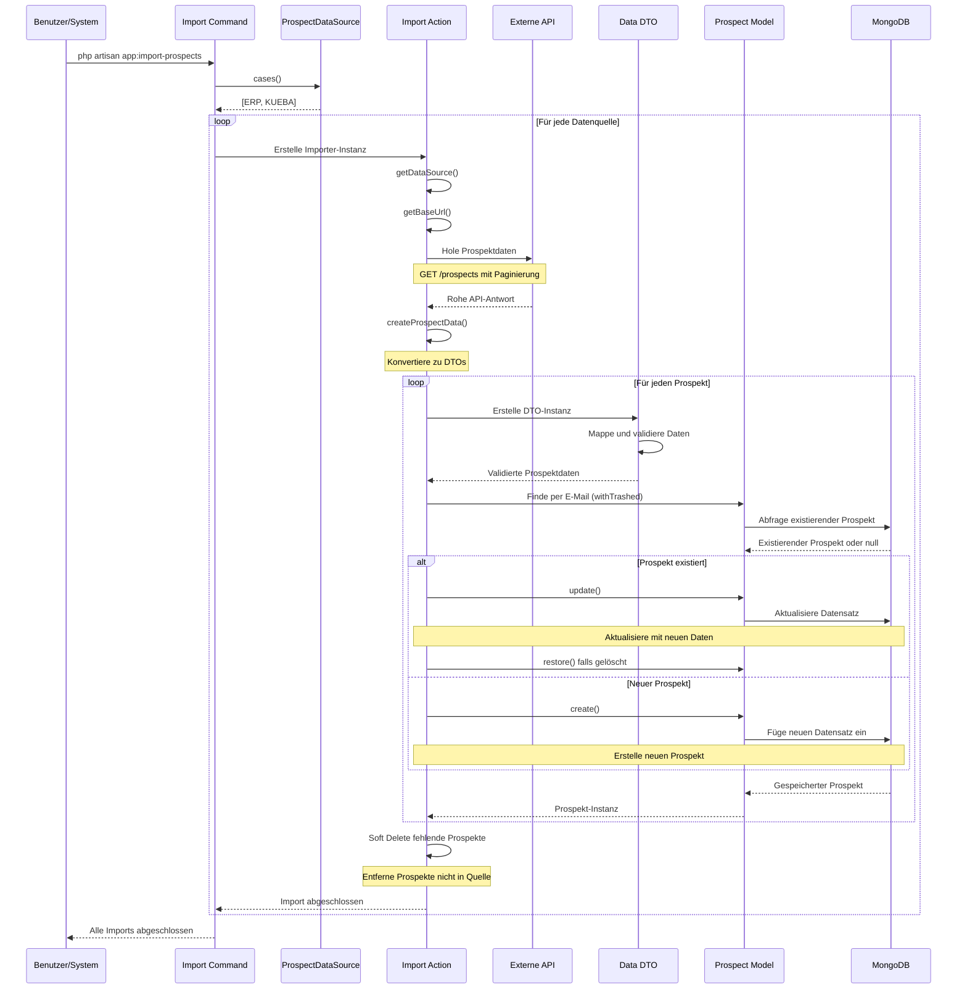
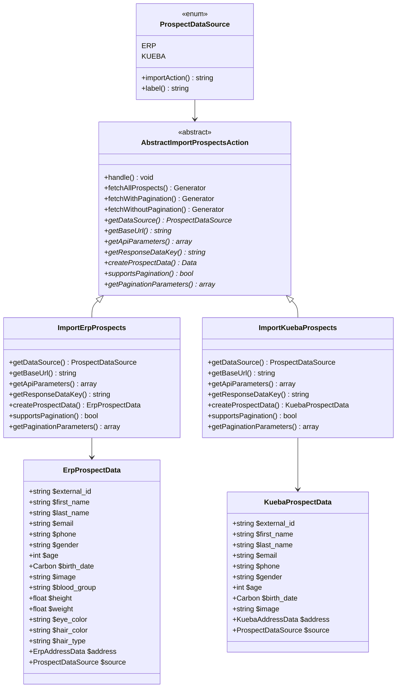
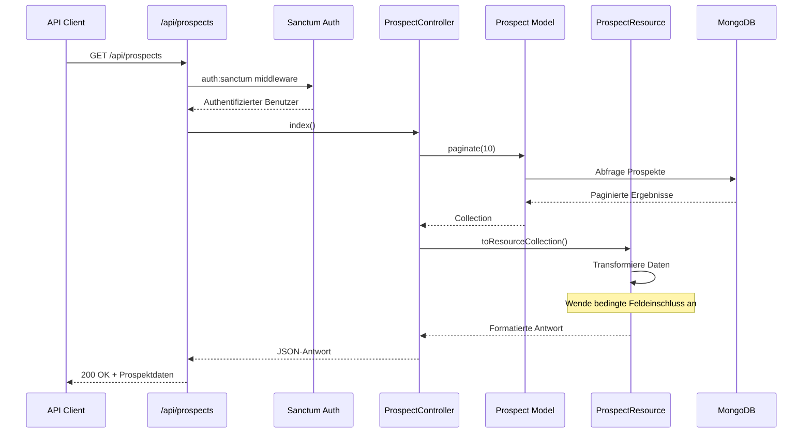
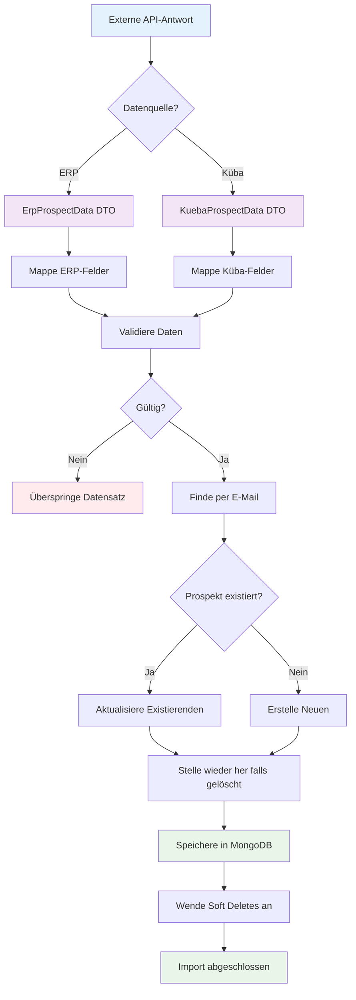
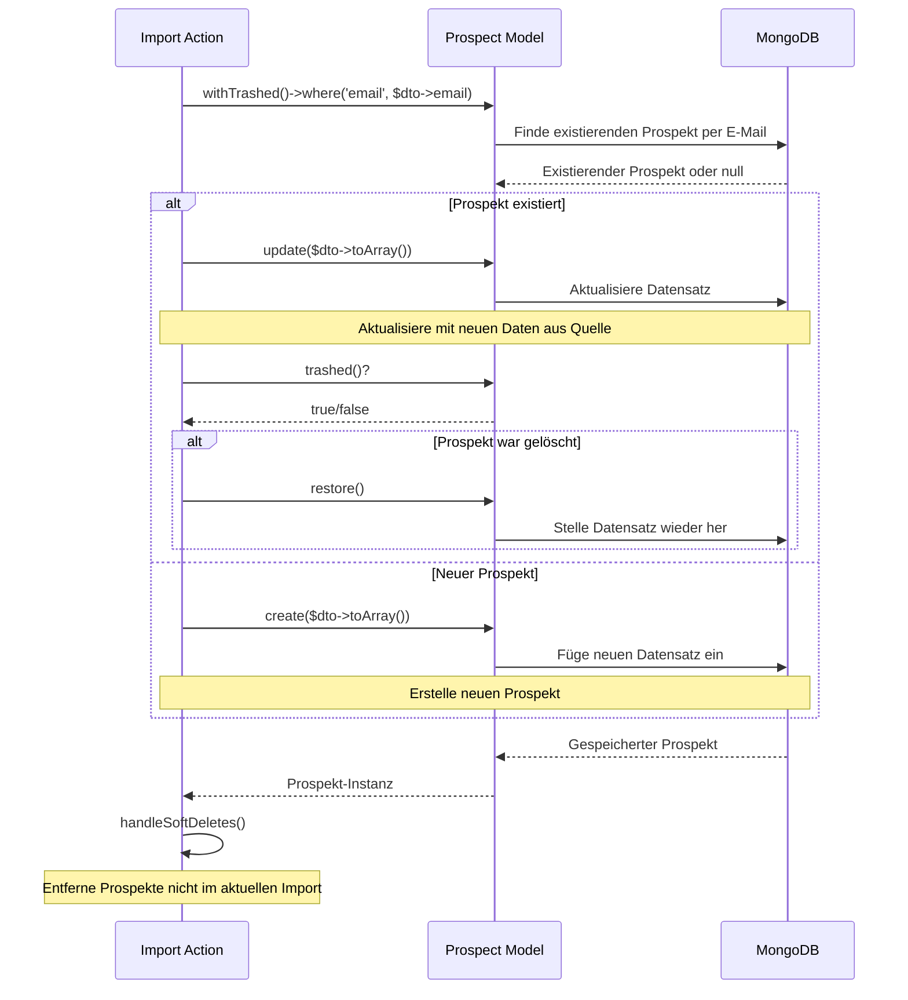
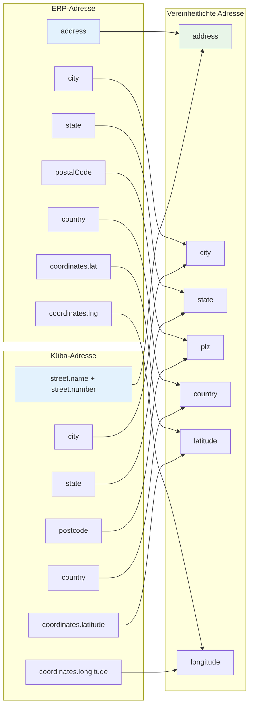

# Prospekte

Das Prospekte-System verwaltet Kunden-/Prospektdaten, die aus mehreren externen Quellen importiert werden und bietet API-Zugriff für den Abruf von Prospektinformationen. Das System ist mit einer modularen Architektur aufgebaut, die mehrere Datenquellen unterstützt und eine einheitliche Schnittstelle für das Prospektmanagement bereitstellt.

## System-Architektur


## Import-Prozess-Flow



## Datenimport-Architektur



## API-Anfrage-Flow



## Datentransformations-Flow



## Upsert-Prozess



## Adress-Daten-Mapping



## Überblick

Das Prospekte-System besteht aus mehreren Hauptkomponenten:

- **Datenimport-System**: Modulare Importer für verschiedene externe Datenquellen
- **Datenmodelle**: MongoDB-basierte Prospektspeicherung mit Soft Deletes
- **API-Endpunkte**: RESTful API für Prospektabruf (index, show)
- **Data Transfer Objects**: Typsichere Datenbehandlung mit quellenspezifischem Mapping
- **Geplante Imports**: Automatisierte Datensynchronisation
- **Generische Filterung**: Erweiterte Filterfähigkeiten mit Bereichs- und Enum-Unterstützung

## Architektur

### Kernkomponenten

- **`Prospect` Model**: MongoDB Eloquent-Model mit Soft Deletes und Filterfähigkeiten
- **`AbstractImportProspectsAction`**: Basis-Abstraktklasse für Importoperationen
- **`ImportErpProspects`**: ERP-System-Datenimporter
- **`ImportKuebaProspects`**: Küba-API-Datenimporter
- **`ProspectDataSource`**: Enum, das verfügbare Datenquellen definiert
- **`ProspectController`**: API-Controller für Prospektoperationen
- **`ProspectResource`**: API-Ressource für Datentransformation
- **Daten-DTOs**: `ErpProspectData`, `KuebaProspectData` und Adress-DTOs

### Datenfluss

```
Externe APIs → Import Actions → DTOs → Prospect Model → API Resources → Client
```

## Datenmodell

### Prospect Model

Das `Prospect`-Model wird in MongoDB gespeichert und enthält umfassende Prospektinformationen mit erweiterten Filterfähigkeiten:

```php
#[UsePolicy(ProspectPolicy::class)]
final class Prospect extends Model
{
    use AuthorizesRequests, HasFilterable, SoftDeletes;

    protected $fillable = [
        'id',
        'external_id',
        'first_name',
        'last_name',
        'email',
        'phone',
        'gender',
        'age',
        'birth_date',
        'image',
        'blood_group',
        'height',
        'weight',
        'eye_color',
        'hair_color',
        'hair_type',
        'address',
        'source',
        'created_at',
        'updated_at',
        'deleted_at',
    ];

    protected $casts = [
        'age' => 'integer',
        'birth_date' => 'date',
        'height' => 'float',
        'weight' => 'float',
        'address.latitude' => 'float',
        'address.longitude' => 'float',
        'source' => ProspectDataSource::class,
        'created_at' => 'datetime',
        'updated_at' => 'datetime',
        'deleted_at' => 'datetime',
    ];

    public static function getFilterableAttributes(): array
    {
        return [
            'source' => 'enum',
            'gender' => 'enum',
            'age' => 'range',
            'birth_date' => 'range',
            'blood_group' => 'enum',
            'height' => 'range',
            'weight' => 'range',
            'eye_color' => 'enum',
            'hair_color' => 'enum',
            'address.city' => 'enum',
            'address.state' => 'enum',
            'address.country' => 'enum',
            'address.plz' => 'range',
            'address.latitude' => 'range',
            'address.longitude' => 'range',
        ];
    }

    public function prospectCampaigns(): HasMany
    {
        return $this->hasMany(CampainProspect::class);
    }
}
```

### Datenbankschema

```php
[
    'id' => 'string',                    // MongoDB ObjectId
    'external_id' => 'string',           // Externe System-ID
    'first_name' => 'string',            // Vorname
    'last_name' => 'string',             // Nachname
    'email' => 'string',                 // E-Mail-Adresse (eindeutige Kennung)
    'phone' => 'string|null',            // Telefonnummer
    'gender' => 'string|null',           // Geschlecht
    'age' => 'int|null',                 // Alter
    'birth_date' => 'Carbon|null',       // Geburtsdatum
    'image' => 'string|null',            // Profilbild-URL
    'blood_group' => 'string|null',      // Blutgruppe
    'height' => 'float|null',            // Grösse in cm
    'weight' => 'float|null',            // Gewicht in kg
    'eye_color' => 'string|null',        // Augenfarbe
    'hair_color' => 'string|null',       // Haarfarbe
    'hair_type' => 'string|null',        // Haartyp
    'address' => 'array|null',           // Adressinformationen
    'source' => 'ProspectDataSource',    // Datenquellen-Enum
    'created_at' => 'Carbon',            // Erstellungszeitstempel
    'updated_at' => 'Carbon',            // Letzter Update-Zeitstempel
    'deleted_at' => 'Carbon|null',       // Soft Delete-Zeitstempel
]
```

### Datentypen

- **`ProspectDataSource`**: Enum mit Werten `ERP` und `KUEBA`
- **Adresse**: Array mit Adresskomponenten (variiert je nach Quelle)
- **Zeitstempel**: Carbon-Instanzen für Datum/Zeit-Behandlung
- **Soft Deletes**: Datensätze werden soft gelöscht, nicht permanent entfernt
- **Filterbare Attribute**: Unterstützung für Bereich (min, max), Enum, in, not_in und verschachtelte Filterung

## API-Endpunkte

### Authentifizierung

Alle Prospekt-Endpunkte erfordern Authentifizierung über Laravel Sanctum:

```bash
# Login um Token zu erhalten
curl -X POST /api/login \
  -H "Content-Type: application/json" \
  -d '{"email": "user@example.com", "password": "password"}'

# Token in nachfolgenden Anfragen verwenden
curl -H "Authorization: Bearer {token}" /api/prospects
```

### Verfügbare Endpunkte

#### Prospekte auflisten

```http
GET /api/prospects
```

**Antwort**: Paginierte Liste von Prospekten (10 pro Seite)

```json
{
  "data": [
    {
      "id": "507f1f77bcf86cd799439011",
      "gender": "male",
      "age": 25,
      "birthDate": "1998-05-15T00:00:00.000000Z",
      "image": "https://example.com/image.jpg",
      "bloodGroup": "A+",
      "height": 175.5,
      "weight": 70.2,
      "eyeColor": "brown",
      "hairColor": "black",
      "hairType": "straight",
      "address": {
        "address": "123 Main St",
        "city": "Zurich",
        "state": "ZH",
        "plz": "8001",
        "country": "Switzerland",
        "latitude": 47.3769,
        "longitude": 8.5417
      }
    }
  ],
  "links": {
    "first": "http://localhost/api/prospects?page=1",
    "last": "http://localhost/api/prospects?page=5",
    "prev": null,
    "next": "http://localhost/api/prospects?page=2"
  },
  "meta": {
    "current_page": 1,
    "from": 1,
    "last_page": 5,
    "per_page": 10,
    "to": 10,
    "total": 50
  }
}
```

#### Einzelnen Prospekt abrufen

```http
GET /api/prospects/{id}
```

**Antwort**: Detaillierte Prospektinformationen

```json
{
  "data": {
    "id": "507f1f77bcf86cd799439011",
    "firstName": "John",
    "lastName": "Doe",
    "email": "john.doe@example.com",
    "phone": "+41 79 123 45 67",
    "gender": "male",
    "age": 25,
    "birthDate": "1998-05-15T00:00:00.000000Z",
    "image": "https://example.com/image.jpg",
    "bloodGroup": "A+",
    "height": 175.5,
    "weight": 70.2,
    "eyeColor": "brown",
    "hairColor": "black",
    "hairType": "straight",
    "address": {
      "address": "123 Main St",
      "city": "Zurich",
      "state": "ZH",
      "plz": "8001",
      "country": "Switzerland",
      "latitude": 47.3769,
      "longitude": 8.5417
    },
    "source": "ERP"
  }
}
```

#### Generische Filterung

```http
GET /api/prospects/filter?gender=male&source=erp&age[min]=25&age[max]=35
```

**Antwort**: Gefilterte Prospekte basierend auf Kriterien

```json
{
  "data": [
    {
      "id": "507f1f77bcf86cd799439011",
      "gender": "male",
      "age": 28,
      "birthDate": "1995-03-15T00:00:00.000000Z",
      "image": "https://example.com/image.jpg",
      "bloodGroup": "A+",
      "height": 175.5,
      "weight": 70.2,
      "eyeColor": "brown",
      "hairColor": "black",
      "hairType": "straight",
      "address": {
        "address": "123 Main St",
        "city": "Zurich",
        "state": "ZH",
        "plz": "8001",
        "country": "Switzerland",
        "latitude": 47.3769,
        "longitude": 8.5417
      }
    }
  ],
  "meta": {
    "current_page": 1,
    "from": 1,
    "last_page": 1,
    "per_page": 10,
    "to": 1,
    "total": 1
  }
}
```

### API-Ressourcen-Transformation

Die `ProspectResource` behandelt Datentransformation mit bedingter Feldeinschluss:

- **Listenansicht**: Nur Grundfelder (keine persönlichen Informationen)
- **Detailansicht**: Vollständige Prospektinformationen einschliesslich Name, E-Mail, Telefon und Quelle

## Datenimport-System

Das Prospekt-Import-System ermöglicht den Import von Prospektdaten aus mehreren externen Quellen in die MongoDB-Datenbank. Das System ist mit einer modularen Architektur konzipiert, die es einfach macht, neue Datenquellen hinzuzufügen.

### Architektur

Das Import-System folgt einem Template-Method-Pattern mit den folgenden Komponenten:

- **`AbstractImportProspectsAction`**: Basis-Abstraktklasse mit gemeinsamer Import-Logik
- **`ImportErpProspects`**: Konkrete Implementierung für ERP-System-Imports
- **`ImportKuebaProspects`**: Konkrete Implementierung für Küba-API-Imports
- **`ProspectDataSource`**: Enum, das verfügbare Datenquellen definiert
- **Data Transfer Objects**: `ErpProspectData` und `KuebaProspectData` für typsichere Datenbehandlung

### Datenquellen

#### ERP-System
- **Konfiguration**: `services.erp.prospects.url`
- **Paginierung**: Unterstützt (limit/skip Parameter)
- **Antwortstruktur**: `{ "users": [...], "total": number }`
- **Datenfelder**: Umfassende Prospektinformationen einschliesslich persönlicher Details, physischer Attribute und Adresse

#### Küba-API
- **Konfiguration**: `services.kueba.prospects.url`
- **Paginierung**: Nicht unterstützt (einzelne Anfrage)
- **Antwortstruktur**: `{ "results": [...] }`
- **Datenfelder**: Grundlegende Prospektinformationen mit Schweizer Nationalitätsfilter (`nat=ch`)

### Verwendung

#### Kommandozeilen-Import

Importiere Prospekte aus allen konfigurierten Quellen:

```bash
php artisan app:import-prospects
```

Dieser Befehl wird:
1. Durch alle verfügbaren Datenquellen iterieren (`ProspectDataSource::cases()`)
2. Die entsprechende Importer-Instanz für jede Quelle erstellen
3. Den Import-Prozess ausführen
4. Fortschrittsinformationen anzeigen

#### Programmatische Verwendung

Importiere Prospekte aus einer bestimmten Quelle:

```php
use App\Actions\Import\ImportErpProspects;
use App\Actions\Import\ImportKuebaProspects;

// Import aus ERP
$erpImporter = new ImportErpProspects();
$erpImporter->handle();

// Import aus Küba
$kuebaImporter = new ImportKuebaProspects();
$kuebaImporter->handle();
```

### Import-Prozess

Der Import-Prozess folgt diesen Schritten:

1. **Daten abrufen**: Prospektdaten von der externen API abrufen
2. **Daten transformieren**: API-Antwort zu standardisierten DTOs konvertieren
3. **Datensätze upserten**: Neue Prospekte erstellen, existierende aktualisieren oder wiederherstellen
4. **Soft Delete**: Prospekte entfernen, die nicht mehr in der Quelle existieren

#### Datenbehandlung

- **Neue Prospekte**: Erstellt mit allen verfügbaren Daten
- **Existierende Prospekte**: Aktualisiert mit neuesten Informationen aus Quelle (abgeglichen per E-Mail)
- **Soft gelöschte Prospekte**: Wiederhergestellt, wenn sie wieder in der Quelle erscheinen
- **Fehlende Prospekte**: Soft gelöscht, wenn sie nicht mehr in der Quelle existieren

### Konfiguration

Fügen Sie folgendes zu Ihrer `.env`-Datei hinzu:

```env
# ERP-System
ERP_PROSPECTS_URL=https://api.erp-system.com/prospects

# Küba-API
KUEBA_PROSPECTS_URL=https://api.kueba.ch/users
```

Und in `config/services.php`:

```php
'erp' => [
    'prospects' => [
        'url' => env('ERP_PROSPECTS_URL'),
    ],
],
'kueba' => [
    'prospects' => [
        'url' => env('KUEBA_PROSPECTS_URL'),
    ],
],
```

### Neue Datenquellen hinzufügen

Um eine neue Datenquelle hinzuzufügen:

1. **DTO erstellen**: Erweitern Sie die Basis-Data-Klasse mit quellenspezifischem Mapping
2. **Import Action erstellen**: Erweitern Sie `AbstractImportProspectsAction` und implementieren Sie erforderliche Methoden
3. **Enum aktualisieren**: Fügen Sie neuen Fall zu `ProspectDataSource` Enum hinzu
4. **Konfiguration hinzufügen**: Konfigurieren Sie die neue Quelle in `config/services.php`

Beispiel-Implementierung:

```php
// 1. DTO erstellen
final class NewSourceProspectData extends Data
{
    public ProspectDataSource $source = ProspectDataSource::NEW_SOURCE;

    public function __construct(
        public string $external_id,
        public string $first_name,
        public string $last_name,
        public string $email,
        // ... andere Felder
    ) {}
}

// 2. Import Action erstellen
final readonly class ImportNewSourceProspects extends AbstractImportProspectsAction
{
    protected function getDataSource(): ProspectDataSource
    {
        return ProspectDataSource::NEW_SOURCE;
    }

    protected function getBaseUrl(): string
    {
        return Config::string('services.new_source.prospects.url');
    }

    protected function getApiParameters(): array
    {
        return [];
    }

    protected function getResponseDataKey(): string
    {
        return 'data';
    }

    protected function createProspectData(array $data): NewSourceProspectData
    {
        return NewSourceProspectData::from($data);
    }

    protected function supportsPagination(): bool
    {
        return false;
    }

    protected function getPaginationParameters(int $limit, int $skip): array
    {
        return [];
    }
}

// 3. Enum aktualisieren
enum ProspectDataSource: string
{
    case ERP = 'erp';
    case KUEBA = 'kueba';
    case NEW_SOURCE = 'new_source';

    public function importAction(): string
    {
        return match ($this) {
            self::ERP => ImportErpProspects::class,
            self::KUEBA => ImportKuebaProspects::class,
            self::NEW_SOURCE => ImportNewSourceProspects::class,
        };
    }
}
```

### Fehlerbehandlung

Das Import-System beinhaltet umfassende Fehlerbehandlung:

- **Konfigurationsfehler**: Validiert URL-Konfiguration vor Anfragen
- **API-Fehler**: Behandelt HTTP-Fehler und ungültige Antwortstrukturen
- **Datenvalidierung**: Überspringt ungültige Datensätze, die nicht zu DTOs konvertiert werden können
- **Datenbankfehler**: Behandelt Datenbankoperationsfehler elegant

### Überwachung

Der Import-Befehl bietet Echtzeit-Feedback:

- Fortschrittsmeldungen für jede Datenquelle
- Erfolgsbestätigungen
- Fehlermeldungen mit Details
- Rückgabecodes für Automatisierung (0 = Erfolg, 1 = Fehler)

## Data Transfer Objects (DTOs)

### ErpProspectData

Umfassende Prospektdaten vom ERP-System:

```php
#[MapInputName(CamelCaseMapper::class)]
final class ErpProspectData extends Data
{
    public ProspectDataSource $source = ProspectDataSource::ERP;

    public function __construct(
        #[MapInputName('id')]
        public string $external_id,
        public string $first_name,
        public string $last_name,
        public string $email,
        public string $phone,
        public string $gender,
        public int $age,
        #[WithCast(DateTimeInterfaceCast::class, format: 'Y-n-j')]
        public Carbon $birth_date,
        public string $image,
        public string $blood_group,
        public float $height,
        public float $weight,
        public string $eye_color,
        #[MapInputName('hair.color')]
        public string $hair_color,
        #[MapInputName('hair.type')]
        public string $hair_type,
        public ErpAddressData $address,
    ) {}
}
```

### KuebaProspectData

Grundlegende Prospektdaten von der Küba-API:

```php
#[MapInputName(CamelCaseMapper::class)]
final class KuebaProspectData extends Data
{
    public ProspectDataSource $source = ProspectDataSource::KUEBA;

    public function __construct(
        #[MapInputName('login.uuid')]
        public string $external_id,
        #[MapInputName('name.first')]
        public string $first_name,
        #[MapInputName('name.last')]
        public string $last_name,
        public string $email,
        public string $phone,
        public string $gender,
        #[MapInputName('dob.age')]
        public int $age,
        #[MapInputName('dob.date')]
        #[WithCast(DateTimeInterfaceCast::class, format: 'Y-m-d\TH:i:s.v\Z')]
        public Carbon $birth_date,
        #[MapInputName('picture.large')]
        public string $image,
        #[MapInputName('location')]
        public KuebaAddressData $address,
    ) {}
}
```

### Adress-DTOs

#### ErpAddressData

```php
#[MapInputName(CamelCaseMapper::class)]
final class ErpAddressData extends Data
{
    public function __construct(
        public string $address,
        public string $city,
        public string $state,
        #[MapInputName('postalCode')]
        public string $plz,
        public string $country,
        #[MapInputName('coordinates.lat')]
        public float $latitude,
        #[MapInputName('coordinates.lng')]
        public float $longitude,
    ) {}
}
```

#### KuebaAddressData

```php
#[MapInputName(CamelCaseMapper::class)]
final class KuebaAddressData extends Data
{
    #[Computed]
    public string $address;

    public function __construct(
        #[MapInputName('street.name')]
        #[Hidden]
        public string $street_name,
        #[MapInputName('street.number')]
        #[Hidden]
        public int $street_number,
        public string $city,
        public string $state,
        #[MapInputName('postcode')]
        public string $plz,
        public string $country,
        #[MapInputName('coordinates.latitude')]
        public float $latitude,
        #[MapInputName('coordinates.longitude')]
        public float $longitude,
    ) {
        $this->address = "{$street_name} {$street_number}";
    }
}
```

## Generisches Filtersystem

Das Prospekte-System beinhaltet ein mächtiges generisches Filtersystem, das unterstützt:

### Filtertypen

- **Enum-Filter**: `source`, `gender`, `blood_group`, `eye_color`, `hair_color`, `address.city`, `address.state`, `address.country`
- **Bereichs-Filter**: `age`, `birth_date`, `height`, `weight`, `address.plz`, `address.latitude`, `address.longitude`

### Verwendungsbeispiele

```bash
# Nach Enum-Werten filtern
GET /api/prospects/filter?gender=male&source=erp

# Nach Bereichen filtern
GET /api/prospects/filter?age[min]=25&age[max]=35

# Nach Adresse filtern
GET /api/prospects/filter?address.city=Zurich&address.country=Switzerland

# Kombinierte Filter
GET /api/prospects/filter?gender=male&age[min]=25&source=erp
```

### Suchkriterien

```http
GET /api/prospects/search-criteria
```

Gibt verfügbare Filteroptionen für das Prospekte-Model zurück.

## Geplante Operationen

### Automatisierte Imports

Das System beinhaltet geplante Import-Operationen:

```php
// routes/console.php
Schedule::command('app:import-prospects')->twiceDaily(7, 13);
```

Dies führt den Import-Prozess zweimal täglich um 7:00 Uhr und 13:00 Uhr aus.

## Sicherheitsüberlegungen

### Datenschutz

- **Persönliche Informationen**: Nur in Detailansicht mit ordnungsgemässer Authentifizierung freigelegt
- **Soft Deletes**: Sensible Daten werden soft gelöscht, nicht permanent entfernt
- **API-Zugriff**: Alle Endpunkte erfordern Authentifizierung über Sanctum-Token
- **Autorisierung**: Verwendet Laravel Policies für granulare Zugriffskontrolle

### Rate Limiting

Erwägen Sie die Implementierung von Rate Limiting für API-Endpunkte:

```php
// In routes/api.php
Route::middleware(['auth:sanctum', 'throttle:60,1'])->group(function () {
    Route::apiResource('prospects', ProspectController::class)->only(['index', 'show']);
});
```

## Performance-Überlegungen

### Datenbankoptimierung

- **Indizierung**: Stellen Sie ordnungsgemässe Indizes auf häufig abgefragten Feldern sicher
- **Paginierung**: API-Antworten sind paginiert, um grosse Datenübertragungen zu verhindern
- **Soft Deletes**: Verwenden Sie `withTrashed()` beim Abfragen, um gelöschte Datensätze einzuschliessen
- **MongoDB**: Nutzt MongoDBs flexible Schema- und Indizierungsfähigkeiten

### Caching

Erwägen Sie die Implementierung von Caching für häufig abgerufene Prospektdaten:

```php
// Beispiel Caching-Implementierung
public function index(): ResourceCollection
{
    return Cache::remember('prospects.page.' . request()->get('page', 1), 300, function () {
        return Prospect::paginate(10)->toResourceCollection();
    });
}
```

## Testen

### Unit-Tests

Erstellen Sie Tests für individuelle Komponenten:

```php
// tests/Unit/ProspectTest.php
class ProspectTest extends TestCase
{
    public function test_prospect_can_be_created(): void
    {
        $prospect = Prospect::factory()->create();

        $this->assertDatabaseHas('prospects', [
            'id' => $prospect->id,
        ]);
    }
}
```

### Feature-Tests

Testen Sie API-Endpunkte:

```php
// tests/Feature/ProspectApiTest.php
class ProspectApiTest extends TestCase
{
    public function test_can_list_prospects(): void
    {
        $user = User::factory()->create();
        $token = $user->createToken('test')->plainTextToken;

        $response = $this->withHeaders([
            'Authorization' => 'Bearer ' . $token,
        ])->get('/api/prospects');

        $response->assertStatus(200);
    }
}
```

## Problembehandlung

### Häufige Probleme

1. **Import-Fehler**: Prüfen Sie externe API-Verfügbarkeit und Konfiguration
2. **Datenvalidierungsfehler**: Überprüfen Sie DTO-Mapping für quellenspezifische Felder
3. **Authentifizierungsprobleme**: Verifizieren Sie Sanctum-Token-Konfiguration
4. **MongoDB-Verbindung**: Stellen Sie sicher, dass MongoDB läuft und erreichbar ist
5. **Filter-Fehler**: Prüfen Sie Filter-Parameter-Syntax und unterstützte Attribute

### Debugging

Aktivieren Sie detailliertes Logging für Import-Operationen:

```php
// In .env
LOG_LEVEL=debug
```

Prüfen Sie Logs für detaillierte Fehlerinformationen:

```bash
tail -f storage/logs/laravel.log
```

## Zukünftige Verbesserungen

### Potenzielle Verbesserungen

1. **Such- und Filterfunktionen**: Erweiterte Suchfähigkeiten mit Volltext-Suche
2. **Bulk-Operationen**: Unterstützung für Bulk-Prospekt-Operationen
3. **Datenvalidierung**: Erweiterte Validierungsregeln für Prospektdaten
4. **Audit-Logging**: Verfolgung von Änderungen an Prospekt-Datensätzen
5. **Export-Funktionalität**: Export von Prospekten in verschiedene Formate
6. **Echtzeit-Updates**: WebSocket-Unterstützung für Echtzeit-Daten-Updates
7. **Erweiterte Analytik**: Prospekt-Interaktions- und Engagement-Tracking
8. **Machine Learning**: Prädiktive Analytik für Prospekt-Verhalten
9. **Integrations-APIs**: Zusätzliche externe Datenquellen-Integrationen
10. **Performance-Monitoring**: Echtzeit-Performance-Metriken und Warnungen