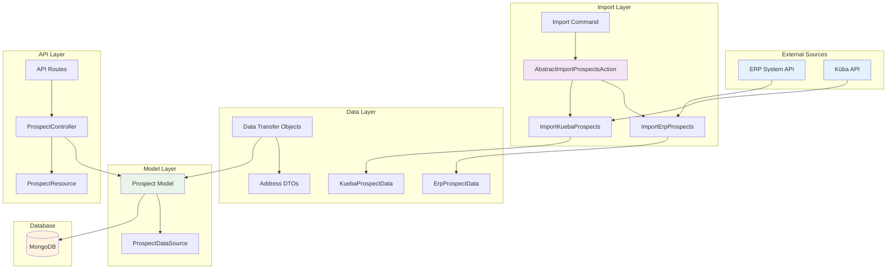
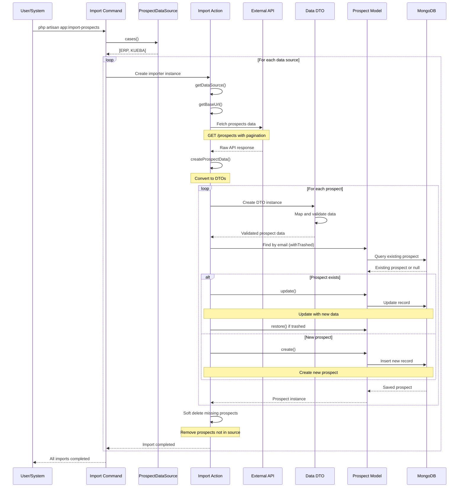
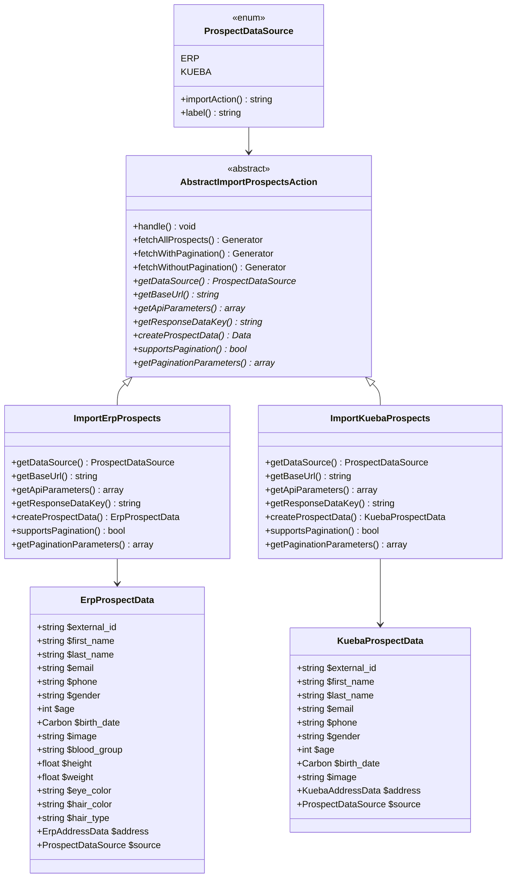
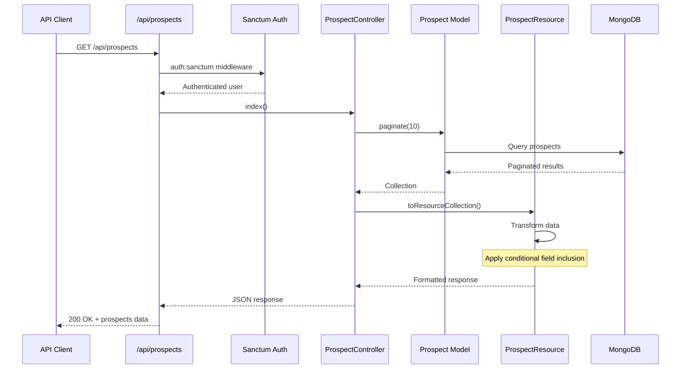
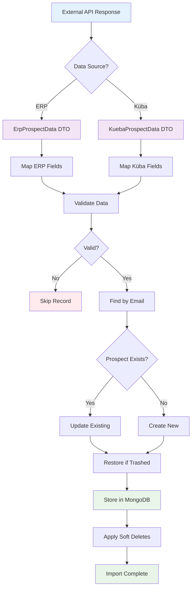
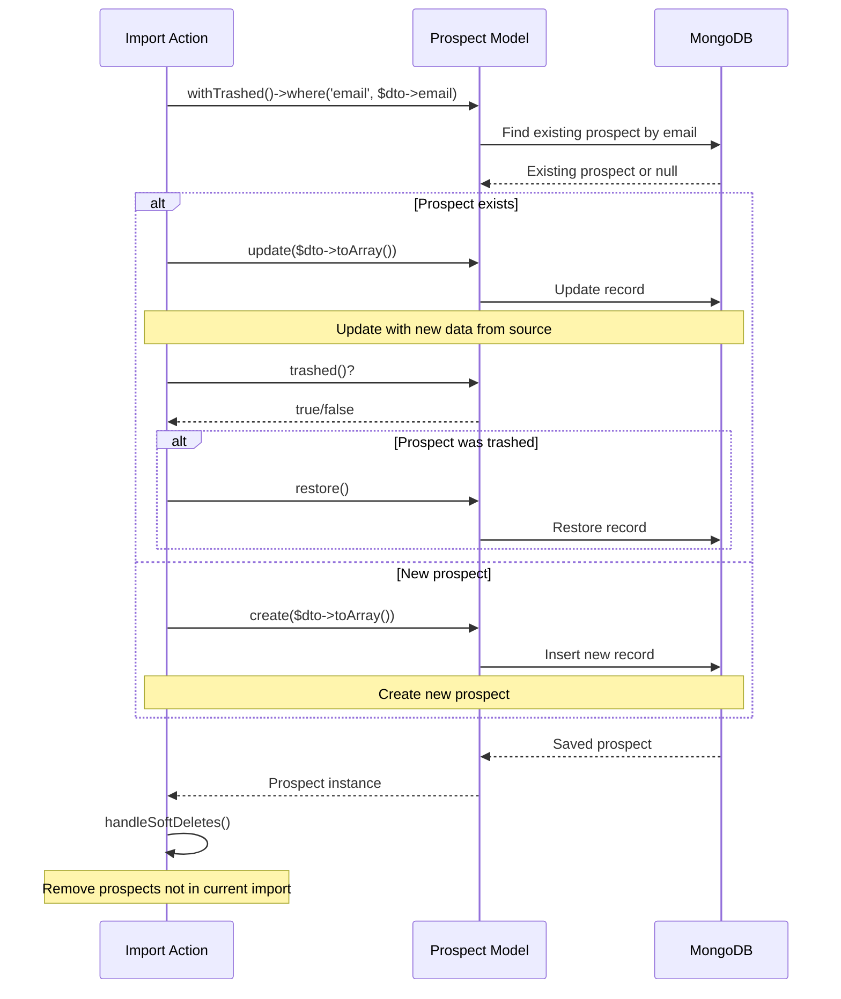
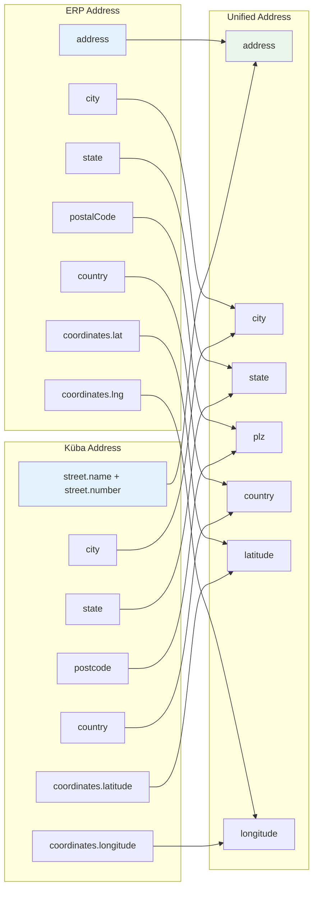
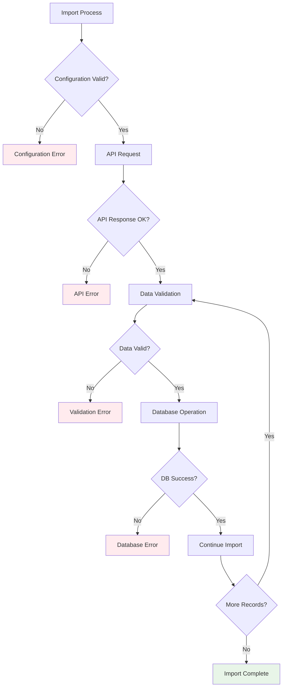

# Prospects

The Prospects system manages customer/prospect data imported from multiple external sources and provides API access for retrieving prospect information. The system is built with a modular architecture that supports multiple data sources and provides a unified interface for prospect management.

## System Architecture



## Import Process Flow



## Data Import Architecture



## API Request Flow



## Data Transformation Flow



## Upsert Process



## Address Data Mapping



## Scheduled Import Flow

```mermaid
gantt
    title Scheduled Prospect Imports
    dateFormat  HH:mm
    axisFormat %H:%M
    
    section Daily Schedule
    Morning Import    :07:00, 07:30
    Afternoon Import  :13:00, 13:30
    
    section Import Process
    ERP Import        :07:00, 07:15
    Küba Import       :07:15, 07:30
    ERP Import        :13:00, 13:15
    Küba Import       :13:15, 13:30
```



## Error Handling Flow



## Overview

The Prospects system consists of several key components:

- **Data Import System**: Modular importers for different external data sources
- **Data Models**: MongoDB-based prospect storage with soft deletes
- **API Endpoints**: RESTful API for prospect retrieval (index, show)
- **Data Transfer Objects**: Type-safe data handling with source-specific mapping
- **Scheduled Imports**: Automated data synchronization
- **Generic Filtering**: Advanced filtering capabilities with range and enum support

## Architecture

### Core Components

- **`Prospect` Model**: MongoDB Eloquent model with soft deletes and filtering capabilities
- **`AbstractImportProspectsAction`**: Base abstract class for import operations
- **`ImportErpProspects`**: ERP system data importer
- **`ImportKuebaProspects`**: Küba API data importer
- **`ProspectDataSource`**: Enum defining available data sources
- **`ProspectController`**: API controller for prospect operations
- **`ProspectResource`**: API resource for data transformation
- **Data DTOs**: `ErpProspectData`, `KuebaProspectData`, and address DTOs

### Data Flow

```
External APIs → Import Actions → DTOs → Prospect Model → API Resources → Client
```

## Data Model

### Prospect Model

The `Prospect` model is stored in MongoDB and includes comprehensive prospect information with advanced filtering capabilities:

```php
#[UsePolicy(ProspectPolicy::class)]
final class Prospect extends Model
{
    use AuthorizesRequests, HasFilterable, SoftDeletes;

    protected $fillable = [
        'id',
        'external_id',
        'first_name',
        'last_name',
        'email',
        'phone',
        'gender',
        'age',
        'birth_date',
        'image',
        'blood_group',
        'height',
        'weight',
        'eye_color',
        'hair_color',
        'hair_type',
        'address',
        'source',
        'created_at',
        'updated_at',
        'deleted_at',
    ];

    protected $casts = [
        'age' => 'integer',
        'birth_date' => 'date',
        'height' => 'float',
        'weight' => 'float',
        'address.latitude' => 'float',
        'address.longitude' => 'float',
        'source' => ProspectDataSource::class,
        'created_at' => 'datetime',
        'updated_at' => 'datetime',
        'deleted_at' => 'datetime',
    ];

    public static function getFilterableAttributes(): array
    {
        return [
            'source' => 'enum',
            'gender' => 'enum',
            'age' => 'range',
            'birth_date' => 'range',
            'blood_group' => 'enum',
            'height' => 'range',
            'weight' => 'range',
            'eye_color' => 'enum',
            'hair_color' => 'enum',
            'address.city' => 'enum',
            'address.state' => 'enum',
            'address.country' => 'enum',
            'address.plz' => 'range',
            'address.latitude' => 'range',
            'address.longitude' => 'range',
        ];
    }

    public function prospectCampaigns(): HasMany
    {
        return $this->hasMany(CampainProspect::class);
    }
}
```

### Database Schema

```php
[
    'id' => 'string',                    // MongoDB ObjectId
    'external_id' => 'string',           // External system ID
    'first_name' => 'string',            // First name
    'last_name' => 'string',             // Last name
    'email' => 'string',                 // Email address (unique identifier)
    'phone' => 'string|null',            // Phone number
    'gender' => 'string|null',           // Gender
    'age' => 'int|null',                 // Age
    'birth_date' => 'Carbon|null',       // Birth date
    'image' => 'string|null',            // Profile image URL
    'blood_group' => 'string|null',      // Blood group
    'height' => 'float|null',            // Height in cm
    'weight' => 'float|null',            // Weight in kg
    'eye_color' => 'string|null',        // Eye color
    'hair_color' => 'string|null',       // Hair color
    'hair_type' => 'string|null',        // Hair type
    'address' => 'array|null',           // Address information
    'source' => 'ProspectDataSource',    // Data source enum
    'created_at' => 'Carbon',            // Creation timestamp
    'updated_at' => 'Carbon',            // Last update timestamp
    'deleted_at' => 'Carbon|null',       // Soft delete timestamp
]
```

### Data Types

- **`ProspectDataSource`**: Enum with values `ERP` and `KUEBA`
- **Address**: Array containing address components (varies by source)
- **Timestamps**: Carbon instances for date/time handling
- **Soft Deletes**: Records are soft deleted, not permanently removed
- **Filterable Attributes**: Support for range (min, max), enum, in, not_in and nested filtering

## API Endpoints

### Authentication

All prospect endpoints require authentication via Laravel Sanctum:

```bash
# Login to get token
curl -X POST /api/login \
  -H "Content-Type: application/json" \
  -d '{"email": "user@example.com", "password": "password"}'

# Use token in subsequent requests
curl -H "Authorization: Bearer {token}" /api/prospects
```

### Available Endpoints

#### List Prospects

```http
GET /api/prospects
```

**Response**: Paginated list of prospects (10 per page)

```json
{
  "data": [
    {
      "id": "507f1f77bcf86cd799439011",
      "gender": "male",
      "age": 25,
      "birthDate": "1998-05-15T00:00:00.000000Z",
      "image": "https://example.com/image.jpg",
      "bloodGroup": "A+",
      "height": 175.5,
      "weight": 70.2,
      "eyeColor": "brown",
      "hairColor": "black",
      "hairType": "straight",
      "address": {
        "address": "123 Main St",
        "city": "Zurich",
        "state": "ZH",
        "plz": "8001",
        "country": "Switzerland",
        "latitude": 47.3769,
        "longitude": 8.5417
      }
    }
  ],
  "links": {
    "first": "http://localhost/api/prospects?page=1",
    "last": "http://localhost/api/prospects?page=5",
    "prev": null,
    "next": "http://localhost/api/prospects?page=2"
  },
  "meta": {
    "current_page": 1,
    "from": 1,
    "last_page": 5,
    "per_page": 10,
    "to": 10,
    "total": 50
  }
}
```

#### Get Single Prospect

```http
GET /api/prospects/{id}
```

**Response**: Detailed prospect information

```json
{
  "data": {
    "id": "507f1f77bcf86cd799439011",
    "firstName": "John",
    "lastName": "Doe",
    "email": "john.doe@example.com",
    "phone": "+41 79 123 45 67",
    "gender": "male",
    "age": 25,
    "birthDate": "1998-05-15T00:00:00.000000Z",
    "image": "https://example.com/image.jpg",
    "bloodGroup": "A+",
    "height": 175.5,
    "weight": 70.2,
    "eyeColor": "brown",
    "hairColor": "black",
    "hairType": "straight",
    "address": {
      "address": "123 Main St",
      "city": "Zurich",
      "state": "ZH",
      "plz": "8001",
      "country": "Switzerland",
      "latitude": 47.3769,
      "longitude": 8.5417
    },
    "source": "ERP"
  }
}
```

#### Generic Filtering

```http
GET /api/prospects/filter?gender=male&source=erp&age[min]=25&age[max]=35
```

**Response**: Filtered prospects based on criteria

```json
{
  "data": [
    {
      "id": "507f1f77bcf86cd799439011",
      "gender": "male",
      "age": 28,
      "birthDate": "1995-03-15T00:00:00.000000Z",
      "image": "https://example.com/image.jpg",
      "bloodGroup": "A+",
      "height": 175.5,
      "weight": 70.2,
      "eyeColor": "brown",
      "hairColor": "black",
      "hairType": "straight",
      "address": {
        "address": "123 Main St",
        "city": "Zurich",
        "state": "ZH",
        "plz": "8001",
        "country": "Switzerland",
        "latitude": 47.3769,
        "longitude": 8.5417
      }
    }
  ],
  "meta": {
    "current_page": 1,
    "from": 1,
    "last_page": 1,
    "per_page": 10,
    "to": 1,
    "total": 1
  }
}
```

### API Resource Transformation

The `ProspectResource` handles data transformation with conditional field inclusion:

- **List View**: Basic fields only (no personal information)
- **Detail View**: Full prospect information including name, email, phone, and source

## Data Import System

The Prospect Import system allows importing prospect data from multiple external sources into the MongoDB database. The system is designed with a modular architecture that makes it easy to add new data sources.

### Architecture

The import system follows a template method pattern with the following components:

- **`AbstractImportProspectsAction`**: Base abstract class containing shared import logic
- **`ImportErpProspects`**: Concrete implementation for ERP system imports
- **`ImportKuebaProspects`**: Concrete implementation for Küba API imports
- **`ProspectDataSource`**: Enum defining available data sources
- **Data Transfer Objects**: `ErpProspectData` and `KuebaProspectData` for type-safe data handling

### Data Sources

#### ERP System
- **Configuration**: `services.erp.prospects.url`
- **Pagination**: Supported (limit/skip parameters)
- **Response Structure**: `{ "users": [...], "total": number }`
- **Data Fields**: Comprehensive prospect information including personal details, physical attributes, and address

#### Küba API
- **Configuration**: `services.kueba.prospects.url`
- **Pagination**: Not supported (single request)
- **Response Structure**: `{ "results": [...] }`
- **Data Fields**: Basic prospect information with Swiss nationality filter (`nat=ch`)

### Usage

#### Command Line Import

Import prospects from all configured sources:

```bash
php artisan app:import-prospects
```

This command will:
1. Iterate through all available data sources (`ProspectDataSource::cases()`)
2. Create the appropriate importer instance for each source
3. Execute the import process
4. Display progress information

#### Programmatic Usage

Import prospects from a specific source:

```php
use App\Actions\Import\ImportErpProspects;
use App\Actions\Import\ImportKuebaProspects;

// Import from ERP
$erpImporter = new ImportErpProspects();
$erpImporter->handle();

// Import from Küba
$kuebaImporter = new ImportKuebaProspects();
$kuebaImporter->handle();
```

### Import Process

The import process follows these steps:

1. **Fetch Data**: Retrieve prospect data from the external API
2. **Transform Data**: Convert API response to standardized DTOs
3. **Upsert Records**: Create new prospects, update or restore existing ones
4. **Soft Delete**: Remove prospects that no longer exist in the source

#### Data Handling

- **New Prospects**: Created with all available data
- **Existing Prospects**: Updated with latest information from source (matched by email)
- **Soft Deleted Prospects**: Restored if they reappear in the source
- **Missing Prospects**: Soft deleted if they no longer exist in the source

### Configuration

Add the following to your `.env` file:

```env
# ERP System
ERP_PROSPECTS_URL=https://api.erp-system.com/prospects

# Küba API
KUEBA_PROSPECTS_URL=https://api.kueba.ch/users
```

And in `config/services.php`:

```php
'erp' => [
    'prospects' => [
        'url' => env('ERP_PROSPECTS_URL'),
    ],
],
'kueba' => [
    'prospects' => [
        'url' => env('KUEBA_PROSPECTS_URL'),
    ],
],
```

### Adding New Data Sources

To add a new data source:

1. **Create Data DTO**: Extend the base Data class with source-specific mapping
2. **Create Import Action**: Extend `AbstractImportProspectsAction` and implement required methods
3. **Update Enum**: Add new case to `ProspectDataSource` enum
4. **Add Configuration**: Configure the new source in `config/services.php`

Example implementation:

```php
// 1. Create DTO
final class NewSourceProspectData extends Data
{
    public ProspectDataSource $source = ProspectDataSource::NEW_SOURCE;
    
    public function __construct(
        public string $external_id,
        public string $first_name,
        public string $last_name,
        public string $email,
        // ... other fields
    ) {}
}

// 2. Create Import Action
final readonly class ImportNewSourceProspects extends AbstractImportProspectsAction
{
    protected function getDataSource(): ProspectDataSource
    {
        return ProspectDataSource::NEW_SOURCE;
    }
    
    protected function getBaseUrl(): string
    {
        return Config::string('services.new_source.prospects.url');
    }
    
    protected function getApiParameters(): array
    {
        return [];
    }
    
    protected function getResponseDataKey(): string
    {
        return 'data';
    }
    
    protected function createProspectData(array $data): NewSourceProspectData
    {
        return NewSourceProspectData::from($data);
    }
    
    protected function supportsPagination(): bool
    {
        return false;
    }
    
    protected function getPaginationParameters(int $limit, int $skip): array
    {
        return [];
    }
}

// 3. Update Enum
enum ProspectDataSource: string
{
    case ERP = 'erp';
    case KUEBA = 'kueba';
    case NEW_SOURCE = 'new_source';
    
    public function importAction(): string
    {
        return match ($this) {
            self::ERP => ImportErpProspects::class,
            self::KUEBA => ImportKuebaProspects::class,
            self::NEW_SOURCE => ImportNewSourceProspects::class,
        };
    }
}
```

### Error Handling

The import system includes comprehensive error handling:

- **Configuration Errors**: Validates URL configuration before making requests
- **API Errors**: Handles HTTP failures and invalid response structures
- **Data Validation**: Skips invalid records that can't be converted to DTOs
- **Database Errors**: Gracefully handles database operation failures

### Monitoring

The import command provides real-time feedback:

- Progress messages for each data source
- Success confirmations
- Error messages with details
- Return codes for automation (0 = success, 1 = failure)

## Data Transfer Objects (DTOs)

### ErpProspectData

Comprehensive prospect data from ERP system:

```php
#[MapInputName(CamelCaseMapper::class)]
final class ErpProspectData extends Data
{
    public ProspectDataSource $source = ProspectDataSource::ERP;

    public function __construct(
        #[MapInputName('id')]
        public string $external_id,
        public string $first_name,
        public string $last_name,
        public string $email,
        public string $phone,
        public string $gender,
        public int $age,
        #[WithCast(DateTimeInterfaceCast::class, format: 'Y-n-j')]
        public Carbon $birth_date,
        public string $image,
        public string $blood_group,
        public float $height,
        public float $weight,
        public string $eye_color,
        #[MapInputName('hair.color')]
        public string $hair_color,
        #[MapInputName('hair.type')]
        public string $hair_type,
        public ErpAddressData $address,
    ) {}
}
```

### KuebaProspectData

Basic prospect data from Küba API:

```php
#[MapInputName(CamelCaseMapper::class)]
final class KuebaProspectData extends Data
{
    public ProspectDataSource $source = ProspectDataSource::KUEBA;

    public function __construct(
        #[MapInputName('login.uuid')]
        public string $external_id,
        #[MapInputName('name.first')]
        public string $first_name,
        #[MapInputName('name.last')]
        public string $last_name,
        public string $email,
        public string $phone,
        public string $gender,
        #[MapInputName('dob.age')]
        public int $age,
        #[MapInputName('dob.date')]
        #[WithCast(DateTimeInterfaceCast::class, format: 'Y-m-d\TH:i:s.v\Z')]
        public Carbon $birth_date,
        #[MapInputName('picture.large')]
        public string $image,
        #[MapInputName('location')]
        public KuebaAddressData $address,
    ) {}
}
```

### Address DTOs

#### ErpAddressData

```php
#[MapInputName(CamelCaseMapper::class)]
final class ErpAddressData extends Data
{
    public function __construct(
        public string $address,
        public string $city,
        public string $state,
        #[MapInputName('postalCode')]
        public string $plz,
        public string $country,
        #[MapInputName('coordinates.lat')]
        public float $latitude,
        #[MapInputName('coordinates.lng')]
        public float $longitude,
    ) {}
}
```

#### KuebaAddressData

```php
#[MapInputName(CamelCaseMapper::class)]
final class KuebaAddressData extends Data
{
    #[Computed]
    public string $address;

    public function __construct(
        #[MapInputName('street.name')]
        #[Hidden]
        public string $street_name,
        #[MapInputName('street.number')]
        #[Hidden]
        public int $street_number,
        public string $city,
        public string $state,
        #[MapInputName('postcode')]
        public string $plz,
        public string $country,
        #[MapInputName('coordinates.latitude')]
        public float $latitude,
        #[MapInputName('coordinates.longitude')]
        public float $longitude,
    ) {
        $this->address = "{$street_name} {$street_number}";
    }
}
```

## Generic Filtering System

The Prospects system includes a powerful generic filtering system that supports:

### Filter Types

- **Enum Filters**: `source`, `gender`, `blood_group`, `eye_color`, `hair_color`, `address.city`, `address.state`, `address.country`
- **Range Filters**: `age`, `birth_date`, `height`, `weight`, `address.plz`, `address.latitude`, `address.longitude`

### Usage Examples

```bash
# Filter by enum values
GET /api/prospects/filter?gender=male&source=erp

# Filter by ranges
GET /api/prospects/filter?age[min]=25&age[max]=35

# Filter by address
GET /api/prospects/filter?address.city=Zurich&address.country=Switzerland

# Combined filters
GET /api/prospects/filter?gender=male&age[min]=25&source=erp
```

### Search Criteria

```http
GET /api/prospects/search-criteria
```

Returns available filter options for the prospects model.

## Scheduled Operations

### Automated Imports

The system includes scheduled import operations:

```php
// routes/console.php
Schedule::command('app:import-prospects')->twiceDaily(7, 13);
```

This runs the import process twice daily at 7:00 AM and 1:00 PM.

## Security Considerations

### Data Privacy

- **Personal Information**: Only exposed in detail view with proper authentication
- **Soft Deletes**: Sensitive data is soft deleted, not permanently removed
- **API Access**: All endpoints require authentication via Sanctum tokens
- **Authorization**: Uses Laravel Policies for fine-grained access control

### Rate Limiting

Consider implementing rate limiting for API endpoints:

```php
// In routes/api.php
Route::middleware(['auth:sanctum', 'throttle:60,1'])->group(function () {
    Route::apiResource('prospects', ProspectController::class)->only(['index', 'show']);
});
```

## Performance Considerations

### Database Optimization

- **Indexing**: Ensure proper indexes on frequently queried fields
- **Pagination**: API responses are paginated to prevent large data transfers
- **Soft Deletes**: Use `withTrashed()` when querying to include deleted records
- **MongoDB**: Leverages MongoDB's flexible schema and indexing capabilities

### Caching

Consider implementing caching for frequently accessed prospect data:

```php
// Example caching implementation
public function index(): ResourceCollection
{
    return Cache::remember('prospects.page.' . request()->get('page', 1), 300, function () {
        return Prospect::paginate(10)->toResourceCollection();
    });
}
```

## Testing

### Unit Tests

Create tests for individual components:

```php
// tests/Unit/ProspectTest.php
class ProspectTest extends TestCase
{
    public function test_prospect_can_be_created(): void
    {
        $prospect = Prospect::factory()->create();
        
        $this->assertDatabaseHas('prospects', [
            'id' => $prospect->id,
        ]);
    }
}
```

### Feature Tests

Test API endpoints:

```php
// tests/Feature/ProspectApiTest.php
class ProspectApiTest extends TestCase
{
    public function test_can_list_prospects(): void
    {
        $user = User::factory()->create();
        $token = $user->createToken('test')->plainTextToken;
        
        $response = $this->withHeaders([
            'Authorization' => 'Bearer ' . $token,
        ])->get('/api/prospects');
        
        $response->assertStatus(200);
    }
}
```

## Troubleshooting

### Common Issues

1. **Import Failures**: Check external API availability and configuration
2. **Data Validation Errors**: Review DTO mapping for source-specific fields
3. **Authentication Issues**: Verify Sanctum token configuration
4. **MongoDB Connection**: Ensure MongoDB is running and accessible
5. **Filter Errors**: Check filter parameter syntax and supported attributes

### Debugging

Enable detailed logging for import operations:

```php
// In .env
LOG_LEVEL=debug
```

Check logs for detailed error information:

```bash
tail -f storage/logs/laravel.log
```

## Future Enhancements

### Potential Improvements

1. **Search and Filtering**: Enhanced search capabilities with full-text search
2. **Bulk Operations**: Support for bulk prospect operations
3. **Data Validation**: Enhanced validation rules for prospect data
4. **Audit Logging**: Track changes to prospect records
5. **Export Functionality**: Export prospects to various formats
6. **Real-time Updates**: WebSocket support for real-time data updates
7. **Advanced Analytics**: Prospect interaction and engagement tracking
8. **Machine Learning**: Predictive analytics for prospect behavior
9. **Integration APIs**: Additional external data source integrations
10. **Performance Monitoring**: Real-time performance metrics and alerts
