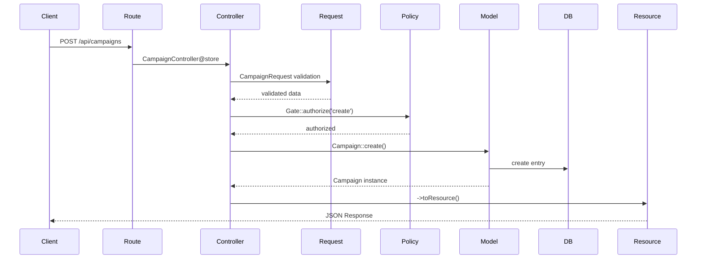

# CRUD Flow Documentation - Campaign Model

## übersicht

Diese Dokumentation beschreibt den vollstündigen **CRUD-Flow** am Beispiel des Campaign Models - von der Route bis zur API Response. Der gleiche Aufbau gilt für alle apiResource Models im System: **prospects**, **campaigns** und **landingpages**.

## CRUD Model Architecture

Alle CRUD Models folgen der **gleichen Architektur**:

```
Route ü Controller ü Validation ü Authorization ü Model ü API Resource ü Response
```

**Wichtiger Hinweis:** Die folgenden Patterns gelten identisch für:
-  **prospects** (`Route::apiResource('prospects', ProspectController::class)`)
-  **campaigns** (`Route::apiResource('campaigns', CampaignController::class)`)
-  **landingpages** (`Route::apiResource('landingpages', LandingpageController::class)`)

## 1. Routes Layer - API Routes Definition

### Route Registration

```php
// routes/api.php
Route::middleware(['auth:sanctum'])->group(function () {
    Route::apiResource('campaigns', CampaignController::class);
});
```

**Was ist apiResource:**
- Automatische Registrierung von 5 Standard-CRUD-Routen
- RESTful URL-Struktur nach Laravel-Konventionen
- Route Model Binding für {campaign} Parameter

### Generierte Routes

```bash
# Laravel generiert automatisch diese 5 Routen:

GET    /api/campaigns              # index()   - Liste alle Campaigns
POST   /api/campaigns              # store()   - Erstelle neue Campaign
GET    /api/campaigns/{campaign}   # show()    - Zeige spezifische Campaign
PUT    /api/campaigns/{campaign}   # update()  - Aktualisiere Campaign
DELETE /api/campaigns/{campaign}   # destroy() - Lüsche Campaign
```

**Route Model Binding:**
- `{campaign}` wird automatisch zu Campaign Model-Instanz aufgelüst
- Laravel findet Campaign anhand der ID in der URL
- 404 Error wenn Campaign nicht existiert

## 2. Controller Layer - CampaignController

### Controller Structure

```php
<?php

declare(strict_types=1);

namespace App\Http\Controllers\Api;

use App\Http\Controllers\Controller;
use App\Http\Requests\CampaignRequest;
use App\Models\Campaign;
use Illuminate\Http\JsonResponse;
use Illuminate\Http\Resources\Json\JsonResource;
use Illuminate\Http\Resources\Json\ResourceCollection;
use Illuminate\Support\Facades\Gate;

final class CampaignController extends Controller
{
    // CRUD Methods...
}
```

### CRUD Operations

#### 2.1 INDEX - Liste aller Campaigns

```php
/**
 * GET /api/campaigns
 * Zeigt paginierte Liste aller Campaigns
 */
public function index(): ResourceCollection
{
    // 1. Authorization Check
    Gate::authorize('viewAny', Campaign::class);

    // 2. Query mit Eager Loading + Pagination
    return Campaign::with('landingpage')
        ->paginate(request()->integer('per_page', 10))
        ->toResourceCollection();
}
```

**Flow-Schritte:**
1. **Authorization**: Policy-Check ob User Campaigns anzeigen darf
2. **Query Building**: Eager Loading für Landingpage-Relationship
3. **Pagination**: Standardmüüig 10 pro Seite, über `?per_page` Parameter ünderbar
4. **Resource Collection**: Automatische Transformation zu API Format

#### 2.2 STORE - Neue Campaign erstellen

```php
/**
 * POST /api/campaigns
 * Erstellt neue Campaign mit Validierung
 */
public function store(CampaignRequest $request): JsonResource
{
    // 1. Authorization Check
    Gate::authorize('create', Campaign::class);

    // 2. Model Creation + Eager Loading
    return Campaign::create($request->validated())
        ->load('landingpage')
        ->toResource();
}
```

**Flow-Schritte:**
1. **Form Request Injection**: Automatische Validierung über CampaignRequest
2. **Authorization**: Policy-Check für Create-Permission
3. **Model Creation**: Eloquent `create()` mit validierten Daten
4. **Relationship Loading**: Eager Loading der Landingpage
5. **Resource Transformation**: Konvertierung zu API Format

#### 2.3 SHOW - Spezifische Campaign anzeigen

```php
/**
 * GET /api/campaigns/{campaign}
 * Zeigt eine spezifische Campaign
 */
public function show(Campaign $campaign): JsonResource
{
    // 1. Authorization Check
    Gate::authorize('view', $campaign);

    // 2. Eager Loading + Resource Transformation
    return $campaign->load('landingpage')->toResource();
}
```

**Flow-Schritte:**
1. **Route Model Binding**: Automatische Campaign-Auflüsung via URL-Parameter
2. **Authorization**: Policy-Check auf spezifische Campaign-Instanz
3. **Eager Loading**: Landingpage-Relationship laden
4. **Resource Transformation**: API Format zurückgeben

#### 2.4 UPDATE - Campaign aktualisieren

```php
/**
 * PUT /api/campaigns/{campaign}
 * Aktualisiert existierende Campaign
 */
public function update(CampaignRequest $request, Campaign $campaign): JsonResource
{
    // 1. Authorization Check
    Gate::authorize('update', $campaign);

    // 2. Model Update
    $campaign->update($request->validated());

    // 3. Fresh Load + Resource Transformation
    return $campaign->load('landingpage')->toResource();
}
```

**Flow-Schritte:**
1. **Form Request Validation**: Gleiche CampaignRequest wie bei store()
2. **Authorization**: Update-Permission auf spezifische Instanz
3. **Model Update**: Eloquent `update()` mit validierten Daten
4. **Fresh Relationships**: Landingpage neu laden falls geündert
5. **Resource Response**: Aktualisierte Campaign zurückgeben

#### 2.5 DESTROY - Campaign lüschen

```php
/**
 * DELETE /api/campaigns/{campaign}
 * Lüscht Campaign (Soft Delete)
 */
public function destroy(Campaign $campaign): JsonResponse
{
    // 1. Authorization Check
    Gate::authorize('delete', $campaign);

    // 2. Soft Delete
    $campaign->delete();

    // 3. Success Response
    return response()->json(['success' => true]);
}
```

**Flow-Schritte:**
1. **Authorization**: Delete-Permission prüfen
2. **Soft Delete**: MongoDB SoftDeletes Trait - `deleted_at` wird gesetzt
3. **Success Response**: Einfache JSON Success-Antwort

## 3. Validation Layer - CampaignRequest

### Form Request Class

```php
<?php

declare(strict_types=1);

namespace App\Http\Requests;

use Illuminate\Foundation\Http\FormRequest;
use Illuminate\Support\Facades\Auth;
use Illuminate\Support\Str;
use Illuminate\Validation\Rule;

final class CampaignRequest extends FormRequest
{
    /**
     * Authorization auf Request-Level
     */
    public function authorize(): bool
    {
        return Auth::check(); // Nur authentifizierte User
    }

    /**
     * Validation Rules
     */
    public function rules(): array
    {
        return [
            'title' => [
                'required',
                'string',
                'max:255',
                Rule::unique('campaigns', 'title')
                    ->ignore($this->campaign?->id)    // Ignore bei Update
                    ->whereNull('deleted_at'),        // Ignore Soft Deleted
            ],
            'slug' => [
                'required',
                'string',
                'max:255',
                Rule::unique('campaigns', 'slug')
                    ->ignore($this->campaign?->id)
                    ->whereNull('deleted_at'),
            ],
            'description' => 'sometimes|string|max:255',
            'status' => 'required|string|in:' . implode(',', \App\Enums\CampaignStatus::values()),
            'start_date' => 'sometimes|nullable|date',
            'end_date' => 'sometimes|nullable|date|after:start_date',
            'landingpage_id' => 'sometimes|nullable|exists:landingpages,id',
            'prospect_filter' => 'sometimes|array',
        ];
    }

    /**
     * Data Preparation vor Validation
     */
    protected function prepareForValidation(): void
    {
        $title = is_string($this->title) ? $this->title : '';
        $this->merge([
            'slug' => Str::slug($title), // Auto-Generate Slug
        ]);
    }
}
```

### Validation Features

**Automatische Slug-Generierung:**
- `prepareForValidation()` erstellt Slug aus Title
- URL-freundlicher String für SEO

**Unique Rules mit Soft Delete Support:**
- `whereNull('deleted_at')` ignoriert gelüschte Campaigns
- `ignore($this->campaign?->id)` erlaubt Updates ohne Unique-Conflict

**Enum Validation:**
- `CampaignStatus::values()` für dynamische Enum-Werte
- Type-safe Status-Validierung

**Cross-Field Validation:**
- `end_date|after:start_date` stellt logische Reihenfolge sicher

## 4. Authorization Layer - Policies

### Policy Integration

```php
// Im Campaign Model
#[UsePolicy(CampaignPolicy::class)]
final class Campaign extends Model
{
    // Model Definition...
}

// Im Controller
Gate::authorize('viewAny', Campaign::class);     // Class-Level
Gate::authorize('view', $campaign);              // Instance-Level
Gate::authorize('create', Campaign::class);      // Class-Level
Gate::authorize('update', $campaign);            // Instance-Level
Gate::authorize('delete', $campaign);            // Instance-Level
```

**Policy Methods:**
- `viewAny()`: Darf User überhaupt Campaigns sehen?
- `view()`: Darf User diese spezifische Campaign sehen?
- `create()`: Darf User neue Campaigns erstellen?
- `update()`: Darf User diese Campaign bearbeiten?
- `delete()`: Darf User diese Campaign lüschen?

**Role-based Authorization:**
```php
public function create(User $user): bool
{
    return in_array($user->role, [
        UserRole::ADMIN,
        UserRole::SUPER_ADMIN,
    ]);
}
```

## 5. Model Layer - Campaign Model

### Model Definition

```php
<?php

declare(strict_types=1);

namespace App\Models;

use App\Enums\CampaignStatus;
use App\Policies\CampaignPolicy;
use Illuminate\Database\Eloquent\Attributes\UsePolicy;
use Illuminate\Database\Eloquent\Factories\HasFactory;
use MongoDB\Laravel\Eloquent\Model;
use MongoDB\Laravel\Eloquent\SoftDeletes;
use MongoDB\Laravel\Relations\BelongsTo;
use MongoDB\Laravel\Relations\HasMany;

#[UsePolicy(CampaignPolicy::class)]
final class Campaign extends Model
{
    use HasFactory, SoftDeletes;

    // Mass Assignment Protection
    protected $fillable = [
        'landingpage_id',
        'title',
        'slug',
        'description',
        'status',
        'start_date',
        'end_date',
        'prospect_filter',
    ];

    // Automatic Type Casting
    protected $casts = [
        'status' => CampaignStatus::class,    // Enum Casting
        'start_date' => 'datetime',
        'end_date' => 'datetime',
        'created_at' => 'datetime',
        'updated_at' => 'datetime',
        'deleted_at' => 'datetime',
    ];

    // Relationships
    public function landingpage(): BelongsTo
    {
        return $this->belongsTo(Landingpage::class);
    }

    public function campaignProspects(): HasMany
    {
        return $this->hasMany(CampainProspect::class);
    }
}
```

### Model Features

**MongoDB-spezifische Features:**
- Erbt von `MongoDB\Laravel\Eloquent\Model`
- Flexible Schema - `prospect_filter` als dynamisches Array
- Embedded Documents Support

**Soft Deletes:**
- `SoftDeletes` Trait für logisches Lüschen
- `deleted_at` Timestamp statt physischer Entfernung
- Query Builder ignoriert soft-deleted automatisch

**Type Casting:**
- `CampaignStatus` Enum wird automatisch konvertiert
- DateTime-Felder als Carbon-Instanzen
- Array-Casting für komplexe Filter

## 6. API Resource Layer - Response Transformation

### CampaignResource

```php
<?php

declare(strict_types=1);

namespace App\Http\Resources;

use App\Models\Campaign;
use Illuminate\Http\Request;
use Illuminate\Http\Resources\Json\JsonResource;
use Illuminate\Support\Facades\Gate;

final class CampaignResource extends JsonResource
{
    /**
     * Transform Model zu API Response
     */
    public function toArray(Request $request): array
    {
        /** @var Campaign $campaign */
        $campaign = $this->resource;

        return [
            'id' => $campaign->id,
            'title' => $campaign->title,
            'slug' => $campaign->slug,
            'description' => $campaign->description,

            // Conditional Fields basierend auf Permissions
            $this->mergeWhen(Gate::allows('viewAny', Campaign::class), [
                'start_date' => $campaign->start_date,
                'end_date' => $campaign->end_date,
                'status' => $campaign->status->label(),
                'prospect_filter' => $campaign->prospect_filter ?? [],
            ]),

            // Nested Resource für Relationship
            'landingpage' => new LandingpageResource($this->whenLoaded('landingpage')),
        ];
    }
}
```

### Resource Features

**Conditional Fields:**
- `mergeWhen()` zeigt Felder nur bei entsprechenden Permissions
- Sensitive Daten nur für berechtigte User

**Nested Resources:**
- `LandingpageResource` für Relationship-Transformation
- `whenLoaded()` verhindert N+1-Queries

**Enum Transformation:**
- `$campaign->status->label()` für human-readable Status
- API-freundliche Enum-Darstellung

## 7. Complete CRUD Flow Examples

### 7.1 CREATE Campaign Flow



**Request:**
```bash
POST /api/campaigns
Content-Type: application/json
Authorization: Bearer {token}

{
    "title": "Summer Campaign 2024",
    "description": "Wellness promotion for summer season",
    "status": "draft",
    "start_date": "2024-06-01",
    "end_date": "2024-08-31",
    "landingpage_id": "60f1e2b8c8f4a61234567890",
    "prospect_filter": {
        "age_min": 25,
        "age_max": 55,
        "gender": "female"
    }
}
```

**Response:**
```json
{
    "data": {
        "id": "60f1e2b8c8f4a61234567891",
        "title": "Summer Campaign 2024",
        "slug": "summer-campaign-2024",
        "description": "Wellness promotion for summer season",
        "start_date": "2024-06-01T00:00:00.000Z",
        "end_date": "2024-08-31T00:00:00.000Z",
        "status": "Draft",
        "prospect_filter": {
            "age_min": 25,
            "age_max": 55,
            "gender": "female"
        },
        "landingpage": {
            "id": "60f1e2b8c8f4a61234567890",
            "title": "Summer Wellness Landing",
            "headline": "Transform Your Summer"
        }
    }
}
```

### 7.2 INDEX Campaigns Flow

**Request:**
```bash
GET /api/campaigns?per_page=5&page=2
Authorization: Bearer {token}
```

**Response:**
```json
{
    "data": [
        {
            "id": "60f1e2b8c8f4a61234567891",
            "title": "Summer Campaign 2024",
            "slug": "summer-campaign-2024"
        }
    ],
    "links": {
        "first": "http://localhost:8000/api/campaigns?page=1",
        "last": "http://localhost:8000/api/campaigns?page=10",
        "prev": "http://localhost:8000/api/campaigns?page=1",
        "next": "http://localhost:8000/api/campaigns?page=3"
    },
    "meta": {
        "current_page": 2,
        "from": 6,
        "last_page": 10,
        "per_page": 5,
        "to": 10,
        "total": 47
    }
}
```

### 7.3 UPDATE Campaign Flow

**Request:**
```bash
PUT /api/campaigns/60f1e2b8c8f4a61234567891
Content-Type: application/json
Authorization: Bearer {token}

{
    "title": "Summer Campaign 2024 - Extended",
    "status": "active",
    "end_date": "2024-09-15"
}
```

**Response:**
```json
{
    "data": {
        "id": "60f1e2b8c8f4a61234567891",
        "title": "Summer Campaign 2024 - Extended",
        "slug": "summer-campaign-2024-extended",
        "status": "Active",
        "end_date": "2024-09-15T00:00:00.000Z"
    }
}
```

## 8. Error Handling

### Validation Errors

```json
{
    "message": "The given data was invalid.",
    "errors": {
        "title": [
            "The title field is required."
        ],
        "end_date": [
            "The end date must be a date after start date."
        ]
    }
}
```

### Authorization Errors

```json
{
    "message": "This action is unauthorized."
}
```

### Not Found Errors

```json
{
    "message": "No query results for model [App\\Models\\Campaign] 60f1e2b8c8f4a61234567891"
}
```

## 9. Anwendung auf alle CRUD Models

### Prospect Controller (Identisches Pattern)

```php
final class ProspectController extends Controller
{
    public function index(): ResourceCollection
    {
        Gate::authorize('viewAny', Prospect::class);
        return Prospect::paginate(request()->integer('per_page', 10))->toResourceCollection();
    }

    public function show(Prospect $prospect): JsonResource
    {
        Gate::authorize('view', $prospect);
        return $prospect->toResource();
    }

    // store(), update(), destroy() folgen gleichem Pattern
}
```

### Landingpage Controller (Identisches Pattern)

```php
final class LandingpageController extends Controller
{
    public function store(LandingpageRequest $request): JsonResource
    {
        Gate::authorize('create', Landingpage::class);
        return Landingpage::create($request->validated())->toResource();
    }

    // Alle anderen Methods identisch strukturiert
}
```

### Gemeinsame Patterns

**Alle apiResource Controllers verwenden:**

1. **Gate Authorization** in jeder Method
2. **Form Request Validation** für store/update
3. **Route Model Binding** für show/update/destroy
4. **Eager Loading** wo nütig (`->with()`)
5. **API Resources** für Response Transformation
6. **Pagination** für index() Methods
7. **Soft Deletes** über Model Traits

**Alle Models implementieren:**

1. **MongoDB Eloquent Model** als Base Class
2. **Policy Integration** via `#[UsePolicy]` Attribute
3. **Factory Support** für Testing
4. **Relationship Definitions** (BelongsTo/HasMany)
5. **Type Casting** für Enums und Dates
6. **Mass Assignment Protection** via `$fillable`

**Alle Form Requests verwenden:**

1. **Authorization Check** in `authorize()`
2. **Validation Rules** in `rules()`
3. **Data Preparation** in `prepareForValidation()`
4. **Unique Rules** mit Soft Delete Support

## 10. Performance Considerations

### N+1 Query Prevention

```php
// Gut: Eager Loading im Controller
Campaign::with('landingpage')->paginate(10);

// Schlecht: N+1 Problem
$campaigns = Campaign::paginate(10);
foreach ($campaigns as $campaign) {
    echo $campaign->landingpage->title; // Separate Query pro Campaign
}
```

### Selective Field Loading

```php
// Nur benütigte Felder laden
Campaign::select(['id', 'title', 'status'])->paginate(10);
```

### Query Optimization

```php
// Index auf hüufig verwendete Filter
Campaign::where('status', 'active')
    ->where('start_date', '<=', now())
    ->where('end_date', '>=', now())
    ->paginate(10);
```

## 11. Testing der CRUD Operations

### Feature Tests

```php
it('can create campaign', function () {
    $user = User::factory()->admin()->create();
    $landingpage = Landingpage::factory()->create();

    $response = $this->actingAs($user)
        ->postJson('/api/campaigns', [
            'title' => 'Test Campaign',
            'status' => 'draft',
            'landingpage_id' => $landingpage->id,
        ]);

    $response->assertCreated()
        ->assertJsonStructure([
            'data' => [
                'id',
                'title',
                'slug',
                'status',
                'landingpage'
            ]
        ]);
});

it('can update campaign', function () {
    $user = User::factory()->admin()->create();
    $campaign = Campaign::factory()->create();

    $response = $this->actingAs($user)
        ->putJson("/api/campaigns/{$campaign->id}", [
            'title' => 'Updated Campaign',
            'status' => 'active',
        ]);

    $response->assertOk();
    expect($campaign->fresh()->title)->toBe('Updated Campaign');
});
```

## Zusammenfassung

###  CRUD Flow Pattern

1. **Route**: `apiResource()` generiert 5 Standard-CRUD-Routes
2. **Controller**: Authorization ü Model Operation ü Resource Response
3. **Validation**: Form Request mit Rules und Data Preparation
4. **Authorization**: Policy-basierte Permission Checks
5. **Model**: MongoDB Eloquent mit Relationships und Casting
6. **Resource**: API Response Transformation mit Conditional Fields

### = Consistency Across Models

**Alle CRUD Models (prospects, campaigns, landingpages) verwenden:**
- Identische Controller-Struktur
- Gleiche Authorization-Patterns
- Einheitliche Validation-Approach
- Konsistente API Resource Transformation
- Standardisierte Error Handling

Dieses Pattern gewührleistet **Wartbarkeit**, **Konsistenz** und **Skalierbarkeit** der gesamten API-Architektur.